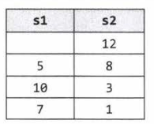

# 3 Stacks and Queues

p108

## Stacks

+ Operations: 
  + pop() top
  + push(item) to top
  + peek() return top
  + isEmpty()

### Implementation (LinkedList)

```java
public class MyStack<T> {
    private static class StackNode<T>{
        private T data;
        private StackNode<T> next;
        public StackNode(T data){
            this.data = data;
        }
    }

    private StackNode<T> top;

    public T pop(){
        if (top==null) throw new EmptyStackException();
        T data = top.data;
        top = top.next;
        return data;
    }
    public void push(T item){
        StackNode newTop = new StackNode(item);
        newTop.next = top;
        top = newTop;
    }
    public T peek(){
        if (top==null) throw new EmptyStackException();
        return top.data;
    }
    public boolean isEmpty(){
        return top==null;
    }
}
```

### Application

+ In recursive algorithms
  + Backtrack
+ implement recursive algorithm iteratively

## Queue

### Operations

+ add(item) to last
+ remove() first item
+ peek() first item
+ isEmpty()

### Implementation (LinkedList)

```java
public class MyQueue<T> {
    private static class QueueNode<T>{
        private T data;
        private QueueNode<T> next;

        public QueueNode(T data){
            this.data = data;
        }
    }
    private QueueNode<T> first;
    private QueueNode<T> last;

    public void add(T item){
        QueueNode<T> newLast = new QueueNode<T>(item);
        if (last!=null){
            last.next = newLast;
        }
        last = newLast;
        if(first==null){
            first = last;
        }
    }

    public T remove(){
        if(first==null) throw new NoSuchElementException();
        T data = first.data;
        first = first.next;
        if(first==null){
            last = null;
        }
        return data;
    }
    public T peek(){
        if(first==null) throw new NoSuchElementException();
        return first.data;
    }
    public boolean isEmpty(){
        return first==null;
    }
}

```

### Application

+ Breadth-first search
+ Implementation of cache


## Interview Questions

p239

### 3.1 Three in One

Use A single Array to implement three stacks

+ Draw Example
+ Brute Force
  + Fixed division 
+ Optimize + Conceptual algorithm walk through
  + Flexible Divisions: when one stack exceeds its initial capacity, grow allowable capacity and shift elements as necessary
+ Implement + Test

### 3.2 Stack Min

Design a stack with push, pop, min all operating in $O(1)$ time. 

+ Draw Example

+ Brute Force

  + Have a ```minValue``` field, each time pop a min value, search again to find where the min values, amortized $O(1)$ but not strictly.

+ Optimize + Conceptual algorithm walk through

  + Each node remembers min, and the min below it.: additional n integers in memory
  + Have a new stack tracking the min: only number of min integers in stack

+ Implement + Test

  + ```java
    public class MinStack_3_2 extends Stack<Integer> {
        Stack<Integer> minStack;
    
        public MinStack_3_2(){minStack = new Stack<Integer>();}
    
        public void push (int value){
            if (value <=min()){
                minStack.push(value);
            }
            super.push(value);
        }
    
        public Integer pop(){
            int value = super.pop();
            if (value==min()){
                minStack.pop();
            }
            return value;
        }
    
        public int min(){
            if (minStack.isEmpty()){
                return Integer.MAX_VALUE;
            }else {
                return minStack.peek();
            }
        }
    
        public boolean answer(String s){
    
    
            return true;
        }
        public void test(){
            System.out.println(answer(""));
        }
    }
    ```

### 3.3 Stack of Plates

 Imagine a (literal) stack of plates. If the stack gets too high, it might topple.
Therefore, in real life, we would likely start a new stack when the previous stack exceeds some threshold. Implement a data structure SetOfStacks that mimics this. SetOfStacks should be composed of several stacks and should create a new stack once the previous one exceeds capacity. SetOfStacks. push () and      SetOfStacks. pop() should behave identically to a single stack (that is, pop ( ) should return the same values as it would if there were just a single stack).
FOLLOW UP Implement a function popAt (int index) which performs a pop operation on a specific substack.

```java
public class StackOfPlates_3_3{
    class Stack extends java.util.Stack<Integer> {
        int capacity;
        int size = 0;
        public Stack(int capacity){this.capacity = capacity;}
        public int size(){return this.size;}
        public void push(int data){
            if(size<capacity){
                super.push(data);
                size++;
            }else{
                throw new StackOverflowError();
            }
            return;
        }
        public boolean isFull(){
            return this.size==this.capacity;
        }
    }

    int capacity;
    ArrayList<Stack> stacks = new ArrayList<Stack>();
    public StackOfPlates_3_3(int capacity){this.capacity = capacity;}
    public void push(int data){
        Stack last = getLastStack();
        if(last!=null && !last.isFull()){
            last.push(data);
        }else {
            Stack stack = new Stack(capacity);
            stack.push(data);
            stacks.add(stack);
        }
    }
    public int pop(){
        Stack last = getLastStack();
        if(last == null) throw new EmptyStackException();
        int top = last.pop();
        if (last.size()==0) stacks.remove(stacks.size()-1);
        return top;
    }

    private Stack getLastStack(){
        return stacks.get(stacks.size() - 1);
    }

}
```

### 3.4 Queue via Stacks

MyQueue class which implements a queue using two stacks

+ Idea:

  + Stack: last in first out
  + Queue: first in first out
  + Stack of stack: first in first out

+ ```java
  public class QueueViaStacks_3_4<T> {
      Stack<T> firstStack, secondStack;
      public QueueViaStacks_3_4(){
          firstStack = new Stack<T>();
          secondStack = new Stack<T>();
      }
  
      public void push(T item){
          firstStack.push(item);
      }
  
      private void shiftStacks(){
          if (secondStack.isEmpty()){
              while (!firstStack.isEmpty()){
                  secondStack.push(firstStack.pop());
              }
          }
      }
  
      public T peek(){
          shiftStacks();
          return secondStack.peek();
      }
  
      public T pop(){
          shiftStacks();
          return secondStack.pop();
      }
  
  }
  ```


### 3.5 Sort Stack

Write a program to sort a stack such that the smallest items are on the top. You can use
an additional temporary stack, but you may not copy the elements into any other data structure
(such as an array).The stack supports the following operations: push, pop, peek, and isEmpty.

+ Draw Example

  + 3->1->5->4->2->
  + 5->4->3->2->1

+ Brute Force

  + Pop all to another stack to find biggest element, add biggest number to original stack
  + pop all of the second stack and put back to original stack except for the biggest element
  + pop all but last element, repeat step 1-2 until all sorted
  + $n+n-1+... = O(n^2)$

+ Optimize + Conceptual algorithm walk through

  + instead of repeating 1,2 to remember one number each time. Can remember one each on the first and second step, reduce total time by half
  + Can also remember smallest number, reduce total time by another half 
  + Solution: keep s2 sorted. Every step:
    + pop s1 to temporary variable cur
    + pop s2 to s1 until top of s2> cur, remember total number of elements popped
    + push cur to s2
    + pop numPopped elements from s1 to s2
    + Stop when s1 is empty
    + 

+ Implement + Test

  + Commented out codes are unnecessary

  ```java
  public class SortStack_3_5 {
  
      public Stack<Integer> answer(Stack<Integer> s1)
      {
          Stack<Integer> s2 = new Stack<Integer>();
          if(s1.size()<=1){return s1;}
          while(!s1.isEmpty()){
              //int numPopped = 0;
              int top = s1.pop();
              while (!s2.isEmpty()&& s2.peek()<top){
                  s1.push(s2.pop());
              //    numPopped ++;
              }
              s2.push(top);
              //for (int i=0;i<numPopped;i++){
              //    s2.push(s1.pop());
              //}
          }
          return s2;
      }
      public void test(){
          Integer[] raw = {3,1,5,4,2};
          Stack<Integer> s1 = new Stack<Integer>();
          for(int i=0; i<raw.length; i++){
              s1.push(raw[i]);
          }
          System.out.println(answer(s1));
      }
  }
  
  ```

  

### Animal Shelter

An animal shelter, which holds only dogs and cats, operates on a strictly "first in, first
out"basis. [Queue] People must adopt either the "oldest"(based on arrival time) of all animals at the shelter, or they can select whether they would prefer a dog or a cat (and will receive the oldest animal of
that type). They cannot select which specific animal they would like. Create the data structures to
maintain this system and implement operations such as enqueue, dequeueAny, dequeueDog,
and dequeueCat. You may use the built-in LinkedList data structure.

+ Draw Example
+ Brute Force
  + 2 queues with LinkedList, one for cat and one for dog.
+ Optimize + Conceptual algorithm walk through
+ Implement + Test


-> p253


