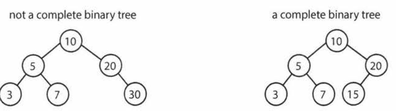
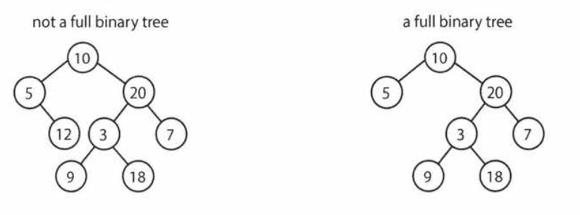
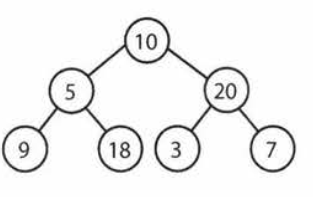
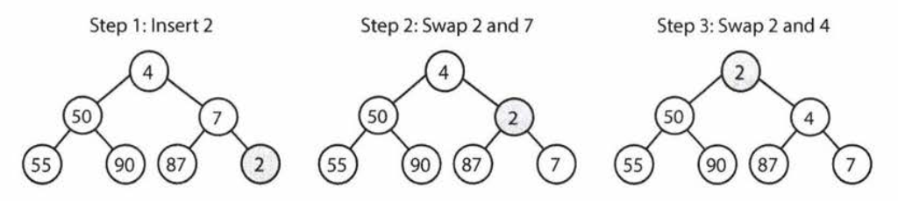
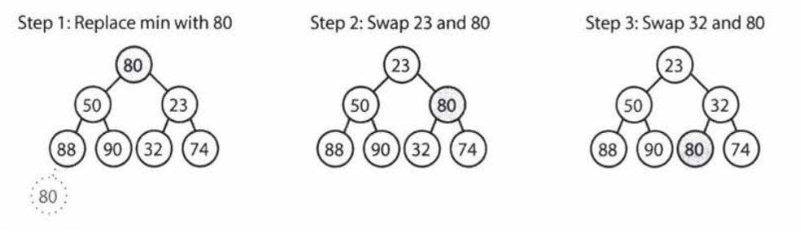
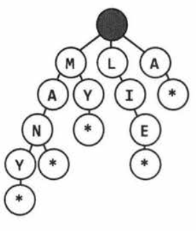
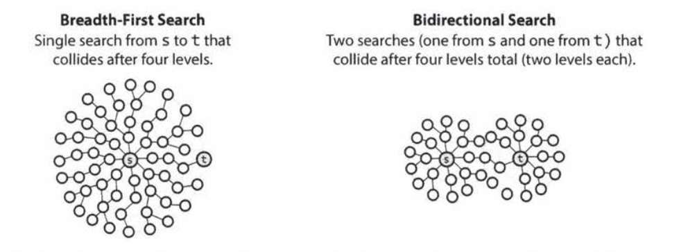

# 4 Trees and Graphs

## Trees

### Basic definition

```java
class Node{
    public String name;
    public Node[] children;
}
class Tree{
    public Node root;
}
```


### Types of Trees

+ Binary trees: each node has only 2 children
+ Binary search tree: all left descendants <= cur <= all right descendants
+ Balanced (binary search) tree: $O(\log n)$ insert & find
  + Complete binary trees: every level filled except right most nodes of last level
    
  + Full binary trees: each node has zero or two children
    
  + Perfect binary trees: all levels full (both full and complete), total $2^k -1$ nodes
    

### Binary tree traversal

+ In-order (left, cur, right)

  ```java
  void inOrderTraversal(TreeNode node){
      if(node!=null){
          inOrderTraversal(node.left);
          visit(node);
          inorderTraversal(node.right);
      }
  }
  ```

+ Pre-order: (cur, left, right)

  ```java
  void preOrderTraversal(TreeNode node){
      if(node!=null){
          visit(node);
          preOrderTraversal(node.left);
          preorderTraversal(node.right);
      }
  }
  ```

+ Post-order: (left, right, cur)

  ```java
  void postOrderTraversal(TreeNode node){
      if(node!=null){
          postOrderTraversal(node.left);
          postorderTraversal(node.right);
          visit(node);
      }
  }
  ```

### Binary Heaps

#### Definition (MinHeap)

+ complete binary tree
+ Every node is smaller than all its children
+ root is minimum

#### Operations

+ Insert $O(\log n)$

  

+ Remove Min: $O(\log n)$
  

### Tries (prefix trees)

#### Properties

+ n-ary tree
+ characters stored at each node
+ each path down the tree represent a word
+ start with dummy head
+ null nodes or * indicate complete words
+ Max number of children: ALPHABET_SIZE+1(*)
+ hash table: can look up whether has word, but not whether any word has certain prefix
+ $O(K)$ time look up, $K=$ length of word
+ 


## Graphs

### Definition

	+ Directed: with directed edges ; Undirected: two-way edges
	+ Connected Graph: exist a path between every pair of vertices 
	+ Cyclic graph

### Implementation

#### Adjacency List

```java
class Graph{
    public Node[] nodes;
}
class Node{
    public String name;
    public Node[] children;
}
```

Or an array of lists

#### Adjacency Matrices

+ A true value at matrix$[i][j]$ indicates an edge from node i to node j
+ Symmetric for undirected graph

### Graph Search 

#### Depth first search (DFS)

+ Search one branch exhaustively a time

```java
void DFS(Node root){
    if (root==null) return;
    visit(root);
    root.visited = true;
    for each (Node n in root.adjacent){
        if(n.visited==false){
            DFS(n)
        }
    }
}
```

#### Breadth first search (BFS)

+ exhaust all children before going to next layer

```java
void search(Node root){
    Queue queue = new Queue();
    root.marked = true;
    queue.enqueue(root);
    
    while(!queue.isEmpty()){
        Node r = queue.dequeue();
        visit(r);
        foreach (Node n in r.adjacent){
            if (n.marked == false){
                n.marked = true;
                queue.enqueue(n);
            }
        }
    }
}
```

#### Bidirectional search

+ To find shortest path between two nodes
+ Run two simultaneous BFS from each node, find a shortest path when their searches collide
+ Faster than single BFS source can have many children
  + Assume each node has on average k children, and overall k levels
  + 1 BFS: visit $k^d$ nodes $O(k^d)$
  + Bidirectional: collide half-way through $O(k^{d/2})$
  + 

## Interview Questions

p253

### 4.1 Route between nodes

Given a directed graph, design an algorithm to find out whether there is a
route between two nodes.

+ Draw Example
+ Brute Force
  + DFS
+ Optimize + Conceptual algorithm walk through
  + DFS is easier to implement, simply with recursion
  + BFS finds shortest path
+ Implement + Test

```java
enum State{ Unvisited, Visited, Visiting; }

boolean search(Graph graph, Node start, Node end){
    if(start==end) return true;
    
    //Queue as common practice to implement BFS
    LinkedList<Node> queue = new LinkedList<Node>();
    
    //mark all nodes unvisited first
    for (Node u: graph.getNodes()){
        u.state = State.Unvisited;
    }
    start.state = State.Visiting;
    queue.add(start);
    Node u;
    while(!queue.isEmpty()){
        u = queue.removeFirst(); //dequeue()
        if(u!=null){
            for(Node v: u.getAdjacent()){
                if(v.state == State.Unvisited){
                    if(v==end){
                        return true;
                    }else{
                        v.state=State.Visiting; //Visiting for nodes in queue
                        q.add(v);
                    }
                }
            }
            u.state = State.Visited // Visited for nodes dequeued
        }
    }
    return false;
    
}
```


### 4.2 Minimal Tree

Given a sorted (increasing order) array with unique integer elements, write an algorithm to create a binary search tree with minimal height.

+ Draw Example

  + [1,2,3,4,5,6,7]

  + ```mermaid
    graph TD;
    	4 --> 2
    	4 --> 6	
    	2 --> 1
    	2 --> 3
    	6 --> 5
    	6 --> 7
    ```

+ Brute Force

+ Optimize + Conceptual algorithm walk through

  + First find the middle element, put it at root
  + Then recursively 
    + find middle element of left part, put at left child
    + find middle element of left part, put at right child
  + Base case:
    + If no element, stop
    + If one element, put at corresponding location

+ Implement + Test

  + ```java
        private static TreeNode createMinimalBST(int arr[], int start, int end){
            if(end<start){
                return null;
            }
            int mid = (start+end)/2;
            TreeNode n = new TreeNode((arr[mid]));
            n.setRightChild(createMinimalBST(arr,start,mid-1));
            n.setRightChild(createMinimalBST(arr,mid+1, end));
            return n;
        }
    ```

  + 


### 4.3 ==List of Depths==

Given a binary tree, design an algorithm which creates a linked list of all the nodes
at each depth (e.g., if you have a tree with depth D, you'll have Dlinked lists).

+ Draw Example

  + ```mermaid
    graph TD;
    	4 --> 2
    	4 --> 6	
    	2 --> 1
    	2 --> 3
    	6 --> 5
    	6 --> 7
    ```

  + [4; 2->6; 1->3->5->7]

+ Brute Force
  
  + Level by level traversal and record each level
+ Optimize + Conceptual algorithm walk through
  + Both BFS and DFS work
    + DFS: pre-order traversal
      + pass level + 1 in each recursive call
    + BFS
      + keep a queue

+ Implement + Test

  ```java
      void createLevelLinkedList(TreeNode root, ArrayList<LinkedList<TreeNode>> lists, int level){
          if(root==null) return;
          LinkedList<TreeNode> list = null;
          if(lists.size()==level){
              list = new LinkedList<TreeNode>();
              lists.add(list);
          }else {
              list = lists.get(level);
          }
          list.add(root);
          createLevelLinkedList(root.left,lists,level+1);
          createLevelLinkedList(root.right,lists,level+1);
      }
  
      public ArrayList<LinkedList<TreeNode>> createLevelLinkedList(TreeNode root){
          ArrayList<LinkedList<TreeNode>> lists = new ArrayList<LinkedList<TreeNode>>();
          createLevelLinkedList(root, lists,0);
          return lists;
      }
      public ArrayList<LinkedList<TreeNode>> answer(TreeNode root) {
          ArrayList<LinkedList<TreeNode>> result = new ArrayList<LinkedList<TreeNode>>();
          LinkedList<TreeNode> current = new LinkedList<TreeNode>();
          if(root!=null){
              current.add(root);
          }
          while (current.size()>0){
              result.add(current);
              LinkedList<TreeNode> parents = current;
              current = new LinkedList<TreeNode>();
              for (TreeNode parent: parents){
                  if(parent.left!=null){
                      current.add(parent.left);
                  }
                  if(parent.right!=null){
                      current.add(parent.right);
                  }
              }
          }
          return result;
      }
  ```

+ Tips

  + Pass lists as argument to recursive calls to keep track of data to be accumulated

### 4.4 Check Balanced

Implement a function to check if a binary tree is balanced. For the purposes of this question, a balanced tree is defined to be a tree such that the heights of the two subtrees of any node never differ by more than one

+ Draw Example

  + Yes: 

    ```mermaid
    graph TD;
    	4 --> 2
    	4 --> 6	
    	2 --> 1
    	2 --> 3
    	6 --> 5
    	6 --> 7
    ```

     

  + Yes:

    ```mermaid
    graph TD;
    	4 --> 2
    	4 --> 6	
    	2 --> 1
    	2 --> 3
    ```

  + No:

    ```mermaid
    graph TD;
    	4 --> 2
    	2 --> 1
    	2 --> 3
    ```

+ Brute Force

  + Traverse with recursion, add height while going down the tree, and output height at each leaf node, see whether they differ more than one

+ Optimize + Conceptual algorithm walk through

  + Check balance in the while traversing
  + Pass an error code (Integer.MIN_VALUE) whenever see unbalanced branch. 

+ Implement + Test

  + ```java
        public int getHeight(TreeNode root){
            if(root==null) return -1;
            return Math.max(getHeight(root.left), getHeight(root.right)) +1;
        }
    
        public boolean isBalanced(TreeNode root)
        {
            if(root==null) return  true;
            int heightDiff = Math.abs(getHeight(root.left) - getHeight(root.right));
            if(heightDiff>1){
                return false;
            }else {
                return isBalanced(root.left) && isBalanced(root.right);
            }
        }
    
        public int checkHeight2(TreeNode root){
            if(root==null) return -1;
            int leftHeight = checkHeight2(root.left);
            if(leftHeight==Integer.MIN_VALUE) return Integer.MIN_VALUE;
            int rightHeight = checkHeight2(root.right);
            if(rightHeight==Integer.MIN_VALUE) return Integer.MIN_VALUE;
            int heightDiff = Math.abs(leftHeight-rightHeight);
            if(heightDiff>1){
                return Integer.MIN_VALUE;
            }else {
                return Math.max(leftHeight,rightHeight)+1;
            }
    
        }
    
        boolean isBalanced2(TreeNode root){
            return checkHeight2(root)!=Integer.MIN_VALUE;
        }
    
    ```

+ Tips:

  + use Integer.MIN_VALUE as error code of function needs to return integer and represent boolean

### 4.5 Validate BST

Implement a function to check if a binary tree is a binary search tree.

+ Draw Example

  + yes

    ```mermaid
    graph TD;
    	4 --> 2
    	4 --> 6	
    	2 --> 1
    	2 --> 3
    	6 --> 5
    	6 --> 7
    ```

  + No

    ```mermaid
    graph TD;
    	4 --> 2
    	4 --> 6	
    	2 --> 1
    	2 --> 5
    	6 --> 8
    	6 --> 7
    ```

    

+ Brute Force

  + in-order traversal, keep all elements in an arraylist and see if it is sorted

+ Optimize + Conceptual algorithm walk through

  + in-order traversal, only check if the current element is >= last seen element
  + min-max: recursive pre-order traversal, return false whenever see order max(left)<=cur<=min(right) is broken

+ Implement + Test

  + ```
        Integer lastPrinted = null;
        public boolean inOrder(TreeNode root){
            if(root==null) return true;
            if(!inOrder(root.left)) return false;
            if(!inOrder(root.right)) return false;
            if(lastPrinted!=null && root.data<lastPrinted) return false;
            lastPrinted = root.data;
    
        }
    
        public boolean minmax(TreeNode root, Integer min, Integer max){
            if(root==null) return true;
            if((min!=null&&root.data<=min)||(max!=null&&root.data>=max)) return false;
            if(!minmax(root.left,min,root.data)||!minmax(root.right,root.data,max))return false;
            return true;
    
        }
    ```

+ Tips:

  + Use variable outside of method to keep track of data while traversing tree
  + use range set by root to check validity of data in branches of BST rather than comparing data within branches to root


### 4.6 Successor

Write an algorithm to find the "next" node (i.e., in-order successor) of a given node in a
binary search tree. You may assume that each node has a link to its parent.

+ Draw Example

  + ```mermaid
    graph TD;
    	4 --> 2
    	4 --> 6	
    	2 --> 1
    	2 --> 3
    	6 --> 5
    	6 --> 7
    ```

  + 5-> 6

  + 2-> 3

  + 3-> 1

+ Brute Force

  + in-order traversal, keep track of last node, return current node as soon as last node is the target node

+ Optimize + Conceptual algorithm walk through

  + Look at structure of tree
    + If has right tree -> left most node of right tree
    + If no right tree -> the first right parent

+ Implement + Test

  + ```java
        int lastNode = Integer.MIN_VALUE;
        int found = Integer.MIN_VALUE;
        public void visit(TreeNode root, Integer target){
    
            //System.out.println(lastNode);
            //System.out.println(root.data);
    
            if(lastNode==target) {
                found = root.data;
            }
            lastNode = root.data;
        }
        public void inOrder(TreeNode root, Integer target){
            if(root!=null){
                inOrder(root.left,target);
                visit(root,target);
                inOrder(root.right,target);
            }
        }
    
        public int answer(TreeNode root, Integer target) {
            inOrder(root,target);
            return found;
        }
    ```

  + If given pointer to node

    ```java
        public TreeNode inorderSucc(TreeNode n){
            if(n==null) return null;
            if(n.right!=null){
                return leftMostChild(n.right);
            }else {
                TreeNode q = n;
                TreeNode x = q.parent;
                while(x!=null && x.left!=q){
                    q = x;
                    x = x.parent;
                }
                return x;
            }
        }
    
        TreeNode leftMostChild(TreeNode n){
            if(n==null){
                return  null;
            }
            while (n.left!=null){
                n=n.left;
            }
            return n;
        }
    ```

    

+ Tips
  + use visit() to abstract any operation during traversal
  + In order successor is: left most child of right children; or first right parent going up parent tree

### 4.7 Build Order

You are given a list of projects and a list of dependencies (which is a list of pairs of
projects, where the second project is dependent on the first project). All of a project's dependencies must be built before the project is. Find a build order that will allow the projects to be built. If there is no valid build order, return an error.

+ Draw Example

  + Input:
      projects: a, b, c, d, e, f
      dependencies: (a, d), (f, b), (b, d), (f, a), (d, c)
    Output: f, e, a, b, d, c

+ Brute Force

  + List all permutations, and check which one satisfies

+ Optimize + Conceptual algorithm walk through

  + build as a directed graph, and see if there is a 

  + ```mermaid
    graph LR;
    	a --> d;
    	f --> b;
    	b --> d;
    	f --> a;
    	d --> c;
    	e
    ```

  + Topological sort:

    + All nodes with no incoming edges
    + Remove outgoing edges from those nodes, repeat until all nodes are cleared
    + If all nodes visited: output
      + Else: return error

  + DFS

    + Start from one node without incoming edge: go forward until see end nodes, add all end nodes to end of build order
    + then trace back: add all parents of end node to start of build order 
    + in the end add start node to start of build order
    + Find other unvisited start node and repeat

+ Implement + Test

  + Topological sort:

    ```java
    public static Graph buildGraph(String[] projects, String[][] dependencies){
            Graph graph = new Graph();
          for (String project: projects){
                graph.getOrCreateNode(project);
            }
            for(String[] dependency: dependencies){
                String first = dependency[0];
                String second = dependency[1];
                graph.addEdge(first,second);
            }
            return graph;
        }
    
        /*
        Projects with no dependencies (no parent)
         */
        public static int addNonDependent(Project[] order, ArrayList<Project> projects, int offset){
            for(Project project: projects){
                if(project.getNumberDependencies()==0){
                    order[offset] = project;
                    offset++;
                }
            }
            return offset;
        }
    
        public static Project[] orderProjects(ArrayList<Project> projects){
            Project[] order = new Project[projects.size()];
            int endOfList = addNonDependent(order, projects, 0);
            int toBeProcessed = 0;
            while (toBeProcessed<order.length){
                Project current = order[toBeProcessed];
                if(current==null){
                    return null;
                }
                ArrayList<Project> children = current.getChildren();
                for(Project child: children){
                    child.decrementDependencies();
                }
                endOfList = addNonDependent(order, children, endOfList);
                toBeProcessed++;
    
            }
            return order;
        }
    
        public static String[] convertToStringList(Project[] projects){
            String[] buildOrder = new String[projects.length];
            for(int i=0; i<projects.length; i++){
                buildOrder[i] = projects[i].getName();
            }
            return buildOrder;
        }
    
        public static Project[] findBuildOrder(String[] projects, String[][] dependencies){
            Graph graph = buildGraph(projects, dependencies);
            return orderProjects(graph.getNodes());
        }
    
        public static String[] buildOrderWrapper(String[] projects, String[][] dependencies){
            Project[] buildOrder = findBuildOrder(projects,dependencies);
            if(buildOrder==null)return null;
            String[] buildOrderString = convertToStringList(buildOrder);
            return buildOrderString;
        }
    ```
    
  + DFS:

    ```java
     public static Graph buildGraph(String[] projects, String[][] dependencies){
            Graph graph = new Graph();
            for (String[] dependency: dependencies){
                String first = dependency[0];
                String second = dependency[1];
                graph.addEdge(first,second);
            }
            return graph;
        }
    
        public static boolean doDFS(Project project, Stack<Project> stack){
            if(project.getState()== Project.State.PARTIAL){
                return false;// Cycle
            }
            if(project.getState()== Project.State.BLANK){
                project.setState(Project.State.PARTIAL);
                ArrayList<Project> children = project.getChildren();
                for(Project child: children){
                    if(!doDFS(child, stack)){
                        return false;
                    }
                }
                project.setState(Project.State.COMPLETE);
                stack.push(project);
            }
            return true;
        }
    
        public static Stack<Project> orderProjects(ArrayList<Project> projects){
            Stack<Project> stack = new Stack<Project>();
            for (Project project: projects){
                if(project.getState()== Project.State.BLANK){
                    if(!doDFS(project,stack)){
                        return null;
                    }
                }
            }
            return stack;
        }
        public static String[] convertToStringList(Stack<Project> projects) {
            String[] buildOrder = new String[projects.size()];
            for (int i = 0; i < buildOrder.length; i++) {
                buildOrder[i] = projects.pop().getName();
            }
            return buildOrder;
        }
    
        public static Stack<Project> findBuildOrder(String[] projects, String[][] dependencies) {
            Graph graph = buildGraph(projects, dependencies);
            return orderProjects(graph.getNodes());
        }
    
        public static String[] buildOrderWrapper(String[] projects, String[][] dependencies) {
            Stack<Project> buildOrder = findBuildOrder(projects, dependencies);
            if (buildOrder == null) return null;
            String[] buildOrderString = convertToStringList(buildOrder);
            return buildOrderString;
        }
    ```

    

+ Tips

  + Put node and graph in separate classes. Put methods to determine number of children/ parent of nodes in node class

### 4.8 First Common Ancestor

Design an algorithm and write code to find the first common ancestor of two nodes in a binary tree. Avoid storing additional nodes in a data structure. NOTE: This is not necessarily a binary search tree.

+ Draw Example

  + ```mermaid
    graph TD;
    	0 --> 4
    	4 --> 2
    	4 --> 6	
    	2 --> 1
    	2 --> 3
    	6 --> 5
    	6 --> 7
    	1 --> 9
    ```

  + (9,8) return 4

+ Brute Force

  + traverse from root, find routes to the two nodes
  + go over routes and find the node before first different node

+ Optimize + Conceptual algorithm walk through

  + Change data structure: store parent pointer in each node. 
    + Traceback method
      + Trace from first node upwards until root, save each node in set visited
      + trace from second node upwards and see when current node is contained in set visited
      + $O(h)$: height of tree
      + Can use depth information to remove the need to store path list -> move deeper node up first and trace both nodes up in the same time.
    + search subtree method
      + go up from first node
      + whenever see a node with unvisited subtree, visit that subtree
      + $O(n)$ : number of nodes
  + If parent pointer is not available
    + Recursive search if nodes in on the same side
      + Returns p, if root's subtree includes p (and not q).
        Returns q, if root's subtree includes q (and not pl.
        Returns null, if neither p nor q are in root's subtree.
        Else, returns the common ancestor of p and q.

+ Implement + Test

  + Traceback

    ```java
        private LinkedHashSet<TreeNode> traceBack(TreeNode node){
            if(node==null){return null;}
            LinkedHashSet<TreeNode> pathToRoot = new LinkedHashSet<TreeNode>();
            TreeNode cur = node;
            while (cur!=null){
                pathToRoot.add(cur);
                cur = cur.parent;
            }
            return pathToRoot;
        }
    
        private TreeNode nodeInPath (TreeNode node, LinkedHashSet<TreeNode> pathToRoot){
            if(node==null) return null;
            if(pathToRoot.contains(node)) return node;
            return nodeInPath(node.parent, pathToRoot);
    
        }
    
        public TreeNode firstCommonAncestor(TreeNode first, TreeNode second){
            LinkedHashSet<TreeNode> firstToRoot = traceBack(first);
            return nodeInPath(second, firstToRoot);
        }
    
        public void test(){
    
            int[] array = {1,2,3,4,5,6,7};
    
            TreeNode main = TreeNode.createMinimalBST(array);
    
            main.left.left.setLeftChild(new TreeNode(9));
            TreeNode first = main.left.left.left;
            TreeNode second = main.right.left;
            System.out.println(firstCommonAncestor(first,second).data);
        }
    ```

  + Traceback answer: move deeper node up first and trace both nodes up in the same time.

    ```java
        TreeNode noMemory(TreeNode p, TreeNode q){
            int delta = depth(p) - depth(q);
            TreeNode shallow = delta>0? q: p;
            TreeNode deep = delta>0? p:q;
            deep = goUpBy(deep, Math.abs(delta));
    
            while (deep!=shallow&& deep!=null && shallow!=null){
                deep=deep.parent;
                shallow=shallow.parent;
            }
            return  deep==null|| shallow==null? null: deep;
        }
    
        TreeNode goUpBy(TreeNode node, int delta){
            while (delta>0 && node!=null){
                node=node.parent;
                delta--;
            }
            return node;
        }
    
        int depth(TreeNode node){
            int depth = 0;
            while (node!=null){
                node=node.parent;
                depth++;
            }
            return depth;
        }
    
    ```

    

+ Tips