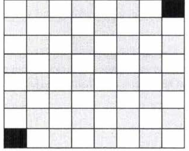
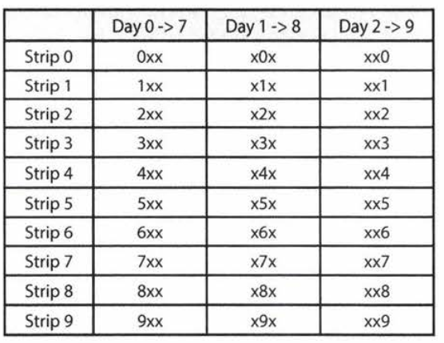
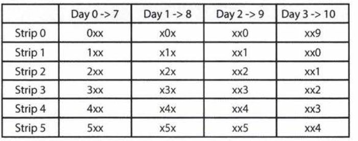
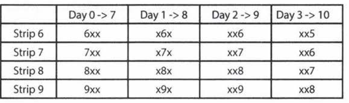

# 6 Math and Logic Puzzles

129

### Prime Numbers

+ Prime factorization: 
  $$
  84=2^{2} * 3^{1} * 5^{0} * 7^{1} * 11^{0} * 13^{0} * 17^{0} * \ldots
  $$

+ Divisibility: `x\y or mod(y,x)=0` if all primes in `x`'s factorization must be in `y`'s prime factorization
  $$
  \begin{aligned}
  &\text { Let } x=2^{j0} * 3^{j 1} * 5^{j 2} * 7^{3} * 11^{j 4} * \cdots\\
  &\text { Let } y=2^{k0} * 3^{k 1} * 5^{k 2} * 7^{k 3} * 11^{k 4} * \ldots\\
  &\text { If } x \backslash y, \text { then for all } i, j_i<=k_i
  \end{aligned}
  $$

  + Greates common divisor: $gcd(x,y) = \Pi_i p_i^{\min(j_i, k_i)}$
  + Least common multiple: $lcm(x,y) = \Pi_i p_i^{\max(j_i, k_i)}$
  + $gcd(x,y)*lcm(x,y)=\Pi_i p_i^{\min(j_i, k_i)+\max(j_i, k_i)}=\Pi_i p_i^{j_i+k_i}=x*y$

+  Check primality

  ```java
  //Naive method
  boolean prime(int n){
      if(n<2) return false;
      for(int i = 2, i<n; i++){
          if(n%i==0){
              return false;
          }
      }
      return true;
  }
  ```

  + Improvement: every non-prime number can be written as a*b=n, a>0 wolg. , then only check up to $\sqrt{n}$ is enough. 

    ```java
    //improvement
    //Naive method
    boolean prime(int n){
        if(n<2) return false;
        int sqrt = (int) Math.sqrt(n);
        for(int i = 2, i<sqrt; i++){
            if(n%i==0) return false;
        }
        return true;
    }
    ```

#### The Sieve of Eratosthenes

Generate a list of primes by subsequently delete all numbers divisible by current prime, and get next prime by next undeleted number.

```java
boolean[] sieveOfEratosthenes(int max){
    //can be improved by using only odd numbers in the array
    boolean[] flags = new boolean[max+1];
    int count = 0;
    init(flags); //set all to true
    int prime = 2;
    while(prime<= Math.sqrt(max)){
        delete(flags, prime);
        prime = getNextPrime(flags, prime);
    }
    return flags;
}
void delete(boolean[] flags, int prime){
    for(int i = prime*prime; i<flags.length; i+=prime){
        //start at prime*prime because n*prime, n<prime is already deleted
        flags[i] = false;
    }
}
int getNextPrime(boolean[] flags, int prime){
    int next = prime+1;
    while(next<flags.length&& !flags[next]) next++;
    return next;
}
```

### Probability

$$
P(A \and B) = P(B|A)P(A)\\
P(A|B) = \frac{P(B|A)P(A)}{P(B)}\\
P(A \or B) = P(A)+P(B)-P(A \and B)\\
P(A\and B)=P(A)P(B) \text{ if A and B are independent}\\
P(A\and B)=0 \Leftrightarrow P(A\or B) = P(A)+P(B) \text{ mutually exclusive}\\
$$


### Problem solving process

+ Write down rules/ patterns

  Example: You have two ropes, and each takes exactly one hour to burn. How would you use them to time exactly 15 minutes? Note that the ropes are of uneven  densities, so half the rope length-wise does not necessarily take half an hour to burn.

  + Rules
    + We can time 1hr
    + If we can light from both ends, we can time 30 min
    + 1hr - 30min = 30min
    + If we at the same time, light first rope on both ends, second rope on one end, then we have 30 mins left on second rope when first rope is done. Then light the other end of the second rope, it will take 15 mins to finish.

+ Worse case minimization
  Example: 9 balls, eight same weight, one is heavier, find heavy ball in 2 uses of a scale

  + 3+3+3, then 1+1+1

+ Start with reduced problem size/ base case


## Interview Questions

p301

### 6.1 The heavy pill

You have 20 bottles of pills. 19 bottles have 1.0 gram/pill pills, but one has pills of weight 1.1 grams/pill. Given a scale that provides an exact measurement, how would you find the heavy bottle? You can only use the scale once.

+ Only use scale once: must weigh at least 19 bottles once

+ How to distribute the 19 bottles: use the clue of exact measurement

+ Reduce problem size:

  + If have 3 bottles in total, weigh 2 bottles: take 1 pill from first bottle, 2 pills from second bottle, following results:

    | Heavy bottle  | 1    | 2    | 3    |
    | ------------- | ---- | ---- | ---- |
    | Total weights | 2.1  | 2.2  | 2    |

+ Original problem size:

  1 pill from first, 2 pill from second... $\text{bottle_number}=\frac{weight-210}{0.1}$

### 6.2 Basketball

You have a basketball hoop and someone says that you can play one of two games.
Game 1:You get one shot to make the hoop.
Game 2:You get three shots and you have to make two of three shots.
If p is the probability of making a particular shot, for which values of p should you pick one game or the other?
$$
P_1 = p\\
P_2 = P_2(2)+P_2(3) = 3*p^2(1-p)+p^3 = p^2(3-2p)\\
P_1 < P_2 \Leftrightarrow p < p^2(3-2p) \Leftrightarrow p < 0.5
$$

### 6.3 Dominos

There is an 8x8 chessboard in which two diagonally opposite corners have been cut off. You are given 31 dominos, and a single domino can cover exactly two squares. Can you use the 31 dominos to cover the entire board? Prove your answer (by providing an example or showing why it's impossible).


All black-white should be alternate, the two blocked squares are of the same color, then the total number of blacks is not equal to white, so not possible.


### 6.4 Ants on a triangle

There are three ants on different vertices of a triangle.What is the probability of
collision (between any two or all of them) if they start walking on the sides of the triangle? Assume that each ant randomly picks a direction, with either direction being equally likely to be chosen, and that they walk at the same speed.
Similarly, find the probability of collision with n ants on an n-vertex polygon.

If one or more ants have different direction with some other ants, then they must collide. So only case when not colliding is when they all walk in the same direction. That is, once one ant picks a direction, all following ants should pick that direction: $P = \frac{1}{2^{n-1}}$, therefore, probability of collision is $1-P = 1-\frac{1}{2^{n-1}}$

### 6.5 Jugs of Water

You have a five-quart jug, a three-quart jug, and an unlimited supply of water (but
no measuring cups) How would you come up with exactly four quarts of water? Note that the jugs are oddly shaped, such that filling up exactly "half" of the jug would be impossible

+ We can get 2: 5-3 = 2
+ We can have -1: 2-(-1) = 3
+ We can have 4: 5-1 = 4

### 6.6 Blue-Eyed Island

A bunch of people are living on an island, when a visitor comes with a strange
order: all blue-eyed people must leave the island as soon as possible. There will be a flight out at 8:00pm every evening. Each person can see everyone else's eye color, but they do not know their own (nor is anyone allowed to tell them). Additionally, they do not know how many people have blue eyes, although they do know that at least one person does. How many days will it take the blue-eyed people to leave?

Reduce problem size (base cases) number of blue-eyes people = c, and A to represent the case where people have blue eyes

1. c=1: that person see no A, then he is A, leaves on day 1.
2. c=2: If no one leaves on day 1, then must have more than 1 A. If they see one other A, then have 2 A's , then leave on day 2.
3. c>2: in the same way, they will all leave on c days.

### 6.7 The Apocalypse

In the new post-apocalyptic world, the world queen is desperately concerned
about the birth rate. Therefore, she decrees that all families should ensure that they have one girl or else they face massive fines. If all families abide by this policy-that is, they have continue to have children until they have one girl, at which point they immediately stop-what will the gender ratio of the new generation be? (Assume that the odds of someone having a boy or a girl on any given pregnancy is equal.) 
$$
n=\text{number of boys}\\
p(n) = \frac{1}{2^{n+1}}\\
P_{tot} = \sum_n p(n) = 1\\
E(1) = \sum_n p(n) = 1\\
E(n) = \sum_n \frac{n}{2^{n+1}}\\
\sum_{n=0}^{\infty} x^{n}=\frac{1}{1-x}\\
\text{take derivative on both sides}\\
\sum nx^{n-1} = \frac{1}{(1-x)^2}\\
\text{Multiply by x on both sides}\\
\sum nx^{n} = \frac{x}{(1-x)^2}\\
(x = 1/2)  = 2\\
E(n) = \sum_n \frac{n}{2^{n+1}} = 2/2 = 1\\
Ratio = 1
$$

### 6.8 The Egg Drop problem

There is a building of 100 floors. If an egg drops from the Nth floor or above, it will break. If it's dropped from any floor below, it will not break. You're given two eggs. Find N, while minimizing the number of drops for the worst case.

+ Brute force: drop from first step by step to top
+ Worst case balancing: With load balanced system, drops(1) + drops(2) is always the same, then every time increase drops(1) by 1, need to decrease drops(2) by 1.
  $x+(x-1) + (x-2)+..+1 = 100, x=14$ 


### 6.9 100 Lockers

There are 100 closed lockers in a hallway. A man begins by opening all 100 lockers.
Next, he closes every second locker. Then, on his third pass, he toggles every third locker (closes it if it is open or opens it if it is closed). This process continues for 100 passes, such that on each pass i, the man toggles every i th locker. After his 100th pass in the hallway, in which he toggles only locker #100, how many lockers are open?

+ Reduce problem size:

  |      | 1    | 2    | 3    | 4    | 5    | 6    | 7    | 8    | 9    | 10   |
  | ---- | ---- | ---- | ---- | ---- | ---- | ---- | ---- | ---- | ---- | ---- |
  | 1    | o    | o    | o    | o    | o    | o    | o    | o    | o    | o    |
  | 2    | o    |      | o    |      | o    |      | o    |      | o    |      |
  | 3    | o    |      |      |      | o    | o    | o    |      |      |      |
  | 4    | o    |      |      | o    | o    | o    | o    | o    |      |      |
  | 5    | o    |      |      | o    |      | o    | o    | o    |      | o    |
  | 6    | o    |      |      | o    |      |      | o    | o    |      | o    |
  | 7    | o    |      |      | o    |      |      |      | o    |      | o    |
  | 8    | o    |      |      | o    |      |      |      |      |      | o    |
  | 9    | o    |      |      | o    |      |      |      |      | o    | o    |
  | 10   | o    |      |      | o    |      |      |      |      | o    |      |

+ A door n is toggled for each factor of n including 1, totally c times.

+ If c is odd, then door is open

+ c is odd if is a perfect square, because each factor has its complement unless it is k*k where k is only counted once

+ Number of perfect square is sqrt(100) = 10


### 6.10 Poison

You have 1000 bottles of soda, and exactly one is poisoned. You have 10 test strips which can be used to detect poison. A single drop of poison will turn the test strip positive permanently. You can put any number of drops on a test strip at once and you can reuse a test strip as many times as you'd like (as long as the results are negative). However, you can only run tests once per day and it takes seven days to return a result. How would you figure out the poisoned bottle in as few days as possible?

+ First approach: 28 days

  | Week           | 1    | 2    | 3    | 4    |
  | -------------- | ---- | ---- | ---- | ---- |
  | num batches    | 10   | 9    | 8    | 7    |
  | bottles/ batch | 100  | 12   | 2    | 1    |

  

+ Second approach: do not do tests all at once, 10 days:
  

  + If on a particular day no new test result, then that strip is already poisoned. Problem when last digit, do not know the new digit is the same as which of the tested two (#383 = # 388). Do one more test 

  

  

+ Use test strip as binary representation

  |      | 0                 | 1                 | 2                 | 3    | 4    | 5    | 6    | 7    | 8    | 9    |
  | ---- | ----------------- | ----------------- | ----------------- | ---- | ---- | ---- | ---- | ---- | ---- | ---- |
  |      | $\frac{n}{2^1}=0$ | $\frac{n}{2^2}=0$ | $\frac{n}{2^3}=0$ | ...  |      |      |      |      |      |      |

  