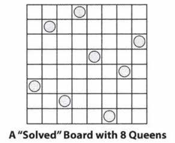

# 8 Recursion and Dynamic Programming

### Approach

+ Bottom-Up: start from simple (base) case, key: build solution of one case based off the previous case
+ Top-down: divide problem for case N into subproblems
+ Half-and-half: divide and merge

Get runtime by drawing out the recursive call tree.

#### Improvements

+ Iterative implementation of recursive algorithms is more space efficient. $O(n) \rightarrow O(1)$

### Dynamic Programming

+ Idea: take recursive algorithm and find the overlapping subproblems (repeated calls), cache the results for future recursive calls
+ Template:
  + `if memorized.getCurrent is True: return memorized.getCurrent`
  + iterate over subproblems:
    + ` subProblemMax = f(subproblem, memorized)`
    + `curmax = max(subproblemMax, curmax)`
  + `memorized.add(someOperation(curmax))`
  + `return curmax`

#### Examples

##### Fibonacci Numbers

+ Recursive: $O(2^n)$, space $O(n)$ 
  + space complexity is no bigger than the depth of recursion tree

```java
int fibonacci(int i){
    if (i==0) return 0;
    if (i==1) return 1;
    return fibonacci(i-1) + fibonacci(i-2)
}
```

+ Top-down Dynamic Programming (memorization): $O(n)$, space $O(n)$
  + space: still need to go down the tree at least once with full depth. A bit lager than $n$ because need to save the memo array.

```java
int fibonacci(int n){
    return fibonacci(n, new int[n+1]);
}
int fibonacci(int i, int[] memo){
    if(i==0||i==1) return o;
    if(memo[i]==0){
        memo[i] = fibonacci(i-1,memo)+fibonacci(i-2, memo);
    }
    return memo[i];
}
```

+ Bottom-up Dynamic Programming (iterative memorization): space is still $O(n)$ because need to save the memo array. 

```java
int fibonacci(int n){
    if (n==0||n==1) return n;
    int[] memo = new int[n];
    memo[0] = 0;
    memo[1] = 1;
    for(int i =2; i<n; i++){
        memo[i] = memo[i-1]+memo[i-2];
    }
    return memo[n-1]+memo[n-2];
}
```

+ Bottom-up DP without memo array: space $O(1)$
  + Only i-1 and i-2 th elements are used in each iteration, no need to save the whole array

```java
int fibonacci(int n){
    if(n==0) return 0;
    int a = 0;
    int b = 1;
    for(int i=2; i<n;i++){
        int c = a+b;
        a = b;
        b = c;
    }
    return a+b;
}
```


p142


## Interview Questions

### 8.1 Triple Step

A child is running up a staircase with n steps and can hop either 1 step, 2 steps, or 3
steps at a time. Implement a method to count how many possible ways the child can run up the stairs.

+ Draw Example

  + 4 steps: 
    + 1111,112,121,13
    + 211,22
    + 31

+ Brute Force

  + Recursion: 
    + Base case: 0: 0; 1: 1; 2: 2; 3: 4 (111,21,12,3)
    + Recursion: f(n) = f(n-1) + f(n-2) + f(n-3)

+ Optimize + Conceptual algorithm walk through

  + Memorize: memo[n] = f(n)
  + Only uses previous 3 numbers: use a,b,c to memorize previous 3 steps

+ Implement + Test

  + ```java
        public int answer(int N) {
            if(N==0) return 0;
            if(N==1) return 1;
            if(N==2) return 2;
            if(N==3) return 4;
            int a = 1;
            int b = 2;
            int c = 4;
            for(int i = 4; i<N; i++){
                int cur = a+b+c;
                a = b;
                b = c;
                c = cur;
            }
            return a+b+c;
        }
    ```

+ Tips

  + If only uses a few previous values, only memorize those in single variables instead of an array
  + If result get too big and overflows, can use BitInteger class or something else to resolve this issue.

### 8.2 Robot in a Grid

Imagine a robot sitting on the upper left corner of grid with r rows and c columns.
The robot can only move in two directions, right and down, but certain cells are "off limits" such that the robot cannot step on them. Design an algorithm to find a path for the robot from the top left to the bottom right.

+ Draw Example

  + | Start | $\rightarrow$ | $\rightarrow$ | $\rightarrow$ |      |
    | ----- | ------------- | ------------- | ------------- | ---- |
    |       |               | x             | $\downarrow$  |      |
    | x     | x             |               | $\downarrow$  |      |
    |       |               |               | $\rightarrow$ | End  |

  + only right and down: (r-1, c-1)

+ Brute Force

  + Recursion: start from i,j = 0,0
    + if i,j = 0,0, return true
    + if $M[i][j] = 0$ blocked: return false 
    + f(i,j)  = f(i+1,j) || f(i,j+1)
  + $O(2^{r+c})$

+ Optimize + Conceptual algorithm walk through

  + memorize $F[i][j]$: value returned by each recursive call $O(rc)$
  + Only uses f(i+1) and f(j+1), only memorize values related to i+1's row and j+1's column
  + Each $F[i][j]$ are just true/ false value, can keep a hashset of Point(row, col) for false points, fast lookup and then no need to take up space of whole array. - may not be more space efficient than the last approach.

+ Implement + Test

  + Answer:

    ```java
    ArrayList<Point> getPath(boolean[][] maze){
        if(maze==null || maze.length==0) return null;
        ArrayList<Point> path = new ArrayList<Point>();
        HashSet<Point> failedPoints = new HashSet<Point>();
        if (getPath(maze, maze.length-1, maze[0].length-1, path, failedPoints)){
            return path;
        }
        return null;
    }
    
    boolean getPath(boolean[][] maze, int row, int col, ArrayList<Point> path, HashSet<Point> failedPoints){
        if(col<0|| row<0||!maze[row][col]){
            return false;
        }
        Point p = new Point(row, col);
        if(failedPoints.contains(p)){return false;}
        boolean isAtOrigin = (row==0) && (col==0);
        if(isAtOrigin || getPath(maze, row, col-1, path, failedPoints)||getPath(maze, row-1, col-1, path, failedPoints)){
            path.add(p);
            return true;
        }
        failedPoints.add(p);
        return false;
    }
    ```

+ Tips

  + Use a HashSet to memorize in DP saves space.
  + If need to memorize trajectory, recursive call is easier to implement than iterative calls.

### 8.3 Magic Index

A magic index in an array A[1. .. n-1] is defined to be an index such that A[ i]=i. Given a sorted array of distinct integers, write a method to find a magic index, if one exists, in array A.
FOLLOW UP
What if the values are not distinct?

+ Draw Example

  + $[-5,-3,0,1,4,5,6]$: 4

+ Brute Force

  + Iterate through array, look for element that matches it

+ Optimize + Conceptual algorithm walk through

  + Binary search, if middle element < index, then magic index must be on right, else on left, if = then is that.
  + Use iteration rather than recursion to save space

+ Implement + Test

  + Distinct Values:

    ```java
        public int answer(int[] x) {
            int start = 0;
            int end = x.length-1;
            while(start<=end){
                System.out.println(start);
                System.out.println(end);
                int mid = (start+end)/2;
                System.out.println(mid);
                if(x[mid]==mid) return mid;
                if(x[mid]>mid){
                    end = mid-1;
                }else{
                    start = mid+1;
                }
            }
            return -1;
        }
    ```

    

+ Draw Example
  + $[-5,4,4,4,4,4,6]$: 4
  + We cannot conclude if middle is larger than index
+ Brute Force: iterate $O(n)$
+ Optimize + Conceptual algorithm walk through: 
  
  + recurse on both left and right, faster than iteration but still $O(n)$
+ Tips
  
  + To use iteration for divide and conquer, use index start/end/mid to shrink the current region 

### 8.4 Power Set

Write a method to return all subsets of a set.

+ Draw Example

  + (a,b,c): (),(a),(b),(c), (a,b), (a,c),(b,c), (a,b,c)
  + Total $2^n$ sets

+ Brute Force

  + Recursion: P(n) = P(n-1) + {P(n-1) + $a_n$}

+ Optimize + Conceptual algorithm walk through

  + Use set[2^n], convert each index to binary number, the index of binary represents whether an element is in the subset. $O(n2^n)$

+ Implement + Test

  + ```java
    ArrayList<ArrayList<Integer>> geSubsets (ArrayList<Integer> set){
        ArrayList<ArrayList<Integer>> allsubsets = new ArrayList<ArrayList<Integer>>();
        int max = 1 << set.size(); //compute 2^n
        for (int k = 0; k<max; k++){
            ArrayList<Integer> subset = convertIntToSet(k, set);
            allsubsets.add(subset);
        }
        return allsubsets;        
    }
    
    ArrayList<Integer> convertIntToSet(int x, ArrayList<Integer> set){
        ArrayList<Integer> subset = new ArrayList<Integer>();
        int index = 0;
        for(int k = x, k>0; k>>=1){
            if((k&1)==1){
                subset.add(set.get(index));
            }
            index++;
        }
        return subset;
    }
    ```

  + 

+ Tips

  + When encounter $2^n$ problems, use binary number

### 8.5 Recursive Multiply

Write a recursive function to multiply two positive integers without using the * operator (or / operator). You can use addition, subtraction, and bit shifting, but you should minimize the number of those operations.

+ Draw Example

  + 2*3 = 2+2+2 = 3+3
  + 4*8 = 8+8+8+8 = (8+8) + (8+8)

+ Brute Force

+ Optimize + Conceptual algorithm walk through

  + Find max of the 2 numbers, repeat that number (m) the other number(n) of times
  + If n is even, calculate $n/2*m + n/2*m$ , else calculate $m + n/2*m + n/2*m$

+ Implement + Test

  + ```java
        public int multiply(int a, int b) {
            if(a==0||b==0) return 0;
            if(a==1||b==1) return a+b-1;
            int m;
            int n;
            int result = 0;
            if(a>b){
                m = a;
                n = b;
            }else{
                m = b;
                n = a;
            }
            if(n%2==1){
                result +=m;
                n-=1;
            }
            int half = multiply(m,n/2);
            result = result + half+half;
            return result;
        }
    ```

  + 

### 8.6 Towers of Hanoi

In the classic problem of the Towers of Hanoi, you have 3 towers and N disks of
different sizes which can slide onto any tower. The puzzle starts with disks sorted in ascending order of size from top to bottom (Le., each disk sits on top of an even larger one). You have the following constraints:
(1) Only one disk can be moved at a time.
(2) A disk is slid off the top of one tower onto another tower.
(3) A disk cannot be placed on top of a smaller disk.
Write a program to move the disks from the first tower to the last using Stacks

+ Draw Example

  + N = 1: a-> c
  + N = 2: a -> b; a-> c; b->c
  + N = 3: 12-> b; 3->c; 12->c
  + N = 4: 123->b; 4->c; 123->c

+ Implement + Test

  ```java
      void answer(int N) {
          move(N, 1,3,2);
      }
      void move(int n, int start, int target, int buffer){
          if(n<=0) return;
          move(n-1, start, buffer, target);
          moveTop(start, target);
          move(n-1, buffer, target, start);
      }
      void moveTop(int start, int target){
          System.out.println("Moved from "+start+" to "+target);
      }
  ```


### 8.7 Permutations without Dups

Write a method to compute all permutations of a string of unique characters.

+ Draw Example

  + {1,2,3}: 123,132,231,213,312,321

+ Brute Force

  + Start with 1 or 2 or 3, permute the remaining 2 numbers. Recurse with n-1 numbers

+ Implement + Test

  ```java
      ArrayList<String> getPerms(String s)
      {
          int len = s.length();
          ArrayList<String> result = new ArrayList<String>();
          if(len==0) {
              result.add("");
              return result;
          }
          for(int i=0; i<len;i++){
              ArrayList<String> remainders = getPerms(s.substring(0,i) + s.substring(i+1,len));
              for(String remainder: remainders){
                  result.add(s.charAt(i)+remainder);
              }
          }
          return result;
      }
  ```

+ Tips

  + append to ArrayList: `list.add(s)`
  + get i'th char of a string: `s.charAt(i)`
  + when need to expand a list of results by more than one result, create a list of current result and append to that first, then append results from recursive calls to that result


### 8.8 Permutations with Duplicates

Write a method to compute all permutations of a string whose characters are not necessarily unique. The list of permutations should not have duplicates.

+ Draw Example

  + {1,2,2}: 122,212,221

+ Optimize + Conceptual algorithm walk through

  + count each char into a hashtable
  + Only iterate through the keys each recursion
  + Goes until all counts are 0 

+ Implement + Test

  ```java
      HashMap<Character, Integer> buildFreqTable(String s){
          HashMap<Character, Integer> map = new HashMap<Character, Integer>();
          for(char c: s.toCharArray()){
              if(!map.containsKey(c)){
                  map.put(c,0);
              }
              map.put(c,map.get(c)+1);
          }
          return map;
      }
      void printPerms(HashMap<Character, Integer> map, String prefix, int remaining, ArrayList<String> result){
          if(remaining==0){
              result.add(prefix);
              return;
          }
          for(Character c: map.keySet()){
              int count = map.get(c);
              if(count>0){
                  map.put(c, count-1);
                  printPerms(map, prefix+c, remaining-1, result);
                  map.put(c, count);
              }
          }
      }
  ```

  

+ Tips

  + Hashmap: `map.put(key, value)`, `map.keySet()`, `if(map.containsKey(key))`, `value=map.get(key)`
  + recursion call based on iterating over parts of a string:
    `f(prefix, remaining, ArrayList<String> result)`


### 8.9 Parens

 Implement an algorithm to print all valid (Le., properly opened and closed) combinations of n pairs of parentheses.

+ Draw Example
  + 1: ()
  + 2: ()(), (())
  + 3:  ((())),(())(),()(()),(()()),()()(), 

+ Brute Force

  + for each combination in n-1, add one parenthesis in every existing parenthesis, and one outside. Need to watch for duplicates (use HashSet for $O(1)$ insertion time)

+ Optimize + Conceptual algorithm walk through

  + Avoid going through duplicates:
    + Keep track of num left paren and num right paren
    + Whenever have left parenthesis left, can always add a left parenthesis
    + When have right parenthesis left, can insert if number of right is more than left
  + Mathematical, number of ways to arrange n pairs =  $\frac{1}{n+1}\left(\begin{array}{c}
    2 n \\
    n
    \end{array}\right)$, equivalent to the number of [Dyck words](https://en.wikipedia.org/wiki/Dyck_language), which can be counted with combinatorics and will be equal to [Catalan number](https://en.wikipedia.org/wiki/Catalan_number)
  + 

+ Implement + Test

  + Simple recursion:

    ```java
        HashSet<String> addParens(int count){
            HashSet<String> list = new HashSet<String>();
            if(count==0) {
                list.add("");
                return list;
            }
            for(String s: addParens(count-1)){
                list.add("()"+s);
                for(int i=0; i<s.length();i++){
                    if(s.charAt(i)=='('){
                        list.add(s.substring(0,i+1)+"()"+s.substring(i+1));
                    }
                }
            }
            return list;
        }
    ```

  + Counting parens:

    ```java
    void addParen(ArrayList<String> list, int leftRem, int rightRem, char[] str, int index){
        if(leftRem<0||rightREM<leftRem) return;//invalid
        if(leftRem==0 && rightRem==0){
            list.add(String.copyValueOf(str));//prevent changing original string
        }else{
            //two cases: add left or add right parens
            str[index] = '(';
            addParen(list, leftRem-1, rightRem, str, index+1);
            str[index] = ')';
            addParen(list, leftRem, rightRem-1, str, index+1);
        }
    }
    ```

    

+ Tips

  + Use HashSet<> when need to avoid duplicates

    + `for(String s: set){...}`
    + `set.add(...)`

  + Traverse over string: 

    ```java
    for(int i=0; i<s.length();i++){s.charAt(i)}
    ```

  + copy string value: `String.copyValueOf(str)`

  + Condition for balanced parenthesis of same type: 

    + Num left = Num right
    + At any index, count parenthesis at or before that index: Num left>=Num right


### 8.10 Paint Fill

Implement the "paint fill" function that one might see on many image editing programs. That is, given a screen (represented by a two-dimensional array of colors), a point, and a new color, fill in the surrounding area until the color changes from the original color.

+ Draw Example

  + For a single point, need to go 4 directions: (r-1,c); (r+1,c); (r, c-1);(r, c+1)

+ Optimize + Conceptual algorithm walk through

  + Stop criteria: $screen[r][c] = newColor$

+ Implement + Test

  ```java
  enum Color{ Black, White, Red, Yellow, Green }
  boolean fillPaint(Color[][] screen, int r, int c, Color newColor, Color oldColor){
      if(screen[r][c] == newColor) return false;
      if(r<0||r>=screen.length||c<0||c>=screen[0].length) return false;
      if(screen[r][c]==oldColor){
          screen[r][c] = newColor;
          fillPaint(screen,r-1,c,newColor, oldCOlor);
          fillPaint(screen,r+1,c,newColor, oldCOlor);
          fillPaint(screen,r,c-1,newColor, oldCOlor);
          fillPaint(screen,r,c+1,newColor, oldCOlor);
      }
      return true;
  }
  ```

  

+ Tips

  + `M.length, M[0].length` to get dimension of arrays 
  + Recurse around a pixel:  go 4 directions: `(r-1,c); (r+1,c); (r, c-1);(r, c+1)`


### 8.11 Coins

Given an infinite number of quarters (25 cents), dimes (10 cents), nickels (5 cents), and pennies (1 cent), write code to calculate the number of ways of representing n cents.

+ Draw Example

  + Only have 10,5,1 cents
  + represent 10: $(10),(5,5),(5,1*5), (1*10)$
  + 8: $(5,1*3), (1*8)$
  + 4: $(1*4)$

+ Brute Force

  + For N cents, possible senarios:
    + $(25*N/25,..), (24*N/25,..)..(0*N/25,..)$
    + '..' are given by:
    + $coins(N-25*N/25,[10,5,1]), coins(N-24*N/25,[10,5,1])...coins(N,[10,5,1]),$

+ Optimize + Conceptual algorithm walk through

  + To prevent counting repetitively, store in a map `int[][] map = {[N+1][num_types]: num_ways}`

+ Implement + Test

  ```java
      int make_change(int n) {
          int[] coins = {25,10,5,1};
          int[][] map = new int[n+1][coins.length]; //n+1: n=25,24..0
          return make_change(n,coins,0,map);
      }
      int make_change(int amount, int[] coins, int index, int[][] map){
          if(map[amount][index]>0) return map[amount][index];
          if(index>= coins.length-1) return 1;//one combination if only one type of coins
          int coinValue = coins[index];
          int combs = 0;
          for(int i = 0; i*coinValue<=amount; i++){
              int amountRemaining = amount-i*coinValue;
              combs += make_change(amountRemaining,coins,index+1, map);
          }
          map[amount][index] = combs;
          return combs;
      }
  ```

  

+ Tips

  + when need to make map with 2 keys, use 2D array. (can use linked hashtable instead, less space, but less clarity in implementation)
  + Store parameters of recursive call directly as keys
  + rather than shrinking size of list during recursive call, pass full list and current index through recursive call, and increment/ decrement index rather than changing list.
  + Make a new method with same name and pass memorization as parameter to remember things.


### 8.12 Eight Queens

Write an algorithm to print all ways of arranging eight queens on an 8x8 chess board so that none of them share the same row, column, **or diagonal**. In this case, "diagonal" means all diagonals, not just the two that bisect the board

+ Draw Example
  

+ Brute Force

  + Recursion: put one on first row, then solve 7 queens on $7*7$ board minus the diagonal problem. Base case: 1 queen on $1*1$ board. If no such vacancy available, then no solution.
  + Block off diagonals can take <=8 calls for each placement. And pass a 8*8 'available' matrix for each call, space consuming

+ Optimize + Conceptual algorithm walk through

  + Implement an 'checkValid()' method to check whether is valid: still need to compare <=8 times for each placement. Same runtime. Only need to pass previous placement.

+ Implement + Test

  ```java
      int GRID_SIZE = 8;
      void placeQueens(int row, Integer[] columns, ArrayList<Integer[]> results){
          if(row==GRID_SIZE){
              results.add(columns.clone());
          }else {
              for(int col = 0; col< GRID_SIZE; col++){
                  if(checkValid(columns, row, col)){
                      columns[row] = col;
                      placeQueens(row+1, columns, results);
                  }
              }
          }
      }
      boolean checkValid(Integer[] columns, int curRow, int curCol){
          for(int preRow = 0; preRow<curRow; preRow++){
              int preCol = columns[preRow];
              if(curCol==preCol) return false;
              int colDistance = Math.abs(preCol-curCol);
              int rowDistance = curRow-preRow;
              if(colDistance==rowDistance) return false;
          }
          return true;
      }
  ```

  

+ Tips

  + For placement on grid problem, use a checkValid() method to wrap the logic of validity.


### 8.13 Stack of Boxes

You have a stack of n boxes, with widths $w_i$, heights $h_i$ and depths $d_i$ The boxes
cannot be rotated and can only be stacked on top of one another if **each box in the stack is strictly larger than the box above it in width, height, and depth**. Implement a method to compute the **height of the tallest possible stack**. The height of a stack is the sum of the heights of each box.

+ Draw Example

  + [(5,5,4),(4,4,3),(2,3,2),(1,1,1)] (4,5,3): 4

+ Brute Force

  + given `checkValid(Integer[] prev, Integer[] cur)`
    + iterate over remaining boxes and if valid then increment height and recurse. Base case: no valid box remains `findTallest(ArrayList<Integer[]> remBoxes, Integer[] prev, int height)`

+ Optimize + Conceptual algorithm walk through

  + Sort the box in any dimension ie. width, then when we recurse, we only start from boxes after the current one in sorted list. `sortedList = sort(Boxes)`, `findTallest(int prevIdx, int height)`
  + Memorize the best solution starting from box[i] 

+ Implement + Test

  ```java
  class Box{
      int width;
      int height;
      int depth;
      Box(int width, int height, int depth){
          this.width =width;
          this.height = height;
          this.depth = depth;
      }
  
      public boolean checkValidTop(Box top){
          if(this.width<=top.width) return false;
          if(this.height<=top.height) return false;
          if(this.depth<=top.depth) return false;
          return true;
      }
  
  }
  
  class BoxComparator implements Comparator<Box> {
  
      @Override
      public int compare(Box o1, Box o2) {
          return o2.height-o1.height;
      }
  }
  
  
  public class StackofBoxes_8_13 {
  
      void sortBoxes(ArrayList<Box> boxes){
          boxes.sort(new BoxComparator());
          return;
      }
      int findTallest(ArrayList<Box> boxes){
          sortBoxes(boxes);
          int maxHeight = 0;
          int[] heightList = new int[boxes.size()];
          for(int i = 0; i < boxes.size(); i++){
              int height = findTallest(boxes, i, heightList);
              maxHeight = Math.max(maxHeight, height);
          }
          return maxHeight;
      }
      int findTallest(ArrayList<Box> boxes, int prevIdx, int[] heightList){
          if(prevIdx<boxes.size() && heightList[prevIdx]>0) return heightList[prevIdx];//use memorized value
          Box prevBox = boxes.get(prevIdx);
          int maxHeight = 0;
          //the following call counts for basecase (maxHeight=0)
          for(int curIdx=prevIdx+1; curIdx<boxes.size(); curIdx++){
              if(prevBox.checkValidTop(boxes.get(curIdx))){
                  int height = findTallest(boxes, curIdx, heightList);
                  maxHeight = Math.max(height, maxHeight);
              }
          }
          maxHeight += prevBox.height;
          heightList[prevIdx] = maxHeight;
          return maxHeight;
      }
      public void test(){
      }
  }
  ```

  

+ Tips

  + In recursion to find max, in each call:
    + `if memorized.getCurrent is True: return memorized.getCurrent`
    + iterate over subproblems:
      + ` subProblemMax = f(subproblem, memorized)`
      + `curmax = max(subproblemMax, curmax)`
    + `memorized.add(someOperation(curmax))`
    + `return curmax`
  + Memorized list is global
  + Return value of recursion function is always the result we want
  + Always check first if current stated is in memory (before base case)

### 8.14 Boolean Evaluation

Given a boolean expression consisting of the symbols e (false), 1 (true), &
(AND), I (OR), and A (XOR), and a desired boolean result value result, implement a function to count the number of ways of parenthesizing the expression such that it evaluates to result .The expression should be fully parenthesized (e.g (0)^(1)   )  but not extraneously (e.g., ( ( (0))^(1))    ).

+ Draw Example

  + countEval("1^0|0|1", false) -> 2
    countEval("0&0&0&1^1|0", true) - > 10

+ Brute Force

  + 1^0|0|1 -> 0:

    + 1^(0|0|1):   (0|0|1)->1
      + 0|(0|1)  = 0|1 =1, +1
      + (0|0)|1 = 0|1 = 1, +1
    + (1^0) |(0|1) = 1|1 = 1 , not valid
    + (1^0|0)|1 = 1, not valid

  + 0&0&0&1^1|0 -> 1

    + 0&(0&0&1^1|0) = 0, not valid
    + (0&0)&(0&1^1|0) = 0, not valid
    + (0&0&0)&(1^1|0) = 0, not valid
    + (0&0&0&1)^(1|0)  = 0 ^ 1 = 1: (0&0&0&1) -> 0:
      + (0)&0&0&1: 0&0&1->0 or 1
        + (0) &(0&1), +1
        + (0&1)&(1), +1
      + (0&0)&(0&1):  +1
      + (0&0&0)&1: 0&0&0->0 
        + (0) &(0&0), +1
        + (0&0)&(0), +1

    + (0&0&0&1^1)|(0)  = 0 ^ 0: (0&0&0&1^1) -> 0:
      + 0&(0&0&1^1) -> 0: 0&0&1^1-> 0 or 1:
        +  0&(0&1^1) -> 0 or 1
        + .....

  + Base case: 

    + if s.length()<=1 (single boolean): 
      + if s==target: return 1
      + else: return 0

  + Recursion

    + (s.length() is always odd, and even indices are booleans, odd indices are operator)
    + counts = 0
    + for i in odd_indices: 
      + if operator = '&', target = 1:
        + counts+= countEval(left, 1)* countEval(right, 1)
      + if operator = '&', target = 0:
        + counts+= countEval(left, 0)* countEval(right, 1)
        + counts+= countEval(left, 1)* countEval(right, 0)
        + counts+= countEval(left, 0)* countEval(right, 0)
      + if operator = '|', target = 1:
        + counts+= countEval(left, 1)* countEval(right, 1)
        + counts+= countEval(left, 0)* countEval(right, 1)
        + counts+= countEval(left, 1)* countEval(right, 0)
      + if operator = '|', target = 0:
        + counts+= countEval(left, 0)* countEval(right, 0)
      + if operator = '^', target = 1:
        + counts+= countEval(left, 0)* countEval(right, 1)
        + counts+= countEval(left, 1)* countEval(right, 0)
      + if operator = '^', target = 0:
        + counts+= countEval(left, 1)* countEval(right, 1)
        + counts+= countEval(left, 0)* countEval(right, 0)
    + return counts

+ Optimize + Conceptual algorithm walk through

  + Memorize countEval(expression, target) in map: {expression: [true counts, false counts]}
  + Add to the beginning of the recursion. If in memo, return memo[s]. in memo: memo.get(s)[target]>=0
  + For an expression of boolean length of n, the total counts is fixed: Catalan numbers for n operators: $C_{n}=\frac{(2 n) !}{(n+1) ! n !}$
  + Then anytime we add to the expression for one type of counts (either true or false), we can fill in the other type by $C_n - foundCounts$

+ Implement + Test

  ```java
      HashMap<String, int[]> memo = new HashMap<String, int[]>();
      boolean evalEquals(String eval, Boolean target){
          if(eval.equals("1")) return target;
          return !target;
      }
      static int fact(int i) {
          if(i <= 1) {
              return 1;
          }
          return i * fact(i - 1);
      }
      int catalan(int n){
          return fact(2*n)/fact(n+1)/fact(n);
      }
  
      int countEval(String eval, Boolean target){
          int intTarget = target ? 1 : 0;
          if(memo.containsKey(eval) && memo.get(eval)[intTarget]>=0) return memo.get(eval)[intTarget];
          if(eval.length()<=1) return evalEquals(eval, target) ? 1: 0;
          int counts = 0;
          int length = eval.length();
          for(int i=1; i<length; i+=2){
              char operator = eval.charAt(i);
              String left = eval.substring(0, i);
              String right = eval.substring(i+1);
              if(operator=='&' && target){
                  counts+=countEval(left, true)*countEval(right,true);
              }
              else if(operator=='&'){
                  counts+=countEval(left, true)*countEval(right,false);
                  counts+=countEval(left, false)*countEval(right,true);
                  counts+=countEval(left, false)*countEval(right,false);
              }
              else if(operator=='|' && target){
                  counts+=countEval(left, true)*countEval(right,true);
                  counts+=countEval(left, true)*countEval(right,false);
                  counts+=countEval(left, false)*countEval(right,true);
              }
              else if(operator=='|'){
                  counts+=countEval(left, false)*countEval(right,false);
              }
              else if(operator=='^' && target){
                  counts+=countEval(left, true)*countEval(right,false);
                  counts+=countEval(left, false)*countEval(right,true);
              }
              else if(operator=='^'){
                  counts+=countEval(left, true)*countEval(right,true);
                  counts+=countEval(left, false)*countEval(right,false);
              }
          }
          int[] curCounts = new int[2];
          curCounts[intTarget] = counts;
          curCounts[1-intTarget] = catalan(length/2) -counts;
          memo.put(eval, curCounts);
          return counts;
      }
  ```

  

+ Tips

  + s.substring(start, end): include start not include end

  + number of ways to parenthesize:  Catalan numbers for n operators: $C_{n}=\frac{(2 n) !}{(n+1) ! n !}$

  + There is no factorial function in Java, implement on our own:

    ```java
    static int fact(int i) {
        if(i <= 1) return 1;
        return i * fact(i - 1);
    }
    ```

    