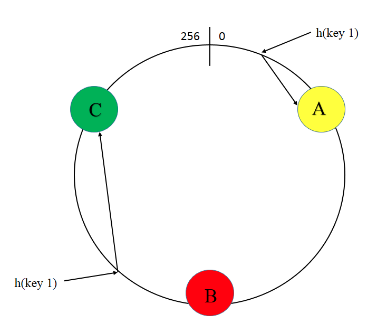
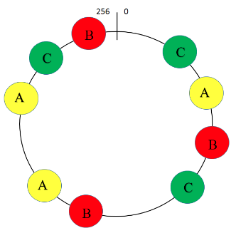
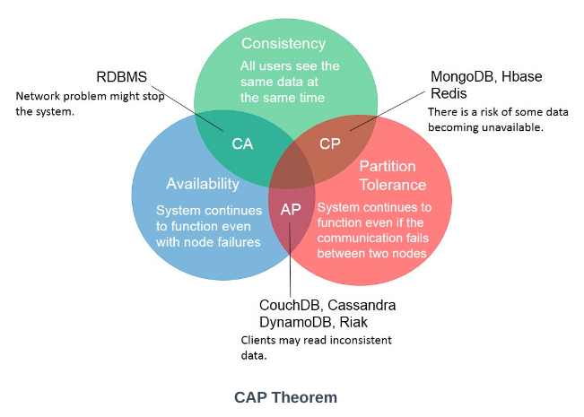
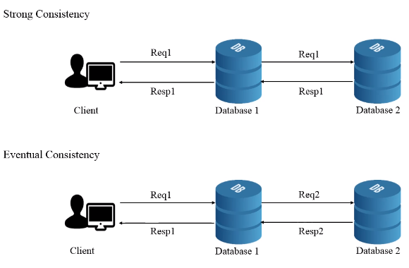
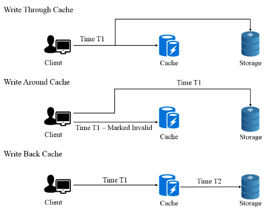
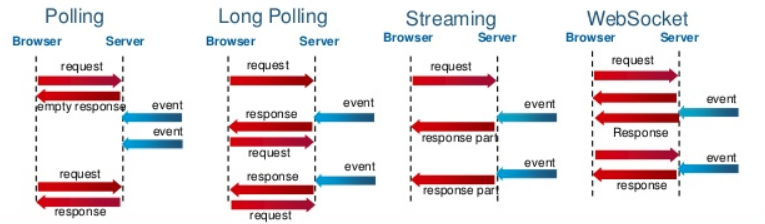

# 9 System Design

### Handling the questions

+ Communicate
+ Go broad first
+ Use whiteboard
+ Acknowledge interviewer concerns
+ Be careful about assumptions, and write down assumptions explicitly
+ Estimate when necessary
+ Drive

### Design

+ Scope the problem: 
  + major features and use cases (who, how)
  + constraints: 
    + traffic and data handling
    + frequency/ type of requests/ write/ read
    + special system requirements: multi-threading
+ Make assumptions: data size, number of users, frequency of use, allowance of time delay
+ Draw major components: with diagram. front-end server/ back-end data store/ server that crawl the Internet for data/ server that process analytics
+ Identify key issues: save time of access for frequently used data
+ Redesign for the key issues: be open about limitations

## Key Concepts

[Reference](https://completedesigninterviewcourse.com/system-design-concepts-components/)

### Scaling

+ Horizontal/ vertical scaling: 
  + |                  | Horizontal Scaling     | Vertical Scaling          |
    | ---------------- | ---------------------- | ------------------------- |
    | Method           | Add additional systems | Upgrading existing system |
    | Load balancer    | Need                   | Not necessary             |
    | System failures  | resilient              | single point of failures  |
    | Data consistency | Inconsistent           | consistent                |
    | scaling          | scales well            | has hardware limit        |

    

+ **Load Balancer:** distribute incoming traffic across servers/ databases. 

  + Hardware load balancer: expensive, effective
  + Software load balancer: cheap, less effective
  + Multiple load balancer to avoid single point of failure: active-active mode/ active-passive mode 
  + Load balancing algorithms: Round Robin, Least Loaded, Session Based, Hashing (consistent hashing)
    + Consistent hashing: 
      + avoid the need to redistribute all keys when changing number of servers. Normally need to recalculate all keys, but here by assign to next available node, only Nkeys/Nservers on average
        
      + avoid imbalanced distribution of keys across servers by adding ghost nodes on hashing ring
        

### Storage

+ **Object Store**: manage data as objects instead of file hierarchy

+ **RAID**: Redundant array of independent disks , add redundant drives to protect data in failures. 

  + Key: save space, reliability during failure, prevent over frequent access to same region

  + RAID levels: 

    | Levels | Method                           | Common Usage                         | Pros                   | Cons                       |      |
    | ------ | -------------------------------- | ------------------------------------ | ---------------------- | -------------------------- | ---- |
    | 0      | Striping                         | Heavy Read                           | Speed                  | Failure                    |      |
    | 1      | Mirroring                        | Standard App Services                | Fault tolerance, read  | Write, space               |      |
    | 5      | Striping with distributed parity | Normal file storage and app services | Speed, fault tolerance | Write, space               |      |
    | 6      | Striping with double parity      | Large file storage and app           | Fault tolearance, read | Write, space               |      |
    | 10     | Combining striping and mirroring | Highly utilized database servers     | Write, fault tolerance | Space, limited scalability |      |
    | JBOD   | Spanning                         | Increase Capacity                    |                        |                            |      |

    

#### Database

+ 3 requirements of a distributed system: (**CAP theorem**: only can achieve 2 of 3)
  + Consistency: same data between nodes
  + Availability: no single point of failure
  + Partition tolerant: function in spite of network partition (loss connection between servers)
    
+ ACID properties: atomicity, consistency, isolation, durability
+ Database Denormalization and NoSQL: 
  + Avoid: Joins in relational database, can be slow for large system.
  + Denormalization: add redundant (repeating) information to speed up reads
  + NoSQL:  does not support joins
+ Consistancy:
  
+ Database replication: architectures:
  + Single-leader architecture
  + Multi-leader architecture
  + No-leader architecture
+ Database partitioning (**sharding**): split data across machines
  + Factors to consider: data size, performance, latency, cost
  + Types
    + Vertical: by feature, issue: large feature cannot fit in one machine, needs to be partitioned further
    + Key-based (hash-based): `mod(key,n)`, issue: number of servers is fixed
    + Consistent hashing
    + Directory-based: maintain a lookup table. issue: table can give failure, accessing table impacts performance

#### Caching

+ Data ( query & results, or object) stored in fast memory (RAM) for fast access
+ Try to keep 20% data in cache
+ Cache Invalidation:
  
+ Cache Eviction:
  + Least Recently Used (LRU)
  + Most Recently Used (MRU)
  + First In First Out (FIFO)
  + Last In First Out (LIFO)
  + Least Frequently Used (LFU)
  + Random Replacement (RR)
+ Use multiple (distributed) cache to avoid single point of failure


#### NoSQL

+ Key-value store: Redis, Amazon’s Dynamo and Voldemort.
+ Column oriented database: all rows of one column is stored together, fast retrieval of one value from the column. Cassandra and HBase.
+ Document-based: can be expressed in json format. MongoDB and CouchDB.
+ Graph-based: The nodes can be entities and the edges can be relationships. Neo4j.

### Servers

+ Web Servers: for web requests.
  + HTML documents, images, CSS stylesheets, and JavaScript files.
+ Application servers:  business logic of the system, both hardware and software environments.

### Architectural patterns

+ Monolithic: single component
+ Layered
+ SOA (Service oriented architecture)
+ Microservice architecture
  + Features of microservice:
    + Highly maintainable and testable
    + Loosely coupled
    + Independently deployable
    + Organized around business capabilities i.e. Single responsibility principle
    + Owned by a small team
  + Components:
    + API gateway
    + Service discovery
    + Service management


### Communication

+ Networking Metrics:
  + Bandwidth: max data transferred/ time (bits/second) 
  + Throughput: actual amount of data transferred/ time
  + Latency: delay between sending and receiving

+ Asynchronous processing:

  + Methods:
    + Pre-process
    + Wait until process is done
    + Parallel processing: MapReduce: `Map<key, value> map` `Reduce(map)`
  + Message queues: 
    + Kafka, RabbitMQ and Azure service bus.

+ Communication models: push/ pull (ask if message present, pull if so)

+ Communication protocols: 

  + HTTP, HTTP Long polling, Websockets
    

  
  [Image reference](https://blog.kakaocdn.net/dn/b6f8BK/btqCxPowWEP/58PRi2CG1jSAnlyPqi126K/img.jpg)

+ content delivery network (CDN) :  geographically distributed group of servers which work together to provide fast delivery of Internet content. 

### Considerations

+ Failures: plan for failure of different parts
+ Operational metrics
  + Availability: % time that system is operational
  + Reliability:  prob system is operational for certain unit of time
+ Read vs. write -heavy
  + Read heavy: cache
  + Write heavy: queuing up writes
+ Security
  + Authentication
  + Authorization
  + Encryption
  + Integrity
  + Symmetric encryption
  + Asymmetric encryption
  + Certificate
  + Certification Authority(CA)
  + Cross-Site Scripting(XSS)
  + Denial of Service(DoS)
  + Distributed Denial of Service(DDoS)

### Back-of-the-envelop estimations

- 1 Bit
- 1 Byte = 8 bits
- 1 Kilobyte (KB) = 1024 Bytes ≈ 1000 Bytes = 1e3
- 1 Megabyte (MB) = 1024 KB ≈ 1000 KB = 1e6
- 1 Gigabyte (GB) = 1024 MB ≈ 1000 MB = 1e9
- 1 Terabyte (TB) = 1024 GB ≈ 1000 GB = 1e12
- 1 Petabyte (PB) = 1024 TB ≈ 1000 TB = 1e15
- 1 Exabyte (EB) = 1024 PB ≈ 1000 PB = 1e18


p149

### Template

+ Requirement Analysis
  + Core Functional Requirements
  + Non-functional requirements
  + Additional requirements
+ API design (core methods)
+ Data model
  + core classes
  + data type
  + Database type
+ Back-of-envelope calculations
+ High level design
  + Challenges
  + Design
+ Scale the design
  + Highly Available (no single point of failure):
  + Minimum latency (no bottleneck): 
  + Scalable (caching/ sharding): 
    + Sharding criteria
+ Additional considerations
  + Security
  + Telemetry

## Interview Questions

### 9.1 Stock Data

Imagine you are building some sort of service that will be called by up to 1,000 client
applications to get simple end-of-day stock price information (open, close, high, low). You may assume that you already have the data, and you can store it in any format you wish. How would you design the client-facing service that provides the information to client applications? You are responsible for the development, rollout, and ongoing monitoring and maintenance of the feed. Describe the different methods you considered and why you would recommend your approach. Your service can use any technologies you wish, and can distribute the information to the client applications in any mechanism you choose.

+ Requirement Analysis

  + Core Functional Requirements
    + Send stock information to client
    + Keep record of stock data
  + Non-functional requirements
    + Accuracy of information, no loss of data
  + Additional requirements
    + Security: client authentication

+ API design (core methods)

  + getStockPrice(clientID)

+ Data model

  + core classes

    + StockPrice: stockName/ID, open, close, high, low
    + User: ID, name, password..

  + data type/ Database type

    + Many stocks, relatively few clients. 

    + | Database                 | Pros                                                         | Cons                                                         |
      | ------------------------ | ------------------------------------------------------------ | ------------------------------------------------------------ |
      | Text file in FTP server  | Easy view, back up, maintain                                 | Complex parsing for query, extending functionalities may break pre-defined parsing mechanism |
      | SQL                      | Easy query, fast development and integration with existing standard database features | Too heavy weight for a few bits of data<br /> Not intuitive read, need additional layer for reading<br /> May have security issue |
      | in XML or JSON documents | Easy distribution, read, expandable features, existing tools for backup/ parsing | More complex querying (one query gets the entire file)       |

+ Back-of-envelope calculations

+ High level design

  + Challenges

  + Design

    ```mermaid
    graph LR
    A[Client] --> B[Web Server]
    B[Web Server] --> C[Database]
    ```

    

+ Scale the design

  + Highly Available (no single point of failure):

    ```mermaid
    graph LR
    A[Client] --> D[2 Load Balancers] 
    D --> B1[Web Server]
    D --> B2[Web Server]
    B1 --> C1[Database]
    B2 --> C1[Database]
    C1 --> C2[Database Replica] 
    
    ```

    

  + Minimum latency (no bottleneck): 

    ```mermaid
    graph LR
    A[Client] --> D[2 Load Balancers] 
    D --> B1[Web Server]
    D --> B2[Web Server]
    B1 --> C1[Cache]
    B2 --> C1
    C1 --> C2[Database] 
    C2 --> C3[Database replica] 
    
    ```

    

  + Scalable (caching/ sharding): 

    + Sharding criteria: by stock ID

+ Additional considerations

  + Security: only logged-in user can access stock info
  + Rate limiting: limit the rate which users can request data
  + Total user number limiting
  + Telemetry: request rate, daily request total..


### 9.2 Social Network

How would you design the data structures for a very large social network like
Facebook or Linkedln? Describe how you would design an algorithm to show the shortest path between two people (e.g., Me -> Bob -> Susan -> Jason -> You).


+ Requirement Analysis

  + Core Functional Requirements
    + Users access their own information, friends' information
    + Be able to find shortest path between people
  + Non-functional requirements
    + Highly available
    + Secure
    + Large scale
    + Data consistency
  + Additional requirements
    + Send Messages? 
    + Post photos/ timelines? 

+ API design (core methods)

  + shortestrPath(users, user1, user2) (BFS, bidirectional BFS)
  + viewProfile(userID)
  + changeProfile(userID)
  + ...

+ Data model

  + core classes
    + User(ID, name, age... )
    + Network(users)
  + data type
    + Graph of User objects
  + Database type
    + Graph-based: The nodes can be entities and the edges can be relationships. Neo4j.

+ Scale the design

  + Sharding: Consistent hashing to servers

    ```java
    class Server{
        HashMap<Integer, Machine> machines;
        HashMap<Integer, Integer> personToMachineMap;
        public Machine getMachineWithID(int machineID){}
        public int getMachineIDForUser(int personID){}
        public Person getPersonWithID(int personID){}
    }
    ```

  + Reduce machine jumps: batch machine jumps by looking up several friends on the same machine all at once

  + Shard by relationships: divide geographically etc.

+ Additional considerations

  + BFS requires marking of visited node, but multiple searches can go on at the same time. Thus, use a hash table/ hashset to maintain visited node
  + Security

### 9.3 Web Crawler

 If you were designing a web crawler, how would you avoid getting into infinite loops?

+ What is web crawler:  an Internet bot that systematically browses the World Wide Web, typically for the purpose of Web indexing.

+ When infinite loop might happen: web as a graph of links, infinite loop occurs where has cycle. 
  + Use a hashset/ hashTable to maintain a visited list
+ How to define 'visited':
  + Based on URL: many URL parameters can be appended to one page, thus visiting different URL doesn't mean visiting one page.
  + Based on content: content may change with time
  + Solution: define an estimation for degree of similarity, deprioritize crawling similar pages.
+ Approach
  + Database: Keep a priority queue of pages to craw
  + Select highest priority page to craw: 
    + Open page, create signature
    + Query database to see if signature is crawled recently
      + If crawled recently: insert back to database at low priority
      + Else: crawl page and insert its links into the database
  + If want to have a stopping point (i.e. for smaller system): set a minimum priority for crawling

### 9.4 Duplicate URLs

You have 10 billion URLs. How do you detect the duplicate documents? In this
case, assume "duplicate" means that the URLs are identical.

+ Back-of-envelope calculation: 
  + Each URL 100 characters, each character is 4 bytes (uint 64)
  + $10^{10}*4*100=4*10^{12}$ = 4 terabytes, likely in disk rather than memory
+ Small scale
  + In memory: hashmap
+ Scale up:
  + Disk storage of hash values:
    + Each memory holds 1GB data. Then split the data into 4k such chunks by hashing function `x = hash(u) % 4000` 
    + Store the URLs in the file x back to disk
    + The second pass, load each file x into memory to do small scale operation
  + Multiple machines
    + Send x to machine number x
    + Requires 4000 different machines
    + But fast due to parallelization

p393