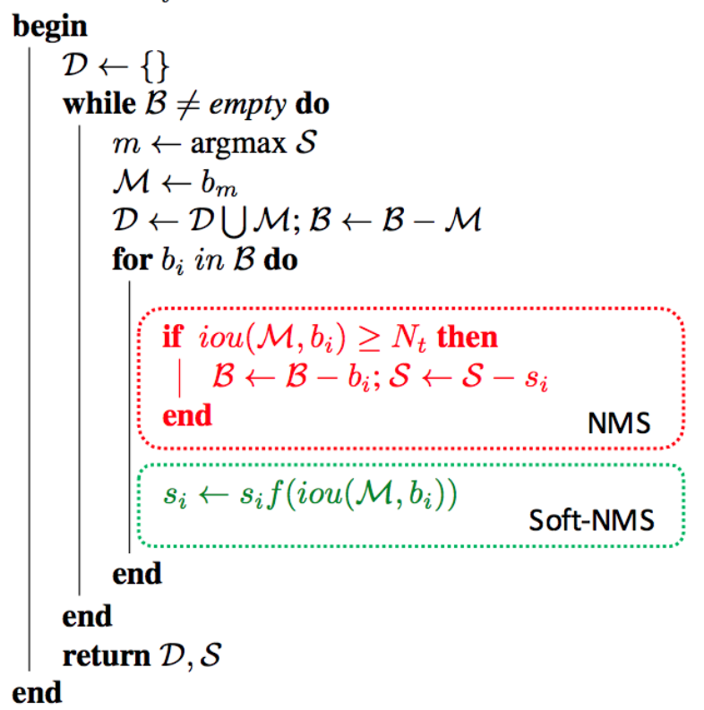
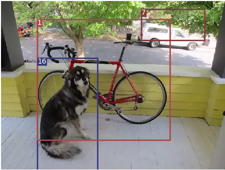

## Introduction

[Reference](https://medium.com/paperspace/tutorial-on-implementing-yolo-v3-from-scratch-in-pytorch-part-1-a0054d38ec78)

### Basics of YOLO

+ Fully convolutional neural network
+ Invariant to size of input image, but constant image size helps with batch processing
+ 

### YOLO v3 network Architecture


[image reference](https://towardsdatascience.com/yolo-v3-object-detection-53fb7d3bfe6b)

+ **Input size**: 416*416
+ **Conv layers**: 75 convolutional layers with skip connections and upsampling layers
+ **Down sampling**: No pooling, use a conv layer with stride=2 instead, to prevent loss of low-level features
+ **Feature map**: stride = 32 before first feature map, dimension of feature map: is 13*13 (416/32 = 13). Each cell can predict 3 bounding boxes
+ **Detection layer**: 
  + A conv layer with kernel size of $1*1*(B*(5+C))$: 
    + $B$ the number of bounding boxes a cell on the feature map predicts, $B=3$ for YOLO v3.
    + $5+C$: each bounding box have following attributes: class confidence+ x,y,w,h,confidence; $C=80$ for COCO.
  + Each cell of the feature map predicts an object through on of its bounding boxes if center of the object falls in the receptive field of that cell.
  + Confidence/ objectness score: ~ 1 for cells close to object center, ~0 far from object center
  + Class confidences: softmax before v3, sigmoid since v3.  Because softmax is mutually exclusive, i.e. one object can't belong to multiple classes.
  + 3 detection heads with different scales. $gridSize = 13, 26, 52$

### Bounding Boxes, Anchor Boxes, Ground Truth Boxes


[Image Reference](https://arxiv.org/abs/1804.02767)

+ Ground truth box: given by label ($g_x, g_y, g_w, g_h$)
+ Bounding boxes: the final prediction made by the network ($b_x, b_y, b_w, b_h$)
+ Anchor boxes: 
  + Motivation: predicting width and height of bounding boxes directly leads to unstable gradients during training
  + Solution:  predict offsets to predefined bounding boxes (log-space transforms)
+ Transformations
  + Apply transforms to anchor boxes to obtain the prediction
    + Predict ($t_x^p, t_y^p, t_w^p, t_h^p$)
  + Do the same transformation on ground truth boxes:
    + Find the anchor box with largest IoU with ground truth box $(w_a, h_a)$
    + Transform ($x_g, y_g, w_g, h_g$) into ($t_x^g, t_y^g, t_w^g, t_h^g$) using that box,  $x_g$ here is in grid coordinate
  + Train Prediction with transformed ground truth box
  + To get real output, transform prediction back to  ($x_p, y_p, w_p, h_p$)  using the chosen bounding box
    + $x_p=\sigma\left(t_{x}^p\right)+c_x$, same for y. $c_x$ is the index of column of current cell, which is equal to $\frac{x_a}{w_a}$ The transformation is sigma rather than linear as shown below. But they both guarantee that the prediction falls between 0 and 1. $x_p$ here is in grid coordinate
    + $w_{p} = w_a e^{t_{w}}$, same for h

$$
\left\{\begin{aligned}
\sigma(t_{x}^{p}) &=x_{p}-\frac{x_{a}}{w_{a}}, \sigma(t_{y}^{p})=y_{p}-\frac{y_{a}}{h_{a}} \\
t_{w}^{p}=& \log \left(\frac{w_{p}}{w_{a}}\right), t_{h}^{p}=\log \left(\frac{h_{p}}{h_{a}}\right) \\
\sigma(t_{x}^{g}) &=x_{g}-\frac{x_{a}}{w_{a}},\sigma(t_{y}^{g})=y_{g}-\frac{y_{a}}{h_{a}} \\
t_{w}^{g}=& \log \left(\frac{w_{g}}{w_{a}}\right), t_{h}^{g}=\log \left(\frac{h_{g}}{h_{a}}\right)
\end{aligned}\right.
$$

### Output processing

+ **Thresholding by objectness score:** ignore boxes below the threshold

+ **Non-maximum suppression**: remove redundant predictions. [Reference](https://towardsdatascience.com/non-maximum-suppression-nms-93ce178e177c)
  $$
  \mathcal{B}=\left\{b_{1}, . ., b_{N}\right\}, \mathcal{S}=\left\{s_{1}, \ldots, s_{N}\right\}, N_{t}
  $$
  $\mathcal{B}$ is the list of initial detection boxes $\mathcal{S}$ contains corresponding detection scores $N_{t}$ is the $\mathrm{NMS}$ threshold. 

  + Soft-NMS: instead of completely removing the proposals with high IOU and high confidence, reduce the confidences of the proposals proportional to IOU value

  + 

  

## Code

### Dataset

+ Face-mask dataset

  + 7958 items

  + Database structure:

    ```
    data
    ├── Annotations
    │   ├── id.xml
    ...
    ├── JPEGImages
    │   ├── id.jpg
    ```

  + Annotation: PASCAL VOC2007:

    ```xml
    <annotation>
        <folder>VOC2007</folder>
        <filename>1_Handshaking_Handshaking_1_35.jpg</filename>
        <source>
            <database>The VOC2007 Database</database>
            <annotation>PASCAL VOC2007 </annotation>
            <image>flickr</image>
        </source>
        <size>
            <width>1024</width>
            <height>1392</height>
            <depth>3</depth>
        </size>
        <segmented>0</segmented>
        <object>
        	<name>face</name>
        	<pose>Unspecified</pose>
        	<truncated>0</truncated>
        	<difficult>0</difficult>
            <bndbox>
            <xmin>440</xmin>
            <ymin>141</ymin>
            <xmax>633</xmax>
            <ymax>399</ymax>
            </bndbox>
        </object>
    </annotation>
    ```

    + name: face (no mask), face_mask(with mask)

+ `utils.datasets`: face_mask data sets that complies with YOLO input type.

### Model

[Reference](https://blog.paperspace.com/how-to-implement-a-yolo-v3-object-detector-from-scratch-in-pytorch-part-2/)

+ `config/yolov3.cfg` : configuration file that defines the model
+ `utils/parse_config.py`: function to parse config file into list of maps of model definition
+ `models.create_modules`: take parsed model_defs, and convert to a module list of layer blocks in the form of `nn.ModuleList()`
+ `models.YOLOLayer`: a head that deals with outputs of previous layers and generates loss based on anchors
+ `utils.build_targets`: convert ground truth to targets (intermediate values) for loss calculation
+ `models.Darknet`: put model configurations and layers together to detection model
  + `route` and `shortcut` layers are defined here in `forward()`
  + `yolo` layer generates `yolo_outputs` in `forward()`


### Test Detection

[Reference](https://blog.paperspace.com/how-to-implement-a-yolo-v3-object-detector-from-scratch-in-pytorch-part-3/)

+ `model.py  __main__`: test forward pass

+ `utils.non_max_supression`: non_maximum suppression. 

+ `detectYOLO.py`: test detection with single image
  

  ```
  	+ Label: 16, Conf: 0.99973
  	+ Label: 1, Conf: 0.99780
  	+ Label: 7, Conf: 0.88477
  ```

  


### Training


