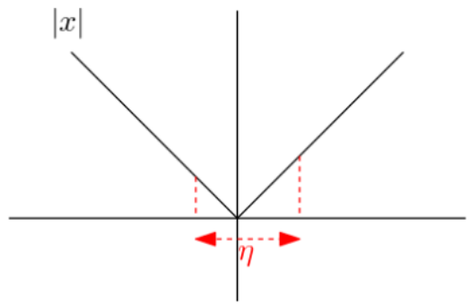
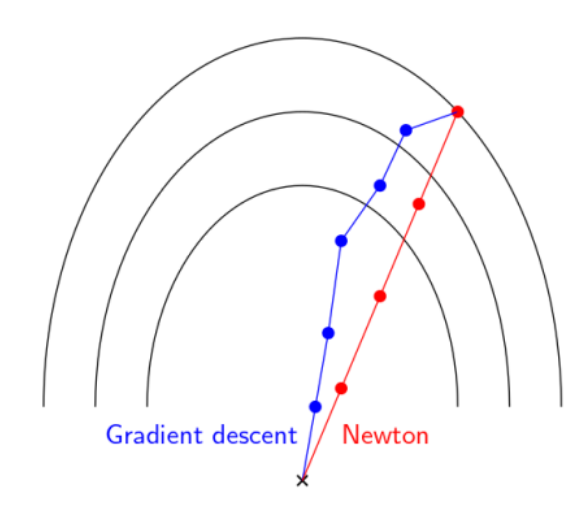

# OPT Week 12
## Subgradient Descent
### Motivation
+ Subgradient: $f(y)-f(x) \ge g^T(y-x)$, $\partial f(x) = set(g)$
+ Issue with gradient descent: non-differentialbility -> GD oscillates
  + eg. $f(x) = |x|$, $x_{+}=x-\eta \operatorname{sgn}(x)$, oscillation for any step size $\eta$
  + 
### Subgradient Method
$$x_{t+1}=x_{t}-\eta_{t} g_{t}$$
$$\text{find }x_{\text {best }}: f\left(x_{\text {best }}^{(t)}\right)=\min _{s \leq t} f\left(x_{s}\right)$$
#### Convergence rate
+ $(-g)$ might not be the descent direction
+ For fixed $\eta$: 
  + $\lim _{t \rightarrow \infty} f\left(x_{\text {best}}^{(t)}\right) \leq f^{*}+\frac{\eta G^{2}}{2}$
  
  + $G$ is the Lipschitz constant of $f$ :$\|f(x)-f(y) \mid \leq G\| x-y \|$
  
  + Then we have to make $\eta \rightarrow 0$ to converge to $f*$, which won't work because $\Sigma_{t} \eta_{t} \rightarrow \infty$ is also required for enough update distances.
  
+ Proof:
  $$
  \begin{aligned}
  &\begin{aligned}
  \left\|x_{t+1}-x^{*}\right\|^{2} &=\left\|x_{t}-\eta_{t} g_{t}-x^{*}\right\|^{2} \\
  &=\left\|x_{t}-x^{*}\right\|^{2}+\eta_{t}^{2}\left\|g_{t}\right\|^{2}-2 \eta_{t} g_{t}\left(x_{t}-x^{*}\right)
    \end{aligned}\\
    &\leq\left\|x_{t}-x^{*}\right\|^{2}+\eta_{t}^{2}\left\|g_{t}\right\|^{2}-2 \eta_{t}\left(f\left(x_{t}\right)-f^{*}\right) \quad[\text { definition of subgradient }]\\
    &\text { sum over all } t\\
    &\left\|x_{t}-x^{*}\right\|^{2} \leq\left\|x_{0}-x^{*}\right\|^{2}+\sum_{s=1}^{t} \eta_{s}^{2}\left\|g_{s}\right\|^{2}-2 \sum_{s=1}^{t} \eta_{s}\left[f\left(x_{s}-f^{*}\right)\right]
    \end{aligned}
  $$
  

Define $R=\left\|x_{0}-x^{*}\right\|$ and note that $\left\|x_{t}-x^{*}\right\|^{2} \geq 0,\left\|g_{s}\right\|^{2} \leq G^{2}$
and

$$
-2 \sum_{s=1}^{t} \eta_{s}\left[f\left(x_{s}-f^{*}\right)\right] \leq-2 \sum_{s \leq t} \eta_{s}\left[f\left(x_{b e s t}^{(t)}-f^{*}\right)\right]
$$

This gives us

$$
f\left(x_{\text {best }}^{(t)}\right)-f^{*} \leq \frac{R^{2}+G^{2} \sum_{s \leq t} \eta_{s}^{2}}{2 \sum_{s \leq t} \eta_{s}}
$$

Choosing $\eta_{t}=\frac{1}{\sqrt{t}}$ gives the best convergence rate.

$$
f\left(x_{\text {best }}^{(t)}\right)-f^{*}  \leq O\left(\frac{R^{2}+G^{2}}{\sqrt{t}}\right)
$$

  + To get $f\left(x_{\text {best}}^{(t)}-f^{*}\right) \leq \varepsilon$, need $O\left(\frac{1}{\varepsilon^{2}}\right)$ steps, comparing to $O\left(\frac{1}{\varepsilon}\right)$ for differentiable functions
  + In general, we cannot do better
  + Proof: $x_{t} \in x_{0} \operatorname{span}\left\{g_{0}, \ldots, g_{t-1}\right\}$, then $f\left(x_{t}\right)-f^{*} \geq \frac{R G}{2(1+\sqrt{t+1})}$
### Comparing Gradient and subgradient algorithms
+ Metric: number of steps for $f(x)-f(x^*)$ to reach within some $\epsilon$
+ Convexity
  + convex: local optimal -> global optimal, $f$ can be globally approximated from below by linear function
  + smooth + convex: 
    + quadratically upper bounded -> self tuning 
    + no kink at optimal
    + $\nabla f(x) \rightarrow 0 \text{ as } x\rightarrow x^*$
  + strongly convex: 
    + quatically lower bounded -> ($\nabla f(x)$) big steps when far away from optimal
    + Not looking at points close to optimal
+ Convergence rate 
  + $f$ convex: subgradient method $O\left(\frac{1}{\varepsilon^{2}}\right)$ steps, each step updates $O\left(\frac{1}{\sqrt T}\right)$
  + $f$ convex and smooth (differentiable everywhere): GD $O\left(\frac{1}{\varepsilon}\right)$ steps
  + $f$ strongly convex and not necessarily smooth: subgradient method $O\left(\frac{1}{\varepsilon}\right)$ steps
  + $f$ strongly convex and smooth: GD method $O\left(\log \frac{1}{\varepsilon}\right)$ steps

## Proximal Gradient Descent
### Assumption - Decomposable functios
Composite optimization: 
$$\min _{x} g(x)+h(x)$$
+ $g$ is convex and smooth
+ $h$ is convex not smooth, with easy-to-calculate prox operator

### Motivation
$x_{+}=x-\eta \nabla f(x)$ is equivalent to minimizing a quadratic approximation:
 $x_{+}=\arg \min _{z}\left\{f(x)+\nabla f(x)^{T}(z-x)+\frac{1}{2 \eta}\|z-x\|^{2}\right\}$
 For $f(x)=g(x)+h(x)$, only apply on $g(x)$:
$$\begin{aligned}
x_{+} &=\arg \min _{z}\left\{g(x)+\nabla g(x)^{T}(z-x)+\frac{1}{2 \eta}\|z-x\|^{2}+h(z)\right\} \\
 &\text{[argmin allows adding/subtracting constants and functions of } x \text{ is constat to } z ]\\
&=\arg \min _{z}\left\{(\eta\|\nabla g(x)\|)^2+\nabla g(x)^{T}(z-x)+\frac{1}{2 \eta}\|z-x\|^{2}+h(z)\right\}\\
&=\arg \min _{z}\left\{\frac{1}{2 \eta}\|z-(x-\eta\nabla g(x))\|^{2}+h(z)\right\}\\
& =\operatorname{prox}_{\eta}(x-\eta \nabla g(x))
\end{aligned}$$

### Prox operator
+ $\mathbb{R}^n \rightarrow \mathbb{R}^n$: not a function but a mapping
$$\begin{array}{c}
\operatorname{prox}_{\eta}(x)=\arg \min _{z}\left\{\frac{1}{2 \eta}\|x-z\|^{2}+h(z)\right\} \\
x_{+}=\operatorname{prox}_{\eta}(x-\eta \nabla g(x))
\end{array}$$
Useful when $prox$ operator is easy to calculate

### As a generalization of PGD
+ Projection and indicator function:
  Let $g: \mathbb{E} \rightarrow(-\infty, \infty]$ be given by $g(\mathbf{x})=\delta_{C}(\mathbf{x}),$ where $C$ is a nonempty set ($1 \; if \; x\in C, else \;\infty$). Then because $\min : g(x); x \in C \Leftrightarrow \min: g(x)+h(x)$
$$
\operatorname{prox}_{g}(\mathbf{x})=\operatorname{argmin}_{\mathbf{u} \in \mathbb{E}}\left\{\delta_{C}(\mathbf{u})+\frac{1}{2}\|\mathbf{u}-\mathbf{x}\|^{2}\right\}=\operatorname{argmin}_{\mathbf{u} \in C}\|\mathbf{u}-\mathbf{x}\|^{2}=P_{C}(\mathbf{x})
$$
Thus, the proximal mapping of the indicator function of a given set is the orthogonal projection operator onto the same set.

+ PGD: Given a closed, convex set $C \in \mathbb{R}^{n},$ the following two problems are equivalent:
$$
\min _{x \in C} g(x) \Longleftrightarrow \min _{x \in \mathbb{R}^{n}} g(x)+I_{C}(x)
$$
where $I_{C}(x)=\left\{\begin{array}{ll}0 & x \in C \\ \infty & x \notin C\end{array}\right.$ is the indicator function of $C$. The proximal operator is thus
$$
\begin{aligned}
\operatorname{prox}_{t}(x) &=\underset{z \in \mathbb{R}^{n}}{\operatorname{argmin}} \frac{1}{2 t}\|x-z\|_{2}^{2}+I_{C}(z) \\
&=\underset{z \in C}{\operatorname{argmin}}\|x-z\|_{2}^{2}=P_{C}(x)
\end{aligned}
$$
### Example
+ Lasso: $\min _{\beta}\|y-X \beta\|^{2}+\lambda\|\beta\|_{1}$
  + separable to each coordinates
  + $\operatorname{prox}_{\eta}(\beta)=\arg \min _{z}\left\{\frac{1}{2 \eta}\|\beta-z\|^{2}+\lambda\|z\|_{1}\right\}$
  + $\arg \min _{z_{i}} \frac{1}{2 \eta}\left\|\beta-z_{i}\right\|^{2}+\lambda\left\|z_{i}\right\|_{1}=\left\{\begin{array}{ll}\beta_{i}-\eta \lambda & \text { if } \beta_{i}>\eta \lambda \\\beta_{i}+\eta \lambda & \text { if } \beta_{i}<-\eta \lambda \\0 & \text { else }\end{array}\right.$
  + $z=s_{\lambda n}(\beta)$ soft thresholding operator
  + $\beta_{+}=s_{\lambda n}\left(\beta+\eta X^{T}(y-X \beta)\right)$
  + Iterative Soft Thresholding Algorithm (ISTA)
+ $h(x)=\|x\|_{1}=\sum\left|x_{i}\right|$
  + $\operatorname{prox}_{\eta}(h)$ is soft thresholding operator: $z_{i}=\left\{\begin{array}{ll}x_{i}-1 & x_{i}>\eta \\0 & -\eta \leqslant x_{i} \leqslant \eta \\x_{i}+1 & x_{i}<-\eta \end{array}\right.$
+ $f(\mathbf{x})=\frac{1}{2} \mathbf{x}^{T} \mathbf{A} \mathbf{x}+\mathbf{b}^{T} \mathbf{x}+c$
  + $\min _{\mathbf{u} \in \mathbb{E}}\left\{\frac{1}{2} \mathbf{u}^{T} \mathbf{A} \mathbf{u}+\mathbf{b}^{T} \mathbf{u}+c+\frac{1}{2}\|\mathbf{u}-\mathbf{x}\|^{2}\right\}$
  + Gradient =0: $\mathbf{A} \mathbf{u}+\mathbf{b}+\mathbf{u}-\mathbf{x}=\mathbf{0}$
  + $\operatorname{prox}_{f}(\mathbf{x})=(\mathbf{A}+\mathbf{I})^{-1}(\mathbf{x}-\mathbf{b})$

### Convergence rate
+ with $\eta<\frac{1}{M}$ ($M$ is for $g(x)$ and $prox(h(x))$ is easy-to-calculate): $f\left(x_{t}\right)-f * \leq \frac{\left\|x_{0}-x^{*}\right\|^{2}}{2 \eta t}$, i.e. $O\left(\frac{1}{\varepsilon}\right)$, same as gradient descent

## Newton Method

### Motivation: Gradient descent is not affine invariant
$$
x_{+}=x-\eta \nabla f(x)
$$
Suppose $f$ is quadratic: $\quad f(x)=\frac{1}{2} x^{T} Q x$ 
Suppose $m I \leq Q \leq M I$
Then, $f$ is $m$ -strongly convex and $M$ -Lipschitz
$$
x_{+}=x-\eta Q x=(I-\eta Q) x
$$
We need: 
The smallest eigenvalue $1-\eta M >-1$ 
The largest eigenvalue $1-\eta m <1$ 
$1-\eta M \Rightarrow \eta<\frac{2}{M}$
Each step has $1-\eta m$ factor decrease in error. Note, $1-\eta m>1-\frac{2 m}{M}$
__affine transformation__: $x=A y,$ where $A$ is invertible.
$$
\tilde{f}(y)=\frac{1}{2} y^{T} A^{T} Q A y
$$
+ Convergence rate is not affine invariant: $1-\frac{2 \tilde{m}}{\tilde{M}}$ decrease, not the same as  $1-\frac{2 m}{M}$
+ Step is not affine invariant: 
$$\begin{aligned}
y_{+} &=y-\eta A^{T} Q A y \\
A y_{+} &=A y-\eta A\left(A^{T} Q A\right) y \\
&=x-\eta A A^{T} Q x \\
& \neq x_{+}
\end{aligned}$$
+ Choosing best affine transformation: $A^{T} Q A=I \Rightarrow A=Q^{-\frac{1}{2}}$
  + If $f$ is not quadratic: use local quadratic approximation - Newton Method

### Newton's Method
Local quadratic approximation
$$
g(x)=f\left(x_{0}\right)+\nabla f\left(x_{0}\right)^{T}\left(x-x_{0}\right)+\frac{1}{2}\left(x-x_{0}\right)^{T} \nabla^{2} f\left(x_{0}\right)\left(x-x_{0}\right)
$$
Idea: $x_{+} \equiv \operatorname{minimum}$ of Local quadratic approximation
$$
x_{+}=x_{0}-\left[\nabla^{2} f\left(x_{0}\right)\right]^{-1} \nabla f\left(x_{0}\right)
$$
$\left[\nabla^{2} f\left(x_{0}\right)\right]^{-1}$ is step size

### Affine invariance of Newton's Method
Suppose $g(y)=f(A y),$ where $x=A y$ for invertible $A$
$$
\begin{aligned}
\nabla g(y) &=A^{T} \nabla f(A y) \\
\nabla^{2} g(y) &=A^{T} \nabla^{2} f(A y) A \\
y_{+} &=y-\left[\nabla^{2} g(y)\right]^{-1} \nabla g(y) \\
A y_{+} &=A y-A A^{-1}\left(\nabla^{2} f(A y)\right)^{-1} A^T \nabla g(y)\\
A y_{+} &=A y-\left(\nabla^{2} f(A y)\right)^{-1} \nabla f(A y)
\end{aligned}
$$

### Summary
Newton's method:
+ minimize quadratic approx.
+ needs to know Hessian $\nabla^{2} f(.)$
+ $+$ can converge with fewer iterations
+ $+$ affine invariant each iteration more expensive
+ $-$ each iteration more expensive

## Questions
+ In Video 1: it was stated that every convex function has a lipschitz constant. What about functions that are not globally Lipschitz?

Moreover, how do we get $\left\|g_{s}\right\|^{2} \leq G^{2}$? From https://people.orie.cornell.edu/mru8/orie6326/lectures/subgradient_methods.pdf it seems to be an assumption rather than fact.

