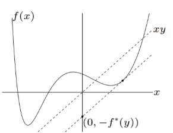

# Convex Program
## Convex sets
### Definition
 $x_{1}, x_{2} \in C, \quad 0 \leq \theta \leq 1 \quad \Longrightarrow \quad \theta x_{1}+(1-\theta) x_{2} \in C$
### Operation that preserves convexity
- intersection

- affine functions
  - scaling, translation, rotation, projection
  - solution set of linear matrix inequality $\left\{x \mid x_{1} A_{1}+\cdots+x_{m} A_{m} \preceq B\right\}$ $\left(\right.$ with $\left.A_{i}, B \in \mathbf{S}^{p}\right)$
  - hyperbolic cone $\left\{x \mid x^{T} P x \leq\left(c^{T} x\right)^{2}, c^{T} x \geq 0\right\}$ (with $P \in \mathbf{S}_{+}^{n}$ )
  
- perspective function $P(x, t)=x / t$, $\mathbf{R}^{n+1} \rightarrow \mathbf{R}^{n}$

- linear-fractional functions $f(x)=\frac{A x+b}{c^{T} x+d}$

- ### Operations that preserve convexity

  + $\alpha f$- nonnegative multiple: $\alpha f$ is convex if $f$ is convex, $\alpha \geq 0$
  + $f_{1}+f_{2}$ - sum: $f_{1}+f_{2}$ convex if $f_{1}, f_{2}$ convex (extends to infinite sums, integrals)
  + $f(A x+b)$- composition with affine function: $f(A x+b)$ is convex if $f$ is convex

### Examples of Convex Sets
+ Convex hull: 
$$\begin{array}{l}
x=\theta_{1} x_{1}+\theta_{2} x_{2}+\ldots+\theta_{n} x_{n} \\
\text { for } \theta_{1}+\theta_{2}+\ldots+\theta_{n}=1, \theta_{i} \geq 0
\end{array}$$
+ Conic combination $x=\theta_{1} x_{1}+\theta_{2} x_{2}+\ldots+\theta_{n} x_{n},$ all $\theta_{i} \geq 0$
+ Affine combination $x=\theta_{1} x_{1}+\theta_{2} x_{2}+\ldots+\theta_{n} x_{n}$
+ Hyperplanes $\left\{x \mid a_{T} x=b\right\}$
+ Halfspaces $\left\{x \mid a^{T} x \leq b\right\}$
+ Ellipses $(x-C)^{T} M(x-C) \leq 1$
where $M$ is positive semidefinite or $\left\{\left.x|\| A x-b|\right|_{2} \leq 1\right\}$
+ polyhedron
+ the set of all positive definite matrices
+ Norm balls: $\{x:\|x\| \leq u\}$
+ Polynomial lower bounded on a set
+ **Not convex:** 
  + Norm balls with $p<1$
  + Unions of convex sets
  + Polynomial whose max on a set is lower bounded
### Theorems

+ Separating hyperplane theorem: if $C$ and $D$ are nonempty disjoint convex sets, there exist $a \neq 0, b$ s.t.
  $$a^{T} x \leq b \text { for } x \in C, \quad a^{T} x \geq b \text { for } x \in D$$
+ Supporting hyperplane theorem: if C is convex, then there exists a
  supporting hyperplane at every boundary point of C:

$$
\left\{x \mid a^{T} x=a^{T} x_{0}\right\}
$$

where $a \neq 0$ and $a^{T} x \leq a^{T} x_{0}$ for all $x \in C$

## Convex Functions
### Definition
+ $f\left(\lambda x_{1}+(1-\lambda) x_{2}\right) \leq \lambda f\left(x_{1}\right)+(1-\lambda) f\left(x_{2}\right)$ for $\lambda \in[0,1]$
+ $f(y) \geq f(x)+\nabla f(x)^{T}(y-x)$
+ $\nabla^{2} f(x) \geq 0$
+ $\forall x, y(\nabla f(x)-\nabla f(y))^{T}(x-y) \geq 0$
### Examples of Convex Functions
+ Total weight of weighted shortest path $f(w)$ is concave in weight $w$, $f(w)=\min _{p}\left(\sum_{e \in p} w_{e}\right)$ (minimization of piecewise linear function in weight - concave)
+ convex in $\mathbb{R}$
  - linear $a^{T} x+b$
  - exponential: $e^{a x},$ for any $a \in \mathbf{R}$
  - powers: $x^{\alpha}$ on $\mathbf{R}_{++},$ for $\alpha \geq 1$ or $\alpha \leq 0$
  - powers of absolute value: $|x|^{p}$ on $\mathbf{R},$ for $p \geq 1$
  - negative entropy: $x \log x$ on $\mathbf{R}_{++}$
  - log det $X$
  - log sum exponential
+ concave in $\mathbb{R}$
  - powers: $x^{\alpha}$ on $\mathbf{R}_{++},$ for $0 \leq \alpha \leq 1$
  - logarithm: $\log x$ on $\mathbf{R}_{++}$
+ convex in $\mathbb{R}^n$ and $\mathbb{R}^{m\times n}$
  - Norms: $\|x\|_{p}=\left(\sum_{i=1}^{n}\left|x_{i}\right|^{p}\right)^{1 / p} \text { for } p \geq 1 ;\|x\|_{\infty}=\max _{k}\left|x_{k}\right|$
  - Spectral (maximum singular value) norm: $f(X)=\|X\|_{2}=\sigma_{\max }(X)=\left(\lambda_{\max }\left(X^{T} X\right)\right)^{1 / 2}$
  - Any line along a convex function: 
    $f: \mathbf{R}^{n} \rightarrow \mathbf{R}$ is convex if and only if the function $g: \mathbf{R} \rightarrow \mathbf{R}$

$$
g(t)=f(x+t v), \quad \operatorname{dom} g=\{t \mid x+t v \in \operatorname{dom} f\}
$$

is convex $($ in $t)$ for any $x \in \operatorname{dom} f, v \in \mathbf{R}^{n}$

+ Affine function is both convex and concave:  $f(x)=a^{T} x+b$, $f(X)=\operatorname{tr}\left(A^{T} X\right)+b=\sum_{i=1}^{m} \sum_{j=1}^{n} A_{i j} X_{i j}+b$
+ Non-linear (proven from 2-nd order condition)
  - Quadratic: $f(x)=(1 / 2) x^{T} P x+q^{T} x+r$ convex if $P \succeq 0$
  - Least squares: $f(x)=\|A x-b\|_{2}^{2}$ convex $\forall A$
  - quadratic-over-linear: $f(x, y)=x^{2} / y$ convex for $y>0$
  - log-sum-exp is convex: $f(x)=\log \sum_{k=1}^{n} \exp x_{k}$
  - geometric mean: $f(x)=\left(\prod_{k=1}^{n} x_{k}\right)^{1 / n} \text { on } \mathbf{R}_{++}^{n}+$
  - sub-level set of convex functions are convex (not converse): $C_{\alpha}=\{x \in \operatorname{dom} f \mid f(x) \leq \alpha\}$
  - ==$f$ is convex if and only if $\text{epi} f$ is a convex set==: $\text { epi } f=\left\{(x, t) \in \mathbf{R}^{n+1} \mid x \in \operatorname{dom} f, f(x) \leq t\right\}$

### Operations Preserving Convex Functions
+ $a_{1} f_{1}(x)+a_{2} f_{2}(x)$: $a_{1}, a_{2} \geq 0$
+ $g(x)=f\left(a^{T} x+b\right)$
+ $g(x)=\min _{y} f(x, y)$
+ Convex proven from operations that preserves convexity
  - log barrier for linear inequalities : $f(x)=-\sum_{i=1}^{m} \log \left(b_{i}-a_{i}^{T} x\right)$
  - norm of affine function: $f(x)=\|A x+b\|$
  - point-wise maximum/ supremum: $f(x)=\max \left\{f_{1}(x), \ldots, f_{m}(x)\right\}$, or $f(x):=\sup _{i} f_{i}(x)$
    - piecewise-linear function: $f(x)=\max _{i=1, \ldots, m}\left(a_{i}^{T} x+b_{i}\right)$ is convex
    - sum of $r$ largest components of $x \in \mathbf{R}^{n}$ :$f(x)=x_{[1]}+x_{[2]}+\cdots+x_{[r]}$
    - support function of a set $C: S_{C}(x)=\sup _{y \in C} y^{T} x$ is convex
    - distance to farthest point in a set $C$ :$f(x)=\sup _{y \in C}\|x-y\|$
    - maximum eigenvalue of symmetric matrix: for $X \in \mathbf{S}^{n}$,$\lambda_{\max }(X)=\sup _{\|y\|_{2}=1} y^{T} X y$
+ Composition function, look at 2-nd derivative
  - $f(x)=h(g(x))$: $f^{\prime \prime}(x)=h^{\prime \prime}(g(x)) g^{\prime}(x)^{2}+h^{\prime}(g(x)) g^{\prime \prime}(x)$, or $f^{\prime \prime}(x)=g^{\prime}(x)^{T} \nabla^{2} h(g(x)) g^{\prime}(x)+\nabla h(g(x))^{T} g^{\prime \prime}(x)$
  - $\exp g(x)$ is convex if $g$ is convex
  - $1 / g(x)$ is convex if $g$ is concave and positive
  - $\sum_{i=1}^{m} \log g_{i}(x)$ is concave if $g_{i}$ are concave and positive
  - $\log \sum_{i=1}^{m} \exp g_{i}(x)$ is convex if $g_{i}$ are convex

- minimize convex $f$ over certain variables in a convex set $C$: $g(x)=\inf _{y \in C} f(x, y)$ is convex
- Perspective of convex $f$ is convex: $g(x, t)=t f(x / t)$
- ==Conjugate is always convex== no matter $f$: $f^{*}(y)=\sup _{x \in \operatorname{dom} f}\left(y^{T} x-f(x)\right)$
- ==Lagrange dual function is always concave==: $g(\boldsymbol{\lambda}, \boldsymbol{\nu})=\inf _{\boldsymbol{x} \in \mathbb{R}^{N}}\left(f_{0}(\boldsymbol{x})+\sum_{m=1}^{M} \lambda_{m} f_{m}(\boldsymbol{x})+\sum_{p=1}^{P} \nu_{p} h_{p}(\boldsymbol{x})\right)$

## Convex program
### Definition
+ objective function is convex + constraint set is convex
+ Standard definition: objective function & inequality constraints are convex function, equality constraints are affine
+ Standard form
$$
\begin{array}{c} 
\min _{x} f_{0}(x) & \text{ [convex] }\\
f_{i}(x) \leq 0, i=1, \ldots, m & \text{ [convex] }\\
A x=b & \text{ [affine] }
\end{array}
$$

### Properties
+ global optima = local optima
+ Any level set $L_{C}=\{x: f(x) \leq c\}$ is convex [note: set of $x$ (domain), not range of $f$]

## Linear Programs
### Definitions
+ Decoupled notation
$$
\begin{array}{l}
\quad \min _{x 1 . \ldots \times 2} \sum_{j=1}^{d} c_{j} x_{j} \\
\text { s.t. } \sum_{j=1}^{d} a_{i j} x_{j} \leq b_{i} \text { for } i=1 \ldots m \\
\sum_{j} d_{i j} x_{j}=f_{i} \text { for } i=1 \ldots p
\end{array}
$$
+ Vector notation
$$
\min _{x} c^{T} x
$$
s.t. $A x\le b$ 
$C x=d$ 
where $a_{i j}$ is the $(i, j)^{t h}$ element of $\mathrm{A}$

### Properties
+ Extreme point: 
  + Definition 1 : it is not the convex combination of any two other points in the polytope If $\exists y, z \in P, \lambda \in[0,1]$ such that $x=\lambda y+(1-\lambda) z,$ then $x$ is not extreme.
  + Definition 2 : it is the unique optimum for some cost vector $c$ : $c^{T} x<c^{T} y$ for any $y \in P$
  + Equivalent: Basic feasible solution (BFS): $x$ is a BFS if its active set $\mathcal{A}_{x}$ has $n$ linearly independent vectors.
  + If an LP has a finite optimum, and its constraint polytope has at least one extreme point, then there is an extreme point which is optimal.
### Formulating LP
#### Convert to standard form [$\min. c^Tx, \quad Ax=b, x\ge 0$]

+ $$
  \boxed{x\in \mathbb{R}^n}, s.t. \boxed{\;A_1x\le b_1}, A_2x=b_2 \Rightarrow\\
  x_i = x_i^+-x_i^-, \quad \text{ where } x_i^+,x_i^- \ge 0\\
  \min. c^Tx+0^Ts, \; s\ge0\\
  A_1x+Is=b_1\\
  A_2x+0s=b_2\\
  c^{\prime}=\left[\begin{array}{c}
  c \\
  -c\\
  0
  \end{array}\right];\quad
  A^{\prime}=\left[\begin{array}{c}
  A_1 & -A_1 & I \\
  A_2 & -A_2 & 0
  \end{array}\right];\quad
  b^{\prime}=\left[\begin{array}{c}
  b_1 \\
  b_2
  \end{array}\right]
  $$

+ $$
  \min. \boxed{|x_1|+|x_2|}, \quad s.t.\quad Ax\le b, \text{ where } x=\left[\begin{array}{c}
  x_1 \\
  x_2
  \end{array}\right] \Rightarrow\\
  \min. z_1+z_2, \text{ where } -z_1\le x_1\le z_1; \; -z_2\le x_2\le z_2\\
  \text {OR}\\
  \min(x_1^++x_1^-)+(x_2^++x_2^-), \quad s.t.\quad Ax^+-Ax^-\le b,\text{ where } x^+, x^- \ge0
  $$

#### Convert non-LP to LP

+ minimize $\|A x-b\|_{1}$ subject to $\|x\|_{\infty} \leq 1$. 
  $$
  \begin{array}{ll}
  \text {minimize} & \mathbf{1}^{T} y \\
  \text {subject to} & -y \leq A x-b \leq y \\
  & -\mathbf{1} \leq x \leq \mathbf{1}
  \end{array}
  $$

+ minimize $\|x\|_{1}$ subject to $\|A x-b\| \leq 1$. 
  $$
  \begin{array}{ll}
  \text { minimize } & \mathbf{1}^{T} y \\
  \text {subject to} & -y \leq x \leq y \\
  & -\mathbf{1} \leq A x-b \leq \mathbf{1}
  \end{array}
  $$

+ $\operatorname{minimize}\|A x-b\|_{1}+\|x\|_{\infty}$
  $$
  \begin{array}{ll}
  \text { minimize } & \mathbf{1}^{T} y+\alpha \\
  \text {subject to} & -y \leq A x-b \leq y \\
  & -\alpha \leq x \leq \alpha
  \end{array}
  $$

+ minimize $\min. \sum_{m}^{i=1} \max \left\{0, a_{i}^{T} x+b_{i}\right\}$ The variable is $x \in \mathbb{R}^{n}$
  $$
  \begin{array}{ll}
  \operatorname{minimize} & \sum_{i=1}^{m} \gamma_{i} \\
  \text {subject to} & 0 \leq \gamma_{i} \quad i=1, \ldots, m \\
  & a_{i}^{T} x+b_{i} \leq \gamma_{i} \quad i=1, \ldots, m
  \end{array}
  $$

+ minimize $\max _{\|y\|_{1}=1}\left\|\left(A_{0}+x_{1} A_{1}+\ldots+x_{p} A_{p}\right) y\right\|_{1}$

$$
\|A y\|_{1}=\left\|\sum_{i=1}^{n} a_{i} y_{i}\right\|_{1} \leq \sum_{i=1}^{n}\left|y_{i}\left\|\mid a_{i}\right\|_{1} \leq \max _{i}\left\|a_{i}\right\|_{1}\right.\\
\begin{array}{ll}
\text {minimize} & \max _{i}\left\|a_{i}\right\|_{1} \\
\text {subject to} & a_{i}=\left(A_{0}+x_{1} A_{1}+\ldots+x_{p} A_{P}\right)_{i} \quad i=1, \ldots, m,
\end{array}\\
\begin{aligned}
&\text {minimize} \quad \gamma\\
&\begin{array}{ll}
\text {subject to} & a_{i}=\left(A_{0}+x_{1} A_{1}+\ldots+x_{p} A_{P}\right)_{i} \quad i=1, \ldots, m \\
& -y_{i} \leq a_{i} \leq y_{i} \quad i=1, \ldots, m \\
& \mathbf{1}^{T} y_{i} \leq \gamma \quad i=1, \ldots, m
\end{array}
\end{aligned}
$$

+ minimize $\max _{i=1, \ldots, p}\left\|I-A_{i} X\right\|_{\infty}$

$$
\begin{array}{ll}
\text {minimize} & t \\
\text {subject to} & \left\|I-A_{i} X\right\|_{\infty} \leq t
\end{array}\\
\left[\|H\|_{\infty}=\max _{i=1, \ldots, m} \sum_{j=1}^{n}\left|H_{i j}\right| \right]\\
\begin{array}
&\text { minimize } & t\\
\text {subject to } & \sum_{k=1}^{n}\left|\left(I-A_{i} X\right)_{j k}\right| \leq t
\end{array}\\
\begin{array}{ll}
\text { minimize } \quad t\\
\text {subject to} & T_{i} \mathbf{1} \leq t \mathbf{1} \quad i=1, \ldots, p \\
& -T_{i} \leq I-A_{i} X \leq T_{i} \quad i=1, \ldots, p,
\end{array}
$$

### LP solutions

+ 

$$
\begin{array}{cl}
\operatorname{minimize} & c^{T} x \\
\text { subject to } & 0 \leq x \leq 1
\end{array}
$$
 $x_{i}=0$ when $c_{i} \geq 0,$ and $x_{i}=1$ when $c_{i} \leq 0 .$ Optimal value is $\sum_{i} \min \left(0, c_{i}\right)$

+ 

$$
\begin{array}{cl}
\operatorname{minimize} & c^{T} x \\
\text { subject to } & -1 \leq x \leq 1
\end{array}
$$
 $\sum_{i}-\left|c_{i}\right|=-\|c\|_{1} .$

+ 

$$
\begin{array}{cl}
\operatorname{minimize} & c^{T} x \\
\text { subject to } & -1 \leq 1^{T} x \leq 1
\end{array}
$$
Problem is bounded only when $c$ is parallel to 1 . $c=a \mathbf{1}$ and $c^{T} x=a \mathbf{1}^{T} x \geq-|a| .$ optimal value is $-|a|$ when $\mathbf{1}^{T} x=\operatorname{sign}(a)$

+ 

$$
\begin{array}{cl}
\operatorname{minimize} & c^{T} x \\
\text { subject to } & 1^{T} x=1, x \geq 0
\end{array}
$$

The optimal value is $\min _{i=1, \ldots, n} c_{i}$ where $x_{argmin}=1, 0 \text{ else}$

+ 

$$
\begin{array}{ll}
\text { maximize } & c^{T} x \\
\text { subject to } & 1^{T} x=k, 0 \leq x \leq 1
\end{array}
$$
optimal value is $\sum_{i=1}^{k} c_{[i]}$ where $c_{[i]}$ denotes i $^{\text {th }}$ largest value in $c$.

+ 

$$
\begin{array}{ll}
\text { maximize } & c^{T} x \\
\text { subject to } & 1^{T} x \leq k, 0 \leq x \leq 1
\end{array}
$$
do not give weights to negative $c_i$ Optimal value is $\sum_{i=1}^{k} \max \left(0, c_{[i]}\right)$

+ 

$$
\begin{array}{ll}
\text { maximize } & c^{T} x \\
\text { subject to } & d^{T} x=\alpha, 0 \leq x \leq 1
\end{array}
$$

Change variables by $x_{i} \leftarrow x_{i}^{\prime} / d_{i},$ getting
$$
\begin{aligned}
\max & \sum_{i=1}^{n}\left(c_{i} / d_{i}\right) x_{i}^{\prime} \\
\text {subject to} & \sum_{i=1}^{n} x_{i}^{\prime}=\alpha \\
& 0 \leq x_{i}^{\prime} \leq d_{i}
\end{aligned}
$$
That is, sort $\frac{c_{[i]}}{d_{[i]}}$ in descending order, assign $x_{[i]}^{\prime}=d_{[i]}$ from $i=1$ to $k,$ where $k$ is the largest index that satisfies $\sum_{i=1}^{k} d_{[i]} \leq \alpha .$ Then set $x_{[i+1]}^{\prime}=\alpha-\sum_{i=1}^{k} d_{[i]}$ and 0 for remained $x_{[i]}$

+ 

$$
\begin{array} [ll]
\text{ minimize } & c^{T} x \\
\text { subject to } & 0 \leq x_{1} \leq x_{2} \leq \ldots \leq x_{n} \leq 1
\end{array}
$$
==Optimal value is $\min _{j}\left(\sum_{i=j}^{n} c_{i}\right)$.==

+ 

$$
\begin{array}{ll}
\text { maximize } & c^{T} x \\
\text { subject to } & -y \leq x \leq y, 1^{T} y=k, y \leq 1
\end{array}
$$
 rewrite the problem as
$$
\begin{array}{ll}
\text {maximize} & \sum_{i=1}^{n}\left|c_{i} y_{i}\right| \\
\text {subject to} & \mathbf{1}^{T} y=k \\
& 0 \leq y \leq \mathbf{1}
\end{array}
$$
optimal value $\sum_{i=1}^{k}|c|_{[i]}$ where $|c|_{[i]}$ is the $i^{\text {th}}$ largest value among $\left|c_{i}\right|$.

+ 

$$
\begin{array}{cl}
\operatorname{minimize} & 1^{T} u+1^{T} v \\
\text { subject to } & u-v=c, u \geq 0, v \geq 0
\end{array}
$$
The variables are $u \in \mathbb{R}^{n}$ and $v \in \mathbb{R}^{n}$ Solution The minimum possible value of $u_{i}+v_{i}$ is $\left|c_{i}\right|$ when $u_{i}-v_{i}=c_{i}$ with $u_{i}, v_{i} \geq 0$ To see that, suppose $c_{i} \geq 0 .$ Then, $u_{i}+v_{i}=c_{i}+2 v_{i} \geq c_{i}$ where equality is attained when $v_{i}=0 .$ Otherwise, $u_{i}+v_{i}=-c_{i}+2 u_{i} \geq-c_{i}$ where similarly equality is attained when $u_{i}=0 .$ Therefore, optimal value is $\sum_{i=1}^{n}\left|c_{i}\right|$

+ 

$$
\begin{array}{cl}
\operatorname{minimize} & d_{1}^{T} u-d_{2}^{T} v \\
\text { subject to } & u-v=c, u \geq 0, v \geq 0
\end{array}
$$
The variables are $u \in \mathbb{R}^{n}$ and $v \in \mathbb{R}^{n} .$ We assume that $d_{1} \geq d_{2}$. Solution We follow the similar procedure. Suppose $c_{i} \geq 0 .$ Then, $d_{1, i} u_{i}-d_{2, i} v_{i}=$ $\left(d_{1, i}-d_{2, i}\right) v_{i}+d_{1, i} c_{i} \geq d_{1, i} c_{i} .$ Otherwise, $d_{1, i} u_{i}-d_{2, i} v_{i}=\left(d_{1, i}-d_{2, i}\right) u_{i}+d_{2, i} c_{i} \geq d_{2, i} c_{i}$
In turn, we have $d_{1, i} u_{i}-d_{2, i} v_{i} \geq d_{1, i} c_{i} 1_{\left\{c_{i} \geq 0\right\}}+d_{2, i} c_{i} 1_{\left\{c_{i} \leq 0\right\}} .$ Thus, the optimal solution
$i s$
$$
\sum_{i=1}^{n}\left(d_{1, i} 1_{\left\{c_{i} \geq 0\right\}}+d_{2, i} 1_{\left\{c_{i} \leq 0\right\}}\right) c_{i}
$$
where sgn is the sign function which gives +1 when $c_{i} \geq 0$ and -1 when $c_{i} \leq 0$

## Dual

### Process of writing
+ $\min _{x} c^{\prime} x$, $\text { s.t. } A x=b \quad Dx\ge f \text { and } x \geq 0$
+ $\min _{x \geq 0}\max _{p,q} \ c^{\prime} x+p^{\prime}(b-A x) + q(f-Dx)$: terms in max should be <= 0, then $q$>=0
+ $\max \min (c'x -p'A-qD)x+p'b+qf$: terms in min should be >= 0
+ $\max pb+qf,\; q\ge 0, \; c'-pA-qD\ge 0$

Dual of dual is primal

### Duality
#### Weak duality
$\min _{x}\left\{\max _{y} f(x, y)\right\} \geq \max _{y}\left\{\min _{x} f(x, y)\right\} \Rightarrow c^{\prime} x(\text { primal value }) \geq p^{\prime} b \text { (dual value) }$
#### Strong duality
+ Farkas' lemma:  For any vectors $c$ and $a_{i}, i \in I$ either 
  + (a) c within the convex hull of a
  $\exists$ some $p_{i} \geq 0$ s.t.
  $$
  c=\sum_{i} a_{i} p_{i}
  $$
  + or (b) Exist separating hyperplane
  $\exists d$ s.t. $d^{\prime} a_{i} \geq 0$ for all $i,$ but $d^{\prime} c<0$
+ Corollary to Farkas' lemma:
  + If vectors $c$ and $a_{i}, i \in I$ are such that the following holds :
  + For any $d$ satisfying $d^{\prime} a_{i} \geq 0$ it has to be that $d^{\prime} c \geq 0$ Then, $\exists p_{i} \geq 0$ s.t. $c=\sum p_{i} a_{i}$
+ Strong duality: primal optimal = dual optimal

#### Complementary slackness
$x, y$ are optimal iff:
$(b_i -\sum_j a_{ij}x_j)y_i=0\; \forall i$
$(\sum_i a_{ij}y_j -c_j)x_j=0\; \forall j$
dual/primal constraints/variable cannot be $\ne$ at the same time

### Max-Flow Min-Cut Duality
#### Max-Flow
$$
\max _{f \geq 0} f_{t s}
$$
s.t. $f_{u v} \leq c_{u v}$ for all $(u, v)$ and $\sum_{v} f_{v u}=\sum_{v} f_{u v}$ for all $u$

#### Min-cut
$$
\min _{d, p} \sum_{u, v} c_{u v} d_{u v}
$$
s.t. $\forall d_{u v}, d_{u v} \geq p_{u}-p_{v}$
$p_{s}-p_{t} \geq 1$
$d_{u v} \geq 0$

### Robust Linear Programming
$$\min_x c^Tx, \; a_i^Tx\le b_i\; \forall i$$
+ Type 1: $c \in \mathcal{U}_{c}$
  + Reduce to type 2: $\min _{x, \alpha} \alpha$, $\text { s.t. } c^{T} x \leq \alpha, c \in \mathcal{U}_{c}$
+ Type 2: $\text { s.t. } a_{i}^{T} x \leq b_{i} \forall i, \text { where } a_{i} \in \mathcal{U}_{a_{i}}$, if $a_i$ is constrained within polytope, can be reduced:
  + Polytope: $\mathcal{U}_{a_{i}}=\left\{a_{i} \mid D_{i} a_{i} \leq d_{i}\right\}$
  + Subproblem is not LP (a*x): $\text { s.t. }\left\{\max _{a_{i}} a_{i}^{T} x \text { s.t. } a_{i} \in \mathcal{U}_{\alpha_{i}}, D_{i} a_{i} \leq d_{i}\right\} \leq b_{i}$
  + Dual of subproblem to separate variables into LP: $\left\{\min _{p_{i}} p_{i}^{\prime} d_{i}, p_{i} \geq 0, D_{i}^{T} p_{i}=x\right\} \leq b_{i}$
  + Put subproblem back to main problem: $\forall i, p_{i}^{T} d \leq b_{i}, D_{i}^{T} p_{i}=x, p_{i} \geq 0$
+ Type 3: $b_{i} \in \mathcal{U}_{b_{i}}$
  + Reduce to type 2: $a_{i}^{T} x \leq b_{i}^{\min }$

## Semidefinite Program (SDP)

### Symmetric matrices

  + Symmetric matrices always have ==eigenvectors that are orthogonal to each other, but may have negative eigenvalues==
  + If $A^{-1}$ exists, it is symmetric if and only if $A$ is symmetric.
  + The sum and difference of two symmetric matrices is again symmetric
  + This is not always true for the product: given symmetric matrices A and V, then ==AB is symmetric if and only if AB=BA==
  + A symmetric real matrix $A$ is diagonalizable and can be written as $U \Lambda U^{T},$ where $\Lambda=\operatorname{diag}\left(\lambda_{1}, \ldots, \lambda_{n}\right)$ is
    a matrix with $A$ 's eigenvalues along the main diagonal and zeros elsewhere, and $U$ is an orthogonal matrix
  + Every quadratic form $q$ on $\mathbb{R}^{n}$ can be uniquely written in the form $q(\mathbf{x})=\mathbf{x}^{\top} A \mathbf{x}$ with a symmetric $n \times n$ matrix $A$. $q\left(x_{1}, \ldots, x_{n}\right)=\sum_{i=1}^{n} \lambda_{i} x_{i}^{2}$

### Positive Semidefinite Matrices (PSD)

#### Definitions

  + Always square and symmetric $M=M^T$
  + $x^{\mathrm{T}} M x \geq 0$ for all $x \in \mathbb{R}^{n}$
  + positive definite: $x^{\top} M x>0$ for all $x \in \mathbb{R}^{n} \backslash \mathbf{0}$
  + $A$ Hermitian (equal to its own conjugate transpose, i.e. real) $\Longleftrightarrow a_{i j}=\bar{a}_{j i}$ . Hermitian matrix M is:
    + positive (semi) definite if and only if all of its eigenvalues are (non-negative) positive.
    + indefinite if and only if it has both positive and negative eigenvalues.
    + positive semidefinite if and only if it can be decomposed as a product $M=B^{*} B$
  + <mark> Real $B$ </mark>,  $M=B^{\top} B$ is always positive semidefinite, not if $B$ is complex.

#### Properties

+ $M \geq N \text { if } M-N \geq 0$
+ Every positive definite matrix is invertible and its inverse is also positive definite. If $M \geq N>0$ then $N^{-1} \geq M^{-1}>0$ Moreover, by the min-max theorem, the $k$ th largest eigenvalue of $M$ is greater than the $k$ th largest eigenvalue of $N$.
+ Operation that preserves PSD: 
  + addition, some multiplication (MNM, NMN, or MN=NM)
  + Hadamard product $M \circ N = \sum M_{ij}N_{ij}\geq 0$
+ $tr(M)=\sum\lambda_i\ge 0$
+ Convexity: if $M$ and $N$ are positive semidefinite, then for any $\alpha$ between 0 and 1, ==$\alpha M+(1-\alpha) N$ is also positive semidefinite==
+ If $M>0$ is real, then there is a $\delta>0$ such that $M>\delta I,$ where $I$ is the identity matrix.
+ $A \le 0$ then $-A\ge 0$

### Semidefinite program

#### Definition

+ Linear objective function
+ Positive semidefinite constraints
+ Convex

#### Original Formulation

$$
\begin{array}{ll}
\underset{x^{1}, \ldots, x^{n} \in \mathbb{R}^{n}}{\min } & \sum_{i, j \in[n]} c_{i, j}\left(x^{i} \cdot x^{j}\right) \\
\text { subject to } & \sum_{i, j \in[n]} a_{i, j, k}\left(x^{i} \cdot x^{j}\right) \leq b_{k} \text { for all } k
\end{array}
$$

where the $c_{i, j}, a_{i, j, k},$ and the $b_{k}$ are real numbers and $x^{i} \cdot x^{j}$ is the dot product of $x^{i}$ and $x^{j}$

+  $n \times n$ matrix $M \succeq 0$ if it is the Gramian matrix of some vectors (i.e. if there exist vectors $x^{1}, \ldots, x^{n}$ such that $m_{i, j}=x^{i} \cdot x^{j}$ for all $\left.i, j\right)$. 

#### Matrix Formulation

$$
\begin{aligned}
\min _{X \in \mathbb{S}^{n}} &\langle C, X\rangle_{\mathrm{S}^{n}} \\
\text { subject to } &\left\langle A_{k}, X\right\rangle_{\mathbb{S}^{n}} \leq b_{k}, \quad k=1, \ldots, m \\
& X \succeq 0
\end{aligned}
$$

+ $C_{i,j}=\frac{c_{i, j}+c_{j, i}}{2}$ symmetric $n\times n$
+ $A_{k,i,j}=\frac{a_{i, j, k}+a_{j, i, k}}{2}$  symmetric $n\times n$

##### Dual

$$
\begin{aligned}
\max _{y \in \mathbb{R}^{m}} &\langle b, y\rangle_{\mathbb{R}^{m}} \\
\text { subject to } & \sum_{i=1}^{m} y_{i} A_{i} = C
\\
& y_i \preceq 0
\end{aligned}
$$

#### Equality Formulation

If add slack variables properly:
$$
\begin{aligned}
\min _{X \in \mathbb{S}^{n}} &\langle C, X\rangle_{\mathbb{S}^{n}} \\
\text { subject to } &\left\langle A_{k}, X\right\rangle_{\mathrm{S}^{n}}=b_{k}, \quad k=1, \ldots, m \\
& X \succeq 0
\end{aligned}
$$

##### Dual

$$
\begin{aligned}
\max _{y \in \mathbb{R}^{m}} &\langle b, y\rangle_{\mathbb{R}^{m}} \\
\text { subject to } & \sum_{i=1}^{m} y_{i} A_{i} \preceq C
\end{aligned}
$$

#### Schur Complement

$$
X=\left[\begin{array}{ll}
A & B \\
B^{\top} & C
\end{array}\right]
$$

+ If $X$ symmetric and $C$ invertible:
  + $X \succ 0 \Leftrightarrow A \succ 0, X / A=C-B^{\top} A^{-1} B \succ 0$
  + $X \succ 0 \Leftrightarrow C \succ 0, X / C=A-B C^{-1} B^{\top} \succ 0$
  + If $A \succ 0,$ then $X \succeq 0 \Leftrightarrow X / A=C-B^{\top} A^{-1} B \succeq 0$
  + If $C \succ 0,$ then $X \succeq 0 \Leftrightarrow X / C=A-B C^{-1} B^{\top} \succeq 0$
    Generalized Schur Complement
+ $X \succeq 0 \Leftrightarrow A \succeq 0, C-B^{\top} A^{g} B \succeq 0,\left(I-A A^{g}\right) B=0$
+ $X \succeq 0 \Leftrightarrow C \succeq 0, A-B C^{g} B^{\top} \succeq 0,\left(I-C C^{g}\right) B^{\top}=0$
+ where $A^{g}$ denotes the generalized inverse of $A$.

### Examples of SDP

#### 1. Linear-fractional program

+ Is a <mark>quasiconvex problem</mark>
+ Equivalent to SDP

$$
\begin{array}{l}
\text { minimize } \frac{\left(c^{T} x\right)^{2}}{d^{T} x} \\
\text { subject to } A x+b \geq 0
\end{array}
$$

where $d^{T} x>0$ whenever $A x+b \geq 0$
$$
\begin{aligned}
&\text { minimize } t\\
&\text { subject to }\left[\begin{array}{ccc}
\operatorname{diag}(A x+b) & 0 & 0 \\
0 & t & c^{T} x \\
0 & c^{T} x & d^{T} x
\end{array}\right] \succeq 0
\end{aligned}
$$

#### 2. QCQP

$$\begin{array}{ll}\operatorname{minimize} & \frac{1}{2} x^{\mathrm{T}} P_{0} x+q_{0}^{\mathrm{T}} x + c_0\\ \text { subject to } & \frac{1}{2} x^{\mathrm{T}} P_{i} x+q_{i}^{\mathrm{T}} x+r_{i} \leq 0 \quad \text { for } i=1, \ldots, m \\ & A x=b\end{array}$$
where $P_{0}, \ldots, P_{m}$ are $n \times n$ and $x \in \mathbf{R}^{n}$ 

+ If these matrices are neither positive nor negative semidefinite, the problem is non-convex. 
+ If $P_{1}, \ldots, P_{m}$ are all zero, then constraints are linear and the problem is a quadratic program.
+ ==If $P_{0}, \ldots, P_{m} = M_i^TM_i$ are all positive semidefinite, then the problem is convex. (SDP)==

$$
\begin{aligned}
&\text { minimize } t\\
&\text { subject to }\left[\begin{array}{cc}
I & M_0X \\
x^TM_0^T & -c_0-q_0^Tx +t \end{array}\right] \succeq 0\\
& \left[\begin{array}{cc}
I & M_iX \\
x^TM_i^T & -c_i-q_i^Tx \end{array}\right] \succeq 0
\end{aligned}
$$

#### 3. Sum of squares (SoS)

+ f is PSD: $f(x) \geq 0 \quad \forall x \in \mathbb{R}^{n}$
+ SoS decomposition: $f$ is PSD if $f=\sum_{i=1}^{s} g_{i}^{2}$, polynomials $g_{1}, \ldots, g_{s}$ (i.e. ==polynomial $g_i(x)$) A certificate for [$f$ is PSD].==
+ Find semidefinite formulation:
  $g_i(x) = <g_i, x>$ where $g_i^j$ is the j'th coefficient of the polynomial. 
   $\sum g_i(x)^2=\sum x^Tg_i^Tg_ix = x^T[\sum g_i^Tg_i]x=x^TQx$, $Q \succeq 0$
+ $f$ is $\mathrm{SOS}$ if and only if there exists $Q$ such that

$$
\begin{array}{l}
Q \succeq 0 \\
f=z^{T} Q z
\end{array}
$$

+ Correspondence to coefficients of f ($q_i$):
  $q_0 = Q_{00}$
  $q_1 = Q_{10}+Q_{01}$
  $q_2 = Q_{20}+Q_{11}+Q_{02}$
+ Example optimization problem

$$
\begin{array}{l}
\min p(x), \quad s.t. \quad x \in \mathbb{R}\\
\max r, \quad s.t. \quad p(x)-r \ge 0, \forall x\in \mathbb{R}\\
\max r, \quad s.t. \quad p(x)-r=\sum (h_j(x))^2\\
\max r, \quad s.t. \quad p(x)-r= x^TQx, Q \succeq 0\\
\max r, \quad s.t. \quad p_0 = Q_{00}-r, p_1 = Q_{10}+Q_{01}....,Q \succeq 0\\
\end{array}
$$

+ Convexity
  + ==the sets of PSD and SOS polynomials are a convex cones;== i.e.,$f, g \text{ PSD } \quad \Longrightarrow \quad \lambda f+\mu g$ is $\mathrm{PSD}$ for all $\lambda, \mu \geq 0$
+ ==SOSs (easily verifiable) $\subset$ PSDs (NP hard)==

## Convex programming duality

### Lagrange duality

https://en.wikipedia.org/wiki/Duality_(optimization)

nonlinear programming problem in standard form
$$
\begin{aligned}
\operatorname{minimize} f_{0}(x)\\
\text { subject to } f_{i}(x) & \leq 0, i \in\{1, \ldots, m\} \\
h_{i}(x) &=0, i \in\{1, \ldots, p\}
\end{aligned}
$$

+ domain $\mathcal{D} \subset \mathbb{R}^{n}$ have non-empty interior
+ Lagrangian function $L: \mathbb{R}^{n} \times \mathbb{R}^{m} \times \mathbb{R}^{p} \rightarrow \mathbb{R}$ is defined as

$$
L(x, \lambda, \nu)=f_{0}(x)+\sum_{i=1}^{m} \lambda_{i} f_{i}(x)+\sum_{i=1}^{p} \nu_{i} h_{i}(x)
$$

+ $\lambda$ and $\nu$: the dual variables or Lagrange multiplier vectors
+ Lagrange dual function $g: \mathbb{R}^{m} \times \mathbb{R}^{p} \rightarrow \mathbb{R}$ is defined as

$$
g(\lambda, \nu)=\inf _{x \in \mathcal{D}} L(x, \lambda, \nu)
$$

+ $g$ is __concave__, even when the initial problem is not convex, because it is a point-wise infimum (min) of affine functions. 
+ ==If Slater's condition holds and the original problem is convex (also works for non-convex problem), then we have strong duality,== i.e. $d^{*}=\max _{\lambda \geq 0, \nu} g(\lambda, \nu)=\inf f_{0}=p^{*}$

### Weak duality

+ Weak duality: the value of the dual SDP $\le$ value of the primal: $g(\lambda, \nu) \leq p^{*}$

### Strong duality

+ sufficient condition for strong duality to hold for convex problem
+ **Slater's condition (equivalent description):**  
  + feasible region have an interior point 
  + strictly feasible: all constraints are satisfied and the nonlinear constraints are satisfied with strict inequalities
  + $f_i(x)<0, \quad \forall i$
  + Note: need strict inequality only over $h_i$ that are
    not affine.
+ Every LP has strong duality, Strong duality breaks in LP only when both primal and dual are infeasible.
+ not every SDP satisfies strong duality
+ SDP has strong duality if: either primal or dual is strictly feasible (has interior points) (there exists $X_{0} \in \mathbb{S}^{n}, X_{0} \succ 0$ such that $\left.\left\langle A_{i}, X_{0}\right\rangle_{\mathrm{S}^{n}}=b_{i}, i=1, \ldots, m\right)$ or ( $\sum_{i=1}^{m}\left(y_{0}\right)_{i} A_{i} \prec C$ for some $\left.y_{0} \in \mathbb{R}^{m}\right)$.

### Examples

$$
\begin{aligned}
\operatorname{minimize} \quad & x^T\omega x\\
\text { s.t. } \quad & x_i^2=1 \forall i \\
L(x,\nu) &= x^T\omega x+\sum\nu_i(x_i^2-1)\\
&=x^T(\omega+diag(\nu))x -\mathbb{1}^T\nu\\
g(\nu)&=\min_x L(x,\nu)\\
&= -1^T\nu \text{ if }\omega+diag(\nu)\ge 0, -\infty \text{ else }\\
\text {choose minimum value that }& \omega+diag(\nu)\ge 0 \text { holds: }\\
 \nu &= -\lambda_{min}(\omega)1^T \\
 p^* &\ge 1^T\lambda_{min}(\omega)1^T=n\lambda_{min}(\omega)
\end{aligned}
$$

### Duality and sensitivity

Perturb with $u_i, v_i$:
$$
\begin{array}{ll}
\operatorname{minimize} & f_{0}(x) \\
\text { subject to } & f_{i}(x) \leq u_{i}, \quad i=1, \ldots, m \\
& h_{i}(x)=v_{i}, \quad i=1, \ldots, p
\end{array}
$$
$p^{\star}(u, v)$ as the optimal value of the perturbed problem. Assume strong duality: 
$$
\begin{aligned}
p^{\star}(0,0)=g\left(\lambda^{\star}, \nu^{\star}\right) & \leq f_{0}(x)+\sum_{i=1}^{m} \lambda_{i}^{\star} f_{i}(x)+\sum_{i=1}^{p} \nu_{i}^{\star} h_{i}(x) \\
& \leq f_{0}(x)+\lambda^{\star T} u+\nu^{\star T} v
\end{aligned}
$$

$$
p^{\star}(u, v) \geq p^{\star}(0,0)-\lambda^{\star T} u-\nu^{\star T} v
$$

#### Local sensitivity around (0,0):

$$
\lambda_{i}^{\star}=-\frac{\partial p^{\star}(0,0)}{\partial u_{i}}, \quad \nu_{i}^{\star}=-\frac{\partial p^{\star}(0,0)}{\partial v_{i}}
$$

__Proof__:
$$
\lim _{t \rightarrow 0} \frac{p^{\star}\left(t e_{i}, 0\right)-p^{\star}}{t}=\frac{\partial p^{\star}(0,0)}{\partial u_{i}}
$$
for $t>0$
$$
\frac{p^{\star}\left(t e_{i}, 0\right)-p^{\star}}{t} \geq-\lambda_{i}^{\star}
$$
while for $t<0$ we have the opposite inequality. Taking the limit $t \rightarrow 0,$ with $t>0$ yields
$$
\frac{\partial p^{\star}(0,0)}{\partial u_{i}} \geq-\lambda_{i}^{\star}
$$
while taking the limit with $t<0$ yields the opposite inequality, so we conclude that
$$
\frac{\partial p^{\star}(0,0)}{\partial u_{i}}=-\lambda_{i}^{\star}
$$

## KKT Condition

_Nonlinear_ problem:
Optimize $f(\mathbf{x})$
subject to
$$
\begin{array}{l}
f_{i}(\mathbf{x}) \leq 0 \\
h_{j}(\mathbf{x})=0
\end{array}
$$

### 1. Theorem

If 

1. _strong duality holds_
2. $f_i$ and $h_j$ are continuously differentiable

then [$x$ is primal opt, $\lambda, \nu$ are dual opt] iff. [$x, \lambda, \nu$ satisfy KKT]

### 2. KKT

1. Primal feasibility $f_{i}(x) \leq 0, \quad h_{i}(x)=0$
2. Dual feasibility $\lambda_i \ge 0$
3. Complementary slackness: $\lambda_i f_i(x) =0$
4. ==Stationarity: $\nabla L = \nabla f_{0}\left(x^{\star}\right)+\sum_{i=1}^{m} \nabla f_{i}\left(x^{\star}\right)^{T} \lambda_{i}^{\star}+\sum_{i=1}^{p} \nu_{i}^{\star} \nabla h_{i}\left(x^{\star}\right)=0$==
   Stationarity in practice: for tight primal ($f_i(x)=0$, $\lambda_i$ can be $\ne 0$):
   $$-\nabla f_0 = \sum \lambda_i \nabla f_i$$
   $\nabla f_i$ are n-dimensional.

+ two linear programming problems are dual to each other if and only if they share KKT conditions with the primal and dual feasibility conditions swapped.

### Approach to prove optimality

1. Check feasibility
2. With complementary slackness, find which constraint is loose:

  + For loose constraint: dual variable $\lambda_i = 0$, ignore for next steps
  + For tight constraint: use dual variable $\lambda_i \ge 0$ in next steps

3. Calculate stationarity $\frac{dy_0}{dx} + \sum \lambda_i \frac{dy_i}{dx} = 0 \in \mathbb{R}^n$

## SVM

### Max Margin Classification

+ ==Margin (of a linear classifier/ hyperplane): min distance between any data point and hyperplane==
+ Max margin classifier: the one with largest margin
+ Find Max margin classifier:
  + Classifier: $y^{(i)}\left(w^{\top} x^{(i)}-b\right)>0$
  + Rescale to make $y^{(i)}\left(w^{\top} x^{(i)}-b\right) \geq 1$
  + Calculate margin between planes $w^{\top} x-b=\pm 1$ is $\frac{2}{\|w\|}$
  + ==Task becomes:==
    ==$$\begin{aligned}
    &\min _{w, b} \quad\|w\|^{2}\\
    &\text { s.t. } \quad y^{(i)}\left(w^{\top} x^{(i)}-b\right) \geq 1 \text { for all samples } i
    \end{aligned}$$==
  + __Support Vectors__: the best $(\widehat{w}, \hat{b})$ found

### Soft Margin

+ For data that is not separable by half plane, add a penalty for being wrong (but still allowed)

$$
\begin{aligned}
&\min _{w, b, \xi} \frac{1}{n} \sum_{i} \xi^{(i)}+\lambda\|w\|^{2}\\
&\text { s.t. } \quad y^{(i)}\left(w^{\top} x^{(i)}-b\right) \geq 1-\xi^{(i)} \text { for all samples } i\\
&\xi^{(i)} \geq 0 \text { for all samples } i
\end{aligned}
$$

### Dual of Soft Margin

$$
\begin{aligned}
&\begin{array}{ll}
\max _{c} & \sum_{i} c^{(i)}-\frac{1}{2} \sum_{i} \sum_{j} y^{(i)} c^{(i)}\left\langle x^{(i)}, x^{(j)}\right\rangle y^{(j)} c^{(j)} \\
\text { s.t. } & \sum_{i} c^{(i)} y^{(i)}=0
\end{array}\\
& 0 \leq c^{(i)} \leq \frac{1}{2 n \lambda} \quad \text { for all samples }
\end{aligned}
$$

+ Obtain primal optima (support vectors) from dual optima: $\widehat{w}=\sum \widehat{c}^{(i)} y^{(i)} x^{(i)}$, and  $\widehat{b}=w^{\top} x^{(i)}-y^{(i)}$ for any supporting $i$
+ $\widehat{c}^{(i)}\ne 0$ only if $i$ is a support vector

### Kernel Trick

+ Kernel: as a similarity measure
+ ==$\text { Replace all }\left\langle x^{(i)}, x^{(j)}\right\rangle \text { by } k\left(x^{(i)}, x^{(j)}\right), \text { where } k(\cdot, \cdot) \text { is the kernel function }$==
+ $\max _{c} \sum_{i} c^{(i)}-\frac{1}{2} \sum_{i} \sum_{j} y^{(i)} c^{(i)} k\left(x^{(i)}, x^{(j)}\right) y^{(j)} c^{(j)}$
+ $k(\hat{w}, x)=\sum_{i} \widehat{c}^{(i)} y^{(i)} k\left(x^{(i)}, x\right)$
+ $\widehat{c}^{(i)}\ne 0$ only if $i$ is a support vector

### Kernel SVM

Non-linear classifiers

+ Quadratic Kernel: $k(a, b)=\left(a^{\top} b\right)^{2}$, equivalent to linear classifier over a larger set of features

  + $K(x, y)=\left(\sum_{i=1}^{n} x_{i} y_{i}+c\right)^{2}=\sum_{i=1}^{n}\left(x_{i}^{2}\right)\left(y_{i}^{2}\right)+\sum_{i=2}^{n} \sum_{j=1}^{i-1}\left(\sqrt{2} x_{i} x_{j}\right)\left(\sqrt{2} y_{i} y_{j}\right)+\sum_{i=1}^{n}\left(\sqrt{2 c} x_{i}\right)\left(\sqrt{2 c} y_{i}\right)+c^{2}$

  + Feature map is given by: $\varphi(x)=\left\langle x_{n}^{2}, \ldots, x_{1}^{2}, \sqrt{2} x_{n} x_{n-1}, \ldots, \sqrt{2} x_{n} x_{1}, \sqrt{2} x_{n-1} x_{n-2}, \ldots, \sqrt{2} x_{n-1} x_{1}, \ldots, \sqrt{2} x_{2} x_{1}, \sqrt{2 c} x_{n}, \ldots, \sqrt{2 c} x_{1}, c\right\rangle$

  + Polynomial kernel $K(x, z)=(x \cdot z+1)^{d}$ feature space dimension ($(n+2)(n+1)$ for quadratic):
    $$
    \left(\begin{array}{c}
    N+d \\
    d
    \end{array}\right)
    $$
  
+ 
  
+ RBF Kernel: $K\left(\mathbf{x}, \mathbf{x}^{\prime}\right)=\exp \left(-\frac{\left\|\mathbf{x}-\mathbf{x}^{\prime}\right\|^{2}}{2 \sigma^{2}}\right)$,  feature space of the kernel has an infinite number of dimensions

## Conjugate Function

+ Given function $f: \mathbb{R}^{n} \rightarrow \mathbb{R},$ its conjugate $f^{*}: \mathbb{R}^{n} \rightarrow \mathbb{R}$ is

$$
f^{*}(y)=\max _{x} y^{T} x-f(x)
$$

### Properties

+ Every function as a conjugate
+ ==$f^{*}$ always convex== function because it is max of affine functions
+ Fenchel’s inequality: ==$f(x)+f^{*}(y) \geq y^{T} x$==
+ If can be decoupled: $\text { If } f(u, v)=f_{1}(u)+f_{2}(v) \text { then } f^{*}(w, z)=f_{1}^{*}(w)+f_{2}^{*}(z)$
+ Double conjugate: 
  + ==$f^{* *}(z) \leq f(z)$, $f^{* *}(z)$ is always convex==
  + if $f$ is __closed__ and convex:
    + $f^{* *}(z)=f(z)$ and $f(x)+f^{*}(y)=x^{T} y$ 
    + $f$ and $f^{*}$ are inverse of each other, ==i.e. $y=\nabla f(x)$<=> $x=\nabla f^*(y)$==
  + If f is not convex, 
    + ==$f^{**}$ is the convex envelope of $f$,== or the largest convex function smaller than $f$, or $g(x) \leq f(x) \forall x$, then $g(x) \leq f^{* *}(x)$
    + $y \in \partial f(x)$<=> $x \in \partial f^*(y)$
+ If $f$ is convex and $\bar{y} \in \partial f(\bar{x})$, then $f^*(\bar{y})=\bar{y}^{T} \bar{x}-f(\bar{x})$
+ Calculus rules:
  + $f\left(x_{1}, x_{2}\right)=g\left(x_{1}\right)+h\left(x_{2}\right) \quad f^{*}\left(y_{1}, y_{2}\right)=g^{*}\left(y_{1}\right)+h^{*}\left(y_{2}\right)$
  + $f(x)=\alpha g(x) \quad f^{*}(y)=\alpha g^{*}(y / \alpha)$, or $(g \alpha)^{*}=\alpha g^{*}$
  + $f(x)=g(x)+a^{T} x+b \quad f^{*}(y)=g^{*}(y-a)-b$
  + $f(x)=g(x-b) \quad f^{*}(y)=b^{T} y+g^{*}(y)$
  + $f(x)=g(A x) \quad f^{*}(y)=g^{*}\left(A^{-T} y\right)$
  + $f(x)=\inf _{u+v=x}(g(u)+h(v)) \quad f^{*}(y)=g^{*}(y)+h^{*}(y)$

### Examples

To find the conjugate:

+ $f^*(y) = \max_x(y^Tx-f(x))$
+ $\nabla_x (y^Tx-f(x)) = 0$ to find $x^*$
+ Put back $f^*(y) =y^Tx^*-f(x^*)$

$$
\begin{array}{l|l}
f(x) & f^{*}(y) \\
\hline \frac{1}{2} x^{T} Q x & \frac{1}{2} y^{T} Q^{-1} y \\
\hline I_{G}(x)=\{0 \text { if } x \in G, \infty \text { otherwise }\} & \max _{x \in G^{\prime}} x^{T} y \\
\hline \text { some norm }\|x\| & \text { dual norm }\|y\|\\
\hline f(x)=\sum_{i=1}^{n} x_{i} \log x_{i} & f^{*}(y)=\sum_{i=1}^{n} e^{y_{i}-1} \\
\hline f(x)=-\sum_{i=1}^{n} \log x_{i} & f^{*}(y)=-\sum_{i=1}^{n} \log \left(-y_{i}\right)-n \\
\hline f(X)=-\log \operatorname{det} X \quad\left(\operatorname{dom} f=\mathbf{S}_{++}^{n}\right) & f^{*}(Y)=-\log \operatorname{det}(-Y)-n \\
\end{array}
$$

Dual Norm: $\|z\|_{*}=\sup \left\{z^{T} x \mid\|x\| \leq 1\right\} = \sup _{x \neq 0} \frac{z^{T} x}{\|x\|}$

### Applications

#### Duality

1. $\min _{x} f(x)+g(x)$
   $\min _{x, z} f(x)+g(z) \text { s.t. } x=z$
   $L(x, z, \mu)=f(x)+g(z)+\mu^{T}(z-x)$
   $$\begin{aligned}
   \operatorname{dual}(\mu) &=\min _{x, 2} L(x, z, \mu) \\
   &=\min _{x}\left\{f(x)-\mu^{T} x\right\}+\min _{z}\left\{g(z)+\mu^{T} z\right\} \\
   &=-\left[\max _{x}\left\{\mu^{T} x-f(x)\right\}\right]-\left[\max _{z}\left\{-\mu^{T} z-g(z)\right\}\right] \\
   &=-f^{*}(\mu)-g^{*}(-\mu)
   \end{aligned}$$

2. 
   $$
   \begin{array}{c}
   \min _{x}\{f(x)+g(A x)\} \\
   \min _{x, z} \max _{\mu}\left\{f(x)+g(z)+\mu^{T}(A x-z)\right\} \\
   \max _{\mu}\left\{-f^{*}\left(A^{T} \mu\right)-g^{*}(-\mu)\right\}
   \end{array}
   $$

3. 

$$
\begin{array}{c}
\min _{x}\|y-A x\|_{2}^{2}+\lambda\|x\|_{1} \\
\text { where }\|y-A x\|_{2}^{2}=g(A x) \text { and } \lambda\|x\|_{1}=f(x) \\
\min _{\mu}\|y-\mu\|_{2}^{2} \text { s.t. }\left\|A^{T} \mu\right\|_{\infty} \leq \lambda
\end{array}
$$

#### Decoupled objective

1. 

$$
\begin{aligned}
\min _{x} & \sum_{i} f_{i}\left(x_{i}\right) \text { s.t. } a^{T} x=b \\
g(\mu) &=\min _{x} \sum_{i} f_{i}\left(x_{i}\right)+\mu\left(b-A^{T} x\right) \\
&=\mu b+\sum_{i} \min _{x_{i}}\left\{f_{i}\left(x_{i}\right)-\mu a_{i} x_{i}\right\} \\
&=\mu b-\sum_{i=1}^{n} f_{i}^{*}\left(a_{i} \mu\right)
\end{aligned}
$$

$\max _{x}\left\{\mu b-\sum_{i} f_{i}^{*}\left(a_{i} \mu\right)\right\}$ is over a concave function, easy computation.
$x_{i}^{*}=\arg \min _{x_{i}} f_{i}\left(x_{i}\right)-a_{i} \mu^{*} x_{i}$

#### Dual Ascent

+ Dual problem is always convex

  For separable function

$$
\begin{aligned}
z_{t+1} & = z_t + \eta \nabla_z(-f^*(-A^Tz_t)-g^*(z_t))\\
& = z_t+\eta(A\hat{x}-\hat{y})\\
\hline
\end{aligned}\\

\begin{aligned}
\hat{x} =  \nabla_zf^*(-A^Tz_t) \\
-A^Tz_t = \nabla f(\hat{x})\\
\nabla f(\hat{x}) + A^T z_t = 0\\
\hat{x} = argmin_x: f(x) + z_t^TAx

\end{aligned}
\quad  \quad
\begin{aligned}
\hat{y} =\nabla g^*(z_t)\\
z_t = \nabla g(\hat{y})\\
\nabla g(\hat{y}) - z_t = 0\\
\hat{y} = argmin_y: g(y) - z_t^Ty
\end{aligned}
$$

