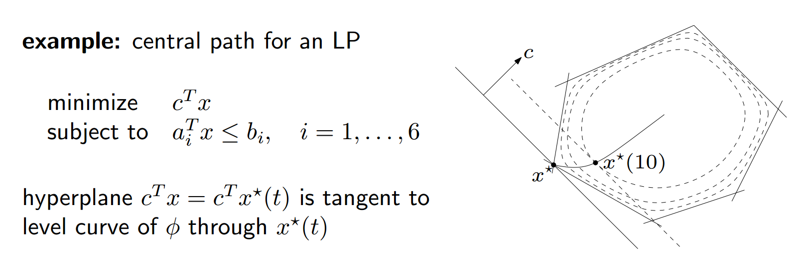

# Optimization Algorithms

## Gradient Descent

### Motivation

+ For unconstrained problem, $\nabla f(x^*) =0$ gives optimal.
+ Oracle access method: we do not know $f$, only access via query
  + First order oracle: access to $\nabla f(x)$, 
    + $x_{t+1} = x_t + \eta d$, 
    + $d=-\nabla f(x)$

### Gradient Descent

+ $x_{k+1}=x_{k}-\eta_{k} \nabla f\left(x_{k}\right)$, optimal when $\nabla =0$
+ choose stepsize:
  + Constant
  + Diminishing $\eta_{k} \rightarrow 0, \sum_{k} \eta_{k}=\infty$
  + Line search (exact / backtracking)

### Convergence

+ For $x_{k+1} = g(k) x_0$, convergence = $\log (g(k))$.i.e.:
  + $f(x)=a x^{2}, x_{0}=1$ -> $g(k)=(1-2a\eta )^k$, linear convergence

### Smoothness: Lipschitz (less convex than a quadratic)

$f$ has $M$ -Lipschitz gradients/ is smooth if
$$
\|\nabla f(x)-\nabla f(y)\| \leq M\|x-y\| \forall x, y
$$

#### Properties

+ Smoothness of function, self-tuning: get arbitrarily close to optimal solution without very small $\eta$
+ $g(x)=\frac{M}{2} x^{\top} x-f(x)$ is convex
  + $\nabla^{2} g(x)=M I-Q \succeq 0$, $M$ is the biggest eigen value of $Q$[Question: Q have to be PSD?]
+ $f$ is less convex than $\frac{M}{2} x^{T} x$
+ $f(y) \leq f(x)+\nabla f(x)^{T}(y-x)+\frac{M}{2}\|y-x\|_{2}^{2}$ Quadratic upper bound
+ for $x_{+}=x-\eta \nabla f(x)$, 
  + $f\left(x_{+}\right) \leq f(x)-\eta\|\nabla f(x)\|^{2}+\frac{M}{2} \eta^{2}\|\nabla f(x)\|^{2}$, 
  + we have descent condition: $\eta<\frac{2}{M} \Rightarrow f\left(x_{+}\right)<f(x)$
  + Steepest descent condition: $\eta=\frac{1}{M}$
  + Convergence rate for $\eta=\frac{1}{M}$: 
    + $f\left(x_{T}\right)-f^* \leq \frac{1}{T} \frac{1}{2 \eta}\left\|x_{0}-x^{*}\right\|^{2}$, i.e. $f\left(x_{T}\right)-f^* \leq O\left(\frac{M}{T}\right)$, i.e. convergence rate = $O(\frac{1}{T})$
+ For a fixed step size $t$, convergence condition is $\nabla^{2} f \npreceq(2 / t) I$

#### Examples:

+ $f(x)=a x^{2}$ -> $M=2a$

### Strongly convex (more convex than a quadratic)

+ Motivation: for very flat convex functions, convergence to optima $x^*$, rather than $f(x^*)$ can be very slow when getting close to optima.

$f$ is $m$ -strongly convex if and only if
$$
\forall x, y\langle\nabla f(x)-\nabla f(y), x-y\rangle \geq m\|x-y\|^{2}
$$

#### Properties

+ GD fast progress when far away ($\eta f(x)$ is big when far from $f(x^*)$)
+ $f(y) \geq f(x)-\frac{1}{2 m}\|\nabla f(x)\|^{2}$
+ $\text { If } \nabla^{2} f(x) \text { exists, then } \nabla^{2} f(x) \geq m I$ i.e. minimum eigenvaue of hessian $\ge m$
+ $g(x)=f(x)-\frac{m}{2} x^{\top} x$ is convex
  + $\nabla^{2} g(x)=Q-m I \succeq 0$, $m$ is the smallest eigen value of $Q$
+ $f(y) \geq f(x)+\nabla f(x)^{T}(y-x)+\frac{m}{2}\|x-y\|^{2}$

### M-Lipshitz and m-strongly convex

#### Convergence rate at $\eta=\frac{1}{M}$:

$$m \leq \frac{\|\nabla f(x)-\nabla f(y)\|}{\|x-y\|} \leq M$$
$$
\begin{aligned}
f\left(x_{+}\right) & \leq f(x)+\langle\nabla f(x),-\eta \nabla f(x)\rangle+\frac{M}{2}\|\eta \nabla f(x)\|^{2} & [M-lipschitz]\\
&=f(x)-\eta\left[1-\frac{\eta M}{2}\right]\|\eta \nabla f(x)\|^{2} \\
&=f(x)-\frac{1}{2 M}\|\eta \nabla f(x)\|^{2} & [\eta=\frac{1}{M}]\\
& f\left(x_{+}\right) \leq f(x)+\frac{m}{M}(f(x *)-f(x)) & [m-Strongly\; convex]\\
& f\left(x_{+}\right)-f(x^*) \leq\left[1-\frac{m}{M}\right](f(x *)-f(x)) &[-f(x^*) on both sides]
\end{aligned}
$$

+ If both smooth and strongly convex - linear convergence: $f(x_T)-f(x^*) \le O((1-m/M)^T)$ 
+ If only smooth - sublinear convergence: $f(x_T)-f(x^*) \le O(1/T)$
+ If only strongly convex: may not be smooth or differentiabe, can diverge

### Line Search

#### Motivation

+ In practice $M$ is unknown

#### Exact Line Search

$$
\eta_{t}=\arg \min _{\eta} f\left(x_{t}-\eta d_{t}\right)
$$

$d=p_k$ is the descent direction: $\left\langle\mathbf{p}_{k}, \nabla f\left(\mathbf{x}_{k}\right)\right\rangle<0$

+ $f\left(x_{t}-\eta d_{t}\right)$ is a convex function of $\eta,$ and $x_{t+1}=x_{t}-\eta d_{t}$
+ Correctness: when $f$ is convex, $f(x-\eta d) \geq f(x)-\eta \nabla f(x)^{T} d$,   $\eta \nabla f(x)^{T} d$ is the biggest descrease possible
+ Problem: computationally expensive

#### Backtracking Line Search

backtracking line search (with parameters $\alpha \in(0,1 / 2), \beta \in(0,1))$, choose step size $t$ small enough to get a fraction of largest possible decrease while not using a very small $t$. Start with $\eta=1$
$$
\begin{array}{l}
B T L S(\alpha, \beta): \\
\qquad \begin{array}{l}
\text { until } f(x-\eta d)<f(x)-\alpha \eta \nabla f(x)^{T} d \\
\eta \leftarrow \eta \beta
\end{array} \\
\text { Here, } \alpha<\frac{1}{2} \text { and } \beta<1
\end{array}
$$

+ If $f$ is M-smooth convex, then $\eta_{B T L S} \geq \frac{\beta}{M}$ and $f\left(x_{+}\right) \leq f(x)-\frac{\alpha \beta}{M}\|\nabla f(x)\|^{2}$

#### Compare theoretical and BTLS

+ M known:
  + $\eta = 1/M$
  + $f(x_T)-f^*\le \frac{M}{2T}\|x_0-x^*\|^2$
  + with m-strong convexity, $(1-\frac{m}{M})$ factor decrease each step
+ BTLS
  + $\eta \ge \frac{\beta}{M}$
  + $f(x_T)-f^*\le \frac{M}{2T\alpha \beta}\|x_0-x^*\|^2$
  + with m-strong convexity, $(1-min(2m\alpha , \frac{2\alpha \beta m}{M}))$ factor decrease each step

## Gradient Descent Methods

### Projected Gradient Descent

+ $x_{t+1}=\operatorname{Proj}_{x}\left(x_{t}-\eta \nabla f\left(x_{t}\right)\right)$
  + Proj: $\Pi_{X}(y)=\underset{x \in X}{\operatorname{argmin}} \frac{1}{2}\|x-y\|_{2}^{2}$
+ Key step: Projection
  + Project point onto plane: 
    + Take the displacement vector from the point in the plane to the given point: $\mathbf{v}=(x-d, y-e, z-f)$
    + $\mathbf{w}$ normal vector to the plane
    + $\mathbf{v}_{\perp}=\mathbf{v}-\frac{\mathbf{v} \cdot \mathbf{w}}{\|\mathbf{w}\|^{2}} \mathbf{w}$
    + projection is $(d, e, f)+\mathbf{v}_{\perp}$
  + Projection point onto norm ball: 
    + L2: $x = \arg \min _{\|\mathbf{x}\|_{2}^{2} \leq 1}\|\mathbf{x}-\mathbf{y}\|_{2}^{2}=\frac{\mathbf{y}}{\max \left\{1,\|\mathbf{y}\|_{2}^{2}\right\}}$
  + Generally, projection are quadratic programming: 

$$
\begin{array}{ll}
\operatorname{minimize} & \sum_{i=1}^{n}\left(x_{i}-y_{i}\right)^{2} \\
\text { subject to } & y \geq 0 \\
& \|y\|_p=1
\end{array}
$$

+ Properties of projection
  1. If $y \in X,$ then $\Pi_{X}(y)=y$
  2. The projection onto a convex set $X$ is non-expansive (contracting map). $\left\|\Pi_{X}(x)-\Pi_{X}(y)\right\|_{2} \leq\|x-y\|_{2}$
     $\left\|\Pi_{X}(x)-\Pi_{X}(y)\right\|_{2}^{2} \leq\left\langle\Pi_{X}(x)-\Pi_{X}(y), x-y\right\rangle \leq\|x-y\|_{2}^{2}$
  3. Optimal solution is fixed point $x^{*}=\Pi_{X}\left(x^{*}-\frac{\nabla f\left(x^{*}\right)}{L}\right)$
  4. ==Not affine invariant==
+ Convergence rate: Unconstrained case, convergence rate is the same 
  + f smooth: $O(1/T)$, i.e. $f\left(x_{t+1}\right)-f\left(x_{t}\right) \leq-\frac{\left\|\nabla f\left(x_{t}\right)\right\|^{2}}{2 M}$
  + f smooth and strongly convex: Linear $O[(1-m / M)^T]$, i.e. $\langle\nabla f(x)-\nabla f(y), x-y\rangle \geq \frac{m M}{m+M}\|x-y\|^{2}+\frac{1}{m+M}\|\nabla f(x)-\nabla f(y)\|^{2}$
  + allowed step size: $\eta=1 / M$
+ Trajectory: ==move perpendicular to level sets and then along boundary==
+ Issue: projection may be slow for some $C$

### Frank Wolfe Method

$$
\begin{aligned} s_{k-1}  \in \arg \min _{s \in C} \nabla f\left(x_{k-1}\right)^{T} s & [s_{k-1} \text{is always an extreme point, linear program in } s]\\ 
x_{k} =\left(1-\gamma_{k}\right) x_{k-1}+\gamma_{k} s_{k-1} & [\text{update to convex combination, always feasible}]\\
\gamma_{k}=\frac{2}{k+1} & [\text{step size decreases when getting close}]
\end{aligned}
$$

+ Key step: Solve argmin:
  + For $\|x\| \leq 1$ constraints

$$
\begin{aligned}
s & \in \arg \min _{\|s\| \leq 1} \nabla f\left(x_{k-1}\right)^{T} s \\
& \in-\partial\left\|\nabla f\left(x_{k-1}\right)\right\|_{*}
\end{aligned}
$$

+ Properties:
  + Works well for polytopes constraints - solve a sequence of linear programs
  + No projection step, fast in some cases
  + involves information of constraints
  + affine invariant
+ Convergence rate: similar, in general $O(1/k)$ sublinear, i.e. $f\left(x^{(k)}\right)-f^{*} \leq \frac{2 M}{k+2}$
+ Trajectory: ==move towards extreme point==

### Coordinate Descent

At each time $t,$ pick a coordinate $i$ and compute
$$
\begin{aligned}
x_{i}^{(t+1)} & \leftarrow \arg \min _{x_{i}} f\left(x_{i}, x_{j\ne i}^{(t)}\right) \\
x_{j}^{(t+1)} & \leftarrow x_{j}^{(t)} \forall j \neq i
\end{aligned}
$$
The choice of $i$: cyclic (most popular), random, greedy, etc.

+ Properties
  + If $f$ is smooth, then $x$ is optimal
    + Proof: If $\nabla f(x)$ exists,$f\left(x+\delta e_{i}\right) \geq f(x) \forall e_{i}, \forall \delta \Leftrightarrow \nabla f(x)=0$, thus $x$ is a 0 -derivative point.
  + If not smooth, generally not necessarily hold, but hold for intermediate case: $f$ can be written as ==smooth function plus a separable non-smooth function.==

$$
\min _{x} g(x)+\sum_{i=1}^{d} h_{i}\left(x_{i}\right)
$$

  + Not necessarily faster than GD because ==1 cycle of CD ~ 1 step of GD==
  + For equality constraints that is not separable, pick two coordinates and optimize jointly to satisfy the constraint
+ Key: separable functions
  + L1 norm = $\sum_{i}\left|x_{i}\right|$
+ Example: 

$$
\begin{array}{c}
\min _{x} \frac{1}{2}\|y-A x\|_{2}^{2}+\lambda\|x\|_{1} \\
0=A_{i}^{T} A_{i} x_{i}+A_{i}^{T}\left(A_{\backslash i} x_{\backslash i}-y\right)+\lambda s_{i} \\
s_i = sign(x_i)\\
x_{i}=sorh_{\frac{\lambda}{\left\|A_{i}\right\|^{2}}}\left(\frac{A_{i}^{T}\left(y-A_{\backslash i} x_{\backslash i}\right)}{\left\|A_{i}\right\|^{2}}\right)\\
\end{array}
$$

Soft threshold $sorh$: 
$$
(x)_{+}=\{\begin{array}{lcc}
x & \text { if } & x \geq 0 \\
0 & \text { otherwise }
\end{array}
$$

## Subgradient Basics

$$
f(y)-f(x) \ge g^T(y-x) \quad \text{ [Subgradient] }\\
\partial f(x) = \text{set}(g) \quad \text{ [Subdifferential] }
$$

###  Properties

+ normally defined for convex function, definition works for non-convex function, but subgradients may not exist for non-convex functions
+ negative subgradient is not always a descent direction, i.e. $f(x-\eta g) \leq f(x)$ Not always true (always true if differentiable).
+ negative subgradient is ==descent direction for distance to optimal point==

- $\partial f(x)=\{\nabla f(x)\}$ if $f$ is differentiable at $x$
- Optimality conditions
  + Unconstrained convex $f(x)$: if $0 \in \partial f(\hat{x})$
  + Constrained convex, KKT stationarity: $0 \in \partial f(x)+\sum_{i=1}^{m} u_{i} \partial h_{i}(x)+\sum_{j=1}^{r} v_{j} \partial \ell_{j}(x)$ 
  + $x$ is optimal (minimizes $f$) iff. there is no descent direction for $f$ at $x$

### Basic rules

- scaling: $\partial(\alpha f)=\alpha \partial f($ for $\alpha>0)$
- summation + linearity (from set relationship): $\partial\left(a_{1} f_{1}+a_{2} f_{2}\right)=a_{1} \partial f_{1}+a_{2} \partial f_{2}$
- Affine composition: if $g(x)=f(A x+b)$, then $\partial g(x)=A^{T} \partial f(A x+b)$
- chain rule: 
  - $\partial(\phi \circ f)(\bar{x})=\{\alpha u||(\alpha, u) \in \partial \phi(f(\bar{x})) \times \partial f(\bar{x})\}$
  - suppose $f$ is convex, and $g$ is differentiable, nondecreasing, and convex. Let $h=g \circ f,$ then

$$
\partial h(\boldsymbol{x})=g^{\prime}(f(\boldsymbol{x})) \partial f(\boldsymbol{x})
$$

- composition: suppose $f(\boldsymbol{x})=h\left(f_{1}(\boldsymbol{x}), \cdots, f_{n}(\boldsymbol{x})\right),$ where $f_{i}$ 's
  are convex, and $h$ is differentiable, nondecreasing, and convex. Let $\boldsymbol{q}=\left.\nabla h(\boldsymbol{y})\right|_{\boldsymbol{y}=\left[f_{1}(\boldsymbol{x}), \cdots, f_{n}(\boldsymbol{x})\right]},$ and $\boldsymbol{g}_{i} \in \partial f_{i}(\boldsymbol{x}) .$ Then

$$
q_{1} \boldsymbol{g}_{1}+\cdots+q_{n} \boldsymbol{g}_{n} \in \partial f(\boldsymbol{x})
$$

- point-wise maximum: if $f(x)=\max _{1 \leq i \leq k} f_{i}(x),$ then ( convex hull of union of subdifferentials of 'active' functions at $x$)

$$
\partial f(\boldsymbol{x})=\underbrace{\operatorname{conv}\left\{\bigcup\left\{\partial f_{i}(\boldsymbol{x}) \mid f_{i}(\boldsymbol{x})=f(\boldsymbol{x})\right\}\right\}}_{\text {convex hull of subdifferentials of all active functions }}
$$

+ point-wise supremum: $\quad$ if $f(x)=\sup _{\alpha \in \mathcal{F}} f_{\alpha}(x),$ then

$$
\partial f(\boldsymbol{x})=\text { closure }\left(\operatorname{conv}\left\{\bigcup\left\{\partial f_{\alpha}(\boldsymbol{x}) \mid f_{\alpha}(\boldsymbol{x})=f(\boldsymbol{x})\right\}\right\}\right)
$$

### Examples

+ 1-Norm
  + $$\begin{aligned}
    &f(x)=\|x\|_{1}=\sum_{i=1}^{n}\left|x_{i}\right|\\
    &g \in \partial\|x\|_{1} \text { if either } g_{i}=\operatorname{sign}\left(x_{i}\right) \text { if } x_{i} \neq 0, \text { or } g_{i} \in[-1,1] \text { if } x_{i}=0
    \end{aligned}$$
+ $f(x)=\max \left\{f_{1}(x), f_{2}(x)\right\},$ where $f_{1}, f_{2}$ are differentiable.

$$
\begin{array}{l}
f_{1}(x)>f_{2}(x) \Rightarrow g=\nabla f_{1}(x) \\
f_{1}(x)<f_{2}(x) \Rightarrow g=\nabla f_{2}(x) \\
f_{1}(x)=f_{2}(x) \Rightarrow g \in \operatorname{conv}\left\{\nabla f_{1}(x), \nabla f_{2}(x)\right\}
\end{array}
$$

## Subgradient Method

### Application

For **non-differentiable** functions

Example: GD oscillates in:

+ eg. $f(x) = |x|$, $x_{+}=x-\eta \operatorname{sgn}(x)$, oscillation for any step size $\eta$

### Algorithm

$$
x_{t+1}=x_{t}-\eta_{t} g_{t}\\
\text{find }x_{\text {best }}: f\left(x_{\text {best }}^{(t)}\right)=\min _{s \leq t} f\left(x_{s}\right)
$$

### Properties

+ Not a descent method: $(-g)$ might not be the descent direction, thus selecting best past point

#### Convergence Rate

**For fixed $\eta$: (doesn't work)**
$$
\lim _{t \rightarrow \infty} f\left(x_{\text {best}}^{(t)}\right) \leq f^{*}+\frac{\eta G^{2}}{2}
$$

+ $G$ is the Lipschitz constant of $f$ :$\|f(x)-f(y) \| \leq G\| x-y \|$
+ Then we have to make $\eta \rightarrow 0$ to converge to $f^*$, which won't work because $\Sigma_{t} \eta_{t} \rightarrow \infty$ is also required for enough update distances.

**For variable $\eta_t$:**
$$
f\left(x_{\text {best }}^{(t)}\right)-f^{*} \leq \frac{R^{2}+G^{2} \sum_{s \leq t} \eta_{s}^{2}}{2 \sum_{s \leq t} \eta_{s}}=O\left(\frac{R^{2}+G^{2}}{\sqrt{t}}\right) \text{ if } \eta_{t}=\frac{1}{\sqrt{t}}
$$

+ $R=\left\|x_{0}-x^{*}\right\|$ and note that $\left\|x_{t}-x^{*}\right\|^{2} \geq 0,\left\|g_{s}\right\|^{2} \leq G^{2}$
+ Corresponds to $O\left(\frac{1}{\varepsilon^{2}}\right)$ convergence rate

### Comparing Gradient and subgradient algorithms

+ Metric: number of steps for $f(x)-f(x^*)$ to reach within some $\epsilon$
+ Convexity
  + convex: local optimal -> global optimal, $f$ can be globally approximated from below by linear function
  + smooth + convex: 
    + quadratically upper bounded -> self tuning 
    + no kink at optimal
    + $\nabla f(x) \rightarrow 0 \text{ as } x\rightarrow x^*$
  + strongly convex: 
    + quadratic lower bounded -> ($\nabla f(x)$) big steps when far away from optimal
    + Not looking at points close to optimal
+ Convergence rate 
  + $f$ convex: subgradient method $O\left(\frac{1}{\varepsilon^{2}}\right)$ steps, each step updates $O\left(\frac{1}{\sqrt T}\right)$
  + $f$ convex and smooth (differentiable everywhere): GD $O\left(\frac{1}{\varepsilon}\right)$ steps
  + $f$ strongly convex and not necessarily smooth: subgradient method $O\left(\frac{1}{\varepsilon}\right)$ steps
  + $f$ strongly convex and smooth: GD method $O\left(\log \frac{1}{\varepsilon}\right)$ steps

## Proximal Gradient Descent

### Application

For **Decomposable** objective functions:
$$
\min _{x} g(x)+h(x)
$$

+ $g$ is convex and smooth
+ $h$ is convex not smooth, with easy-to-calculate $\text{prox}(h)$

### Algorithm

**Prox operator**: $\mathbb{R}^n \rightarrow \mathbb{R}^n$, not a function but a mapping
$$
\begin{array}{c}
\operatorname{prox}_{\eta}(x)=\arg \min _{z}\left\{\frac{1}{2 \eta}\|x-z\|^{2}+h(z)\right\} \\
x_{+}=\operatorname{prox}_{\eta}(x-\eta \nabla g(x))
\end{array}
$$

### Properties

+ Useful when $prox$ operator is easy to calculate

+ $$
  \operatorname{prox}_{g}(\mathbf{x})=\operatorname{argmin}_{\mathbf{u} \in \mathbb{E}}\left\{\delta_{C}(\mathbf{u})+\frac{1}{2}\|\mathbf{u}-\mathbf{x}\|^{2}\right\}=\operatorname{argmin}_{\mathbf{u} \in C}\|\mathbf{u}-\mathbf{x}\|^{2}=P_{C}(\mathbf{x})\\
  \delta: \text{indicator function;} \quad P_{C}:\text{projection function}
  $$

#### Convergence Rate

+ with $\eta<\frac{1}{M}$ ($M$ is for $g(x)$ and $prox(h(x))$ is easy-to-calculate): $f\left(x_{t}\right)-f * \leq \frac{\left\|x_{0}-x^{*}\right\|^{2}}{2 \eta t}$, i.e. $O\left(\frac{1}{\varepsilon}\right)$, same as gradient descent

### Examples

|                            | Objective function                                           | argmin{}                                                     | Prox                                                         |
| -------------------------- | ------------------------------------------------------------ | ------------------------------------------------------------ | ------------------------------------------------------------ |
| Projected Gradient Descent | $\min _{x \in C} g(x) \Longleftrightarrow \min _{x \in \mathbb{R}^{n}} g(x)+I_{C}(x)$ | $\frac{1}{2 t}\|x-z\|_{2}^{2}+I_{C}(z)= \|x-z\|_{2}^{2}$     | $P_c$                                                        |
| Lasso                      | $\min _{\beta}\|y-X \beta\|^{2}+\lambda\|\beta\|_{1}$        | $\left\{\frac{1}{2 \eta}\|\beta-z\|^{2}+\lambda\|z\|_{1}\right\}$ | $\left\{\begin{array}{ll}\beta_{i}-\eta \lambda & \text { if } \beta_{i}>\eta \lambda \\\beta_{i}+\eta \lambda & \text { if } \beta_{i}<-\eta \lambda \\0 & \text { else }\end{array}\right.$ |
| One-norm                   | $h(x)=\|x\|_{1}=\sum\left|x_{i}\right|$                      |                                                              | soft thresholding operator: $z_{i}=\left\{\begin{array}{ll}x_{i}-1 & x_{i}>\eta \\0 & -\eta \leqslant x_{i} \leqslant \eta \\x_{i}+1 & x_{i}<-\eta \end{array}\right.$ |
| Quadratic                  | $f(\mathbf{x})=\frac{1}{2} \mathbf{x}^{T} \mathbf{A} \mathbf{x}+\mathbf{b}^{T} \mathbf{x}+c$ | $\frac{1}{2} \mathbf{u}^{T} \mathbf{A} \mathbf{u}+\mathbf{b}^{T} \mathbf{u}+c+\frac{1}{2}\|\mathbf{u}-\mathbf{x}\|^{2}$ | $(\mathbf{A}+\mathbf{I})^{-1}(\mathbf{x}-\mathbf{b})$        |

## Newton Method

### Application

For functions with easy-to-calculate Hessian $\nabla^{2} f(.)$.

### Idea

$$
\text{Use local quadratic approximation: }\\
g(x)=f\left(x_{0}\right)+\nabla f\left(x_{0}\right)^{T}\left(x-x_{0}\right)+\frac{1}{2}\left(x-x_{0}\right)^{T} \nabla^{2} f\left(x_{0}\right)\left(x-x_{0}\right)\\
\text{update rule:}\\
x=x_{0}-\left[\nabla^{2} f\left(x_{0}\right)\right]^{-1} \nabla f\left(x_{0}\right)\\
\text{Where} \left[\nabla^{2} f\left(x_{0}\right)\right]^{-1} \text{is the step size}
$$

### Algorithm

given a starting point $x \in \operatorname{dom} f,$ tolerance $\epsilon>0$. repeat

1. Compute the Newton step and decrement.

$$
\Delta x_{\mathrm{nt}}:=-\nabla^{2} f(x)^{-1} \nabla f(x) ; \quad \lambda^{2}:=\nabla f(x)^{T} \nabla^{2} f(x)^{-1} \nabla f(x)
$$

2. Stopping criterion. quit if $\lambda^{2} / 2 \leq \epsilon$.
3. Line search. Choose step size $t$ by backtracking line search.
4. Update. $x:=x+t \Delta x_{\text {nt. }}$

+ $\lambda(x)$ Newton decrement: a measure of the proximity of $x$ to $x^{\star}$, is affine invariant

### Affine Invariance

+ $+$ Affine invariance: Suppose $g(y)=f(A y),$ where $x=A y$ for invertible $A$
  $$
  \begin{aligned}
  \nabla g(y) &=A^{T} \nabla f(A y) \\
  \nabla^{2} g(y) &=A^{T} \nabla^{2} f(A y) A \\
  y_{+} &=y-\left[\nabla^{2} g(y)\right]^{-1} \nabla g(y) \\
  A y_{+} &=A y-A A^{-1}\left(\nabla^{2} f(A y)\right)^{-1} A^T \nabla g(y)\\
  A y_{+} &=A y-\left(\nabla^{2} f(A y)\right)^{-1} \nabla f(A y)
  \end{aligned}
  $$

+ Bounds of convergence are not affine invariant, depend on m, M, L..

### Convergence

#### General case: 

Fixed step size $\eta = 1$ Pure Newton Method, may not converge

#### Assume: m-Strongly convex + M-smooth + L-Lipschitz Hessian with Backtracking line search

+ Assumptions: $m I \leq \nabla^{2} f(x) \leq M I \quad \forall x$, $|\nabla^{2} f(x_1)-\nabla^{2} f(x_2)|\le L|x_1-x_2|$

+ Two stage convergence: $\alpha \in\left(0, m^{2} / L\right), \gamma>0$
  + damped Newton phase $\left(\|\nabla f(x)\|_{2} \geq \alpha\right)$ 
    + most iterations require backtracking steps 
    + function value decreases by at least $\gamma$,  $f\left(x_{+}\right)-f(x) \leq-\gamma$ or $f(x_k)-f^*\le f(x_0)-f^*-\gamma k$
    + Linear decrement/ log-sublinear convergence
    + if $p^{\star}>-\infty$, this phase ends after at most $\left(f\left(x^{(0)}\right)-p^{\star}\right) / \gamma$ iterations
  + (pure) quadratically convergent phase $\left(\|\nabla f(x)\|_{2}<\alpha\right)$
    + all iterations use step size $\eta=1$
    + gradient exponential decrement / $\|\nabla f(x)\|_{2}$ converges to zero quadratically: if $\left\|\nabla f\left(x^{(k)}\right)\right\|_{2}<\eta,$ then $\frac{L}{2 m^{2}}\left\|\nabla f\left(x_{+}\right)\right\| \leq\left(\frac{L}{2 m^{2}}\|\nabla f(x)\|\right)^{2} \le 1 \quad [\frac{L}{2 m^{2}}\text{ guarantees} \le 1]$
    + $f(x_k)-f^* \le \frac{2 m^{3}}{L^{2}}\left(\frac{1}{2}\right)^{k-k_{0}+1}$
  
+ Overall number of steps to reach $f(x)-f^{*} \leq \varepsilon$: 

  + $$
    \frac{f\left(x_{0}\right)-f^{*}}{\gamma}+\log \log \left(\frac{\varepsilon_{0}}{\varepsilon}\right)
    $$

  + **Quadratic convergence:** $\log \log \frac{\varepsilon_{0}}{\varepsilon} \approx$ constant, because it changes very slowly. Thus total number of steps ~ constant

  + Assume $\left|\epsilon_{0}\right|=\left|x^{*}-x_{0}\right|<1$

  + $\gamma$, $\epsilon_0$ depend on $m$, $L$. 

  + Compare to GD Linear convergence: $\log \left(\frac{1}{\varepsilon}\right)$ 

+ $+$ can converge with fewer iterations

+ $-$ each iteration more expensive

#### Assume: Self-Concordance

+ Definition: (for objective function)

  + In 1d $f: \mathbb{R} \rightarrow \mathbb{R}$: $\left|f^{\prime \prime \prime}(x)\right| \leq 2\left[f^{\prime \prime}(x)\right]^{\frac{3}{2}}$
  + In nd $f: \mathbb{R}^{n} \rightarrow \mathbb{R}$: if every 1d projection of the function is self-concordant

+ Examples:

  + $g(x)=-x^{p}$ for $0
0$
+ Has infinite number of Hessians as solution: $n$ equality constraints with $O(n^2)$ degree of freedom in Hessian
+ Different methods offer different choice of solution
+ Approximate $B\approx \nabla^{2} f(x),$

### Rank-1 Update

$$
\begin{array}{c}B_{+}=B+a u u^{T} &[a u u^{T}\text{ is symmetric, rank 1 matrix}, a \text{ is scalar}, u \text{ vector}] \\B_{+} s=y \Rightarrow\left(a u^{T} s\right) u=y-B s &[a, u^{T} s\text{ are scalar}] \end{array}
$$

$$
B_{+} \leftarrow B+\frac{(y-B s)(y-B s)^{T}}{(y-B s)^{T} s}\\

s_+=-B_+^{-1}\nabla f(x)\\
x_{k+2}=x_{k+1}+s_{k+1} \eta_{k+1}
$$

+ by Sherman, Morrison, Woodbury (SMW) theorem: $\left(A+u v^{T}\right)^{-1}=A^{-1}-\frac{A^{-1} u v^{T} A^{-1}}{1+v^{T} A^{-1} u}$, where $\frac{A^{-1} u v^{T} A^{-1}}{1+v^{T} A^{-1} u}$ is rank=1, we can update $B_+^{-1}$ from $B^{-1}$ directly with low cost
+ **Problem**: if $(y-B s)^{T} s<0$, $B_+$ may not be positive semidefinite, $B_+$ needs to be symmetric and positive semidefinite for convex function

### Rank-2 Update

$$
\begin{array}{c}B_{+}=B+a u u^{T}+b v v^{T} &[a u u^{T}+bv v^{T}\text{ is  rank 2} ] \\B_{+} s=y \Rightarrow y-B s=\left(a u^{T} s\right) u+\left(b v^{T} s\right) v &[a, u^{T} s\text{ are scalar}] \end{array}
$$

+  $B_+$ is positive semidefinite if $a$ and $b$ are positive
+  The following methods give different solution to these constraints

#### Davidon-Fletcher-Powell (DFP)

+ $\mathbf{u}=\mathbf{y}_{k} \text { and } \mathbf{v}=B_{k} \mathbf{s}_{k}$

+ finds a solution that is symmetric, positive-definite and closest to the current approximate value of$B_k$ 

  + $$
    \begin{aligned}
    \operatorname{minimize}_{\boldsymbol{B}} &\left\|\boldsymbol{B}^{-1}-\boldsymbol{B}_{t}^{-1}\right\| \\
    \text { subject to } & \boldsymbol{B}^{-1}=\boldsymbol{B}^{-1\top} \\
    & \boldsymbol{B} ^{-1} \boldsymbol{y}_{t}=s_{t}
    \end{aligned}
    $$

+ $$
  B_{k+1}=\left(I-\gamma_{k} y_{k} s_{k}^{T}\right) B_{k}\left(I-\gamma_{k} s_{k} y_{k}^{T}\right)+\gamma_{k} y_{k} y_{k}^{T}
  $$

  where
  $$
  \begin{array}{l}
  y_{k}=\nabla f\left(x_{k}+s_{k}\right)-\nabla f\left(x_{k}\right) \\
  \gamma_{k}=\frac{1}{y_{k}^{T} s_{k}}
  \end{array}
  $$
  and $B_{k}$ is a symmetric and positive-definite matrix.

#### Broyden-Fletcher-Goldfarb-Shanno (BFGS) method

+ Choosing $\|\boldsymbol{M}\|:=\left\|\boldsymbol{W}^{1 / 2} \boldsymbol{M} \boldsymbol{W}^{1 / 2}\right\|_{\mathrm{F}}$ for any weight matrix $\boldsymbol{W}$
  obeying $\boldsymbol{W} \boldsymbol{s}_{t}=\boldsymbol{y}_{t},$ we get
  $$
  \begin{array}{cl}
  \operatorname{minimize}_{\boldsymbol{B}} & \left\|\boldsymbol{W}^{1 / 2}\left(\boldsymbol{B}^{-1}-\boldsymbol{B}_{t}^{-1}\right) \boldsymbol{W}^{1 / 2}\right\|_{\mathrm{F}} \\
  \text { subject to } & \boldsymbol{B}^{-1}=\boldsymbol{B}^{-1\top} \\
  & \boldsymbol{B}^{-1} \boldsymbol{y}_{t}=\boldsymbol{s}_{t}
  \end{array}
  $$

+ $B_{k+1}=B_{k}+\frac{\mathbf{y}_{k} \mathbf{y}_{k}^{\mathrm{T}}}{\mathbf{y}_{k}^{\mathrm{T}} \mathbf{s}_{k}}-\frac{B_{k} \mathbf{s}_{k} \mathbf{s}_{k}^{\mathrm{T}} B_{k}^{\mathrm{T}}}{\mathbf{s}_{k}^{\mathrm{T}} B_{k} \mathbf{s}_{k}}$
+ $\begin{aligned}
  a &=\frac{1}{\mathbf{y}_{k}^{T} \mathbf{s}_{k}} \\
  b &=-\frac{1}{\mathbf{s}_{k}^{T} B_{k} \mathbf{s}_{k}}
  \end{aligned}$
+ $\left(B_{+}\right)^{-1}=\left(I-\frac{s y^{T}}{y^{T} s}\right) B^{-1}\left(I-\frac{s y^{T}}{y^{T} s}\right)+\frac{s s^{T}}{y^{T} s}$ Inverse of DFP

### Algorithm

$H = B^{-1}$
$$
\begin{array}{l}
\text { Algorithm BFGS } \\
\hline \text { 1: for } t=0,1, \cdots \text { do } \\
\text { 2: } x^{t+1}=x^{t}-\eta_{t} H_{t} \nabla f\left(x^{t}\right) \text { (line search to determine } \left.\eta_{t}\right) \\
\text { 3: } \quad H_{t+1}=\left(I-\rho_{t} s_{t} y_{t}^{\top}\right) H_{t}\left(I-\rho_{t} y_{t} s_{t}^{\top}\right)+\rho_{t} s_{t} s_{t}^{\top} \\
\text { , where } s_{t}= 
x^{t+1}-x^{t}, y_{t}=\nabla f\left(x^{t+1}\right)-\nabla f\left(x^{t}\right), \text { and } \rho_{t}=\frac{1}{y_{t}^{\top} s_{t}}
\end{array}
$$

+ Backtracking: step size satisfies ($0<\alpha_1<\alpha_2<1$) (for strongly convex $f$)
  + $f(x+\eta s) \leq f(x)+\alpha_{1} \eta \nabla f(x)^{T} s$ [Original Backtracking requirement]
  + $\nabla f(x+\eta x)^{T} s \geq \alpha_{2}\left|\nabla f(x)^{T} s\right|$
  + Convergence: $x_{k} \rightarrow x^{*}$ **super linearly**. $\lim _{t \rightarrow \infty} \frac{\left\|\boldsymbol{x}^{t+1}-\boldsymbol{x}^{*}\right\|_{2}}{\left\|\boldsymbol{x}^{t}-\boldsymbol{x}^{*}\right\|_{2}}=0$
+ each iteration costs $O(n^2)$ from matrix multiplication involving $H$ (in addition to computing gradients)
+ no need to solve linear systems or invert matrices
+ no magic formula for initialization; possible choices: approximate
  inverse Hessian at $x_0$, or identity matrix

**Improvements: LBFGS (Limited-memory BFGS)**

+ Retaining and updating $B$ and $B^{-1}$ may still be hard: BFGS involves
  $$
  \left(B_{+}\right)^{-1}=\left(I-\frac{s y^{T}}{y^{T} s}\right) B^{-1}\left(I-\frac{s y^{T}}{y^{T} s}\right)+\frac{s s^{T}}{y^{T} s}
  $$

+ Idea: calculate $\left(B_{+}\right)^{-1}\left(-\nabla f\left(x_{+}\right)\right)$ directly by retaining past $(s, y)$ values.

## Barrier Methods

### Idea

+ Replace inequality constraint $f_i(x)\le 0$ with smooth barrier terms in objective
+ Increase parameter (closeness to constraint) $t$ and follow along central path
+ Good for linear programs

### Derivation

#### Logarithmic barrier

+ Inequality constraint to indicator function $\begin{array}{ll}
  \operatorname{minimize} & f_{0}(x) \\
  \text { subject to } & f_{i}(x) \leq 0 \\
  & A x=b
  \end{array}\Rightarrow \begin{array}{ll}
  \underset{1}{\operatorname{minimize}} & f_{0}(x)+\sum_{i=1}^{m} I_{-}\left(f_{i}(x)\right) \\
  \text { subject to } & A x=b
  \end{array}$

+ Indicator function to log function 
  $$
  \begin{array}{ll}
  \underset{1}{\operatorname{minimize}} & f_{0}(x)-(1 / t) \sum_{i=1}^{m} \log \left(-f_{i}(x)\right) \\
  \text { subject to } & A x=b
  \end{array}\\
  \quad \\
  \text{Rewrite as:}\\
  \begin{array}{ll}
  \operatorname{minimize} & t f_{0}(x)+\phi(x) \\
  \text { subject to } & A x=b
  \end{array}
  \\
  \quad \\
  \text{Barrier function: }\\
  \phi(x)=-\sum_{i=1}^{m} \log \left(-f_{i}(x)\right), \quad \operatorname{dom} \phi=\left\{x \mid f_{1}(x)<0, \ldots, f_{m}(x)<0\right\}
  $$
  
+ Barrier function is continuously differentiable
  $$
  \begin{aligned}
  \nabla \phi(x) &=\sum_{i=1}^{m} \frac{1}{-f_{i}(x)} \nabla f_{i}(x) \\
  \nabla^{2} \phi(x) &=\sum_{i=1}^{m} \frac{1}{f_{i}(x)^{2}} \nabla f_{i}(x) \nabla f_{i}(x)^{T}+\sum_{i=1}^{m} \frac{1}{-f_{i}(x)} \nabla^{2} f_{i}(x)
  \end{aligned}
  $$
  

#### Central path

##### Central path: $\left\{x^{\star}(t) \mid t>0\right\}$, optimal solution at each $t$

##### Dual points on central path

+ **Gives optimality result $f\left(x^{*}(t)\right)-f^{*} \leq \frac{m}{t}$** 

+ KKT conditions
  $$
  \begin{array}{c}
  t \nabla f_{0}(x)+\sum_{i=1}^{m} \frac{1}{-f_{i}(x)} \nabla f_{i}(x)+A^{T} w=0 & [\text{Stationarity}]\\
   A x^{*}(t)-b=0, f_{i}\left(x^{*}(t)\right) \leq 0 & [\text{Feasibility}]
  \end{array}
  $$
  Optimal dual variables from KKT are feasible: $\lambda_{i}^{\star}(t)=1 /\left(-t f_{i}\left(x^{\star}(t)\right)\right. > 0 \text { and } \nu^{\star}(t)=w / t >0$

  Weak duality: 
  $$
  \begin{aligned}
  p^{\star} & \geq g\left(\lambda^{\star}(t), \nu^{\star}(t)\right) \\
  & =\min _{x} L(x(t), \lambda(t), \nu(t))\\
  &=L\left(x^{\star}(t), \lambda^{\star}(t), \nu^{\star}(t)\right) \\
  & =f_{0}(x^*)+\sum_{i=1}^{m} \lambda_{i}^{\star}(t) f_{i}(x^*)+\nu^{\star}(t)^{T}(A x^*-b)\\
  & A x^*-b = 0 \text{ [Feasibility]}\\
  & \lambda_{i}^{\star}(t) f_{i}(x^*)=1 \text{ [Optimal dual]}\\
  \\
  &=f_{0}\left(x^{\star}(t)\right)-m / t
  \end{aligned}
  $$
  

### Algorithm

**given** strictly feasible $x, t:=t^{(0)}>0, \mu>1,$ tolerance $\epsilon>0$
**repeat**

1. Centering step. Compute $x^{\star}(t)$ by minimizing $t f_{0}+\phi,$ subject to $A x=b$.
   1. Usually with Newton's method
2. Update. $x:=x^{\star}(t)$.
3. Stopping criterion. **quit** if $m / t<\epsilon$.
   1. Follows from $f_{0}\left(x^{\star}(t)\right)-p^{\star} \leq m / t$
4. Increase $t . t:=\mu t$.
   1. Large $\mu$ : fewer outer iterations, more Newton steps
   2. Typical $\mu = 10 - 20$

For LPs:

+ $$
  \begin{array}{c}
  \min _{x} c^{T} x \text { s.t. } D x \leq f, A x=b \\
  \min _{x} t c^{T} x-\sum_{i=1}^{m} \log \left(e_{i}-d_{i}^{T} x\right) \text { s.t. } A x=b
  \end{array}
  $$

  This is self-concordant! The Newton method works very well

### Convergence

+ number of outer (centering) iterations: exactly
  $$
  \left[\frac{\log \left(m /\left(\epsilon t^{(0)}\right)\right)}{\log \mu}\right\rceil
  $$
  plus the initial centering step (to compute $\left.x^{\star}\left(t^{(0)}\right)\right)$

+ Centering problem (Newton's steps)
  

  + $$
    \operatorname{minimize} \quad t f_{0}(x)+\phi(x)
    $$
    + $ t f_{0}+\phi$ must have closed sublevel sets for $t \geq t^{(0)}$

    - classical analysis requires strong convexity, Lipschitz condition
    - analysis via self-concordance requires self-concordance of $t f_{0}+\phi$

## Accelerated Gradient Descent

+ Gradient Descent: lower bound not achieved if has big oscillating gradient
  $$
  \begin{array}{|l|l|l|}
  \hline \text { Gradient descent } & \text { Upper bound } & \text { Lower bound } \\
  \hline \begin{array}{l}
  \nabla f \\
  \text { L-Lipschitz }
  \end{array} & O\left(\frac{1}{T}\right) & \Omega\left(\frac{1}{T^{2}}\right) \\
  \hline \begin{array}{l}
  \text { Strongly convex with } \\
  \text { condition number } \kappa
  \end{array} & \left(1-\frac{2}{\kappa+1}\right)^{T} & \left(1-\frac{2}{\sqrt{\kappa}+1}\right)^{T} \\
  \hline
  \end{array}
  $$
  

### Heavy ball method

$$
\boldsymbol{x}^{t+1}=\boldsymbol{x}^{t}-\alpha_{t} \nabla f\left(\boldsymbol{x}^{t}\right)+\underbrace{\beta_{t}\left(\boldsymbol{x}^{t}-\boldsymbol{x}^{t-1}\right)}_{\text {momentum term }}
$$

+ Understanding momentum term:

  + $\begin{aligned}
    x_{k+1} &=x_{k}-\alpha_{k} \nabla f\left(x_{k}\right)+\beta_{k}\left(x_{k}-x_{k-1}\right) \\
    &=x_{k}-\alpha_{k} \nabla f\left(x_{k}\right)+\beta_{k}\left[-\alpha_{k-1} \nabla f\left(x_{k-1}\right)+\beta_{k-1}\left(x_{k-1}-x_{k-2}\right)\right] \\
    &=x_{k}-\alpha_{k} \nabla f\left(x_{k}\right)-\alpha_{k-1} \beta_{k} \nabla f\left(x_{k-1}\right)
    \end{aligned}$
  + Accumulates gradients but with earlier terms weighted down

+ Achieves lower bound for strongly convex but not L-lipschitz condition.

+ Implementation:  **"gradient before momentum"**
  $$
  \begin{aligned}
  p_{k} &=-\nabla f\left(x_{k}\right)+\beta_{k} p_{k-1} & \text{Gradient Step}\\
  x_{k+1} &=x_{k}+\alpha_{k} p_{k} & \text{Momentum Step}
  \end{aligned}
  $$
  

### Nestrov Accelerated Gradient

**"Momentum before gradient"**
$$
\begin{aligned}
p_{k} &=-\nabla f\left(x_{k}+\beta_{k}\left(x_{k}-x_{k-1}\right)\right)+\beta_{k} p_{k-1} \\
x_{k+1} &=x_{k}+\alpha_{k} p_{k}
\end{aligned}
$$

+ $-\nabla f\left(x_{k}+\beta_{k}\left(x_{k}-x_{k-1}\right)\right)$: take a step with momentum and calculate the gradient at the new point
+ $\alpha_{k}=\frac{1}{L}$ , $\beta_{k}=\frac{k-2}{k-1}$ as standard choice for both methods
+ Achieves lower bound for both stronly convex and L-lipshitz condition
+ Also works for proximal gradient setting

## Stochastic Gradient Descent

+ Gradient descent: calculate $\nabla f(x)$ can be expensive if dimenion is high
+ Separable problem $\min _{x} \frac{1}{n} \sum_{i=1}^{n} f_{i}(x)$: gradient can be calculated for each dimension independently

### Noisy Unbiased (sub) Gradient (NUS)

$g(.)$ is a noisy unbiased subgradient (NUS) of $f(.)$ if its expectation is a subgradient
$$
E[g(x) \mid x] \in \partial f(x) \forall x
$$

+ if gradient exists, $E[g(x) \mid x] = \nabla f(x)$

To obtain NUS:

+ Random gradient descent: $\boldsymbol{f}(x)=\frac{1}{n} \sum_{i} f_{i}(x), g(x)=\nabla f_{i}(x)$
  where the index $i$ is chosen randomly from a uniform distribution
+ random coordinate descent $x_{+}^{(i)}=x^{(i)}-\eta \frac{\partial}{\partial x_{i}} f(x)$
  Again $i$ is chosen uniformly at random.

### Stochastic Gradient Descent

$$
x_{k+1}=x_{k}-\eta_{k} g\left(x_{k}\right)
$$

+ $g$ is NUS, keep track of x best
+ Affected by variance
+ Good for distributed settings
+ Works for Dropout

#### Convergence

$$
E[f(x_{Best}^T)]-f^{*} \leq \frac{R^{2}+G^{2} \Sigma_{0}^{T} \eta_{k}^{2}}{2 \Sigma_{0}^{T} \eta_{k}}
$$

+ $\Sigma_{0}^{\infty} \eta_{k} \rightarrow \infty$: if it increases faster than $\Sigma_{0}^{T} \eta_{k}^{2}$, will have convergence (error = 0)

+ $\left\|x_{0}-x^{*}\right\|^{2} \leq R^{2}$, $R$ depends on initial condition

+ $G^{2} \geq E\left[\|g(x)\|^{2} \mid x\right]$ : $G$ is a uniform upper bound on the variance of $g(x)$, higher variance, slower convergence

+ If fixed step size: not converge, because when close to $x^*$, fixed step size will keep stepping away from $x^*$ Works in practice if very small error is not required

+ Problem: needs $\eta_{k} \rightarrow 0$ because $\operatorname{Var}\left(g_{k}\right)$ does not approach zero, But $\eta_{k} \rightarrow 0$ makes $\mathrm{SGD}$ "slower than it needs to be". 

+ Summary
  $$
  \begin{aligned}
  &\text { Error after } T \text { iterations }\\
  &\begin{array}{|l|l|l|l|}
  \hline & \begin{array}{l}
  \text { Gradient } \\
  \text { descent }
  \end{array} & \begin{array}{l}
  \text { Stochastic } \\
  \text { gradient descent }
  \end{array} \\
  \hline \begin{array}{l}
  \text { Convex } f(.) \\
  \text { (potentially not smooth) }
  \end{array} & O\left(\frac{1}{\sqrt{T}}\right) & O\left(\frac{1}{\sqrt{T}}\right) \\
  \hline \begin{array}{l}
  \text { Lipschitz } \\
  \nabla f(i)
  \end{array} & O\left(\frac{1}{T}\right) & O\left(\frac{1}{\sqrt{T}}\right) \\
  \hline \begin{array}{l}
  \text { Strong } \\
  \text { convex }
  \end{array} & O\left(c^{T}\right) & O\left(\frac{1}{T}\right) \text{expotentially slower}\\
  \hline \text { Per iteration cost } & O(n d) & O(d) \\
  \hline
  \end{array}
  \end{aligned}
  $$

### Mini-batch SGD

[also a NUS] instead of 1 sample a time (SGD), take $b$ samble:
$$
x_{k+1}=x_{k}-\eta_{k} \frac{1}{b} \sum_{i \in I_{k}} \nabla f_{i}\left(x_{k}\right)
$$
where $b$ is the batch size, $I_{k}$ is a random set of samples with cardinality $b,$ and $U P D A T E=\frac{1}{b} \sum_{i \in I_{k}} \nabla f_{i}\left(x_{k}\right)$
$$
\begin{aligned}
E\left[U P D A T E \mid x_{k}\right] &=\nabla f\left(x_{k}\right) \\
\operatorname{Var}\left[U P D A T E \mid x_{k}\right] &=\frac{1}{b} \operatorname{Var}\left[S G D \mid x_{k}\right] & [\text{Reduce variance by } \frac{1}{b}]
\end{aligned}
$$

+ Similar to SGD, still need to have $\eta_k \rightarrow 0$

### Summary

|                              | GD                      | SGD                                   | Minibatch SGD                                    |
| ---------------------------- | ----------------------- | ------------------------------------- | ------------------------------------------------ |
| Convex                       | $O(\frac{1}{\sqrt{T}})$ | $O(\frac{1}{\sqrt{T}})$               | $O(\frac{1}{\sqrt{T}})$                          |
| Smooth (Lipshitz $\nabla f$) | $O(\frac{1}{T})$        | $O(\frac{1}{\sqrt{T}})$               | $O\left(\frac{1}{\sqrt{b T}}+\frac{1}{T}\right)$ |
| Strongly convex              | $O(c^T)$                | $O(\frac{1}{T})$ exponentially slower | $O(\frac{1}{T})$                                 |
| Cost per iteration           | $O(nd)$                 | $O(d)$                                | $O(bd)$                                          |
|                              |                         |                                       |                                                  |

## Variance Reduction

#### Variance of SGD

$$
\begin{array}{l}
g(x) \equiv(\text { random }) \text { update } \\
\qquad x_{k+1}=x_{k} \eta_{k} g\left(x_{k}\right)
\end{array}
$$

set bias: $\quad E\left[g\left(x_{k}\right) \mid x_{k}\right]-\nabla f\left(x_{k}\right) = 0$
set variance: $\operatorname{Var}\left[\left\|g\left(x_{k}\right)\right\| \mid x_{k}\right]\leq G^{2}$
when $B I A S=0$ and $V A R \leq G^{2}, O\left(\frac{G^{2}}{\sqrt{T}}\right)$ convergence

+ If we can reduce variance (bounded by $G_k$ rather than fixed $G$) as $k$ increases, then fixed step size is allowed 
  $E\left[f\left(x_{B E S T}^{T}\right)\right]-f^{*} \leq \frac{R^{2}+\sum_{0}^{T} \eta_{k}^{2} G_{k}^{2}}{2 \sum_{0}^{T} \eta_{k}}$

### Stochastic average gradient (SAG)

+ Update $g$ values only one dimension a step but **uses all the $g$ values** including the stale ones. : at step $k,$ pick $i_{k}$ randomly and do

$$
\begin{array}{l}
g_{i_{k}}^{(k)}=\nabla f_{i_{k}}\left(x^{(k-1)}\right) \\
g_{j}^{(k)}=g_{j}^{(k-1)} \text { for } j \neq i_{k} \\
x^{(k)}=x^{(k-1)}-\frac{\eta_{k}}{n} \sum_{i=1}^{n} g_{i}^{(k)}
\end{array}
$$

​		Memory efficient implementation (no need to memorize all $g_k$' s)':

$$
\sum_{i=1}^{k} g_{i}^{(k)}=\frac{g_{i_{k}}^{(k)}}{n}-\frac{g_{i_{k}}^{(k-1)}}{n}+\sum_{i=1}^{n} g_{i}^{(k-1)}
$$

$$
a^{(k)}=\frac{g_{i_{k}}^{(k)}}{n}-\frac{g_{i_{k}}^{(k-1)}}{n}+a^{(k-1)}\\
x^{(k)}=x^{(k-1)}-\eta_{k}\left[\frac{g_{i_{k}}^{(k)}-g_{i_{k}}^{(k-1)}}{n}+\frac{1}{n} \sum_{i} g_{i}^{(k-1)}\right]
$$

​		$a^{(0)}$ just accumulates $\nabla f_{i}\left(x^{(0)}\right)$ values

+ Not unbiased, but **Asymptotically unbiased**: As $k \rightarrow \infty, x^{(k)} \rightarrow x^{*}$ and so $B I A S \rightarrow 0$ and variance $\rightarrow 0$ Allows **fixed step size**. $B I A S=\frac{1}{n} \sum_{i} \nabla f_{i}\left(x^{(k)}\right)-\frac{1}{n} \sum_{i} g_{i}^{(k)}$

#### Convergence

+ __L-Lipschitz $O(\frac{1}{T})$__: If each $\nabla f_{i}(.)$ is L-Lipschitz, then stochastic average gradient with fixed step size has
  $$
  E\left[f\left(\bar{x}^{(T)}\right)\right]-f^{*} \leq c \frac{n}{T}\left[f\left(x^{(0)}\right)-f^{*}+L\left\|x^{0}-x^{*}\right\|\right]
  $$
  Note $O\left(\frac{1}{T}\right)$ convergence but the constant has $n$ in it (not as good as GD)

+ ___ $m$-strongly convex $O(c^k)$__: If each $f_{i}$ is $m$ -strongly convex,
  $$
  E\left[f\left(\bar{x}^{(T)}\right)\right]-f^{*} \leq\left(1-\frac{c_{0} m}{L}\right)^{T}+c_{1}\left[f\left(x_{0}\right)-f^{*}+\frac{L}{n}\left\|x^{(0)}-x^{*}\right\|\right]
  $$
  Linear convergence when strong convexity holds
  $c_0$ depends on $\frac{1}{n}$ 

### SAGA

$$
x^{(k)}=x^{(k-1)}-\eta_{k}\underbrace{\left[g_{i_{k}}^{(k)}-g_{i_{k}}^{(k-1)}+\frac{1}{n} \sum_{i} g_{i}^{(k-1)}\right]}_{\text{gradient estimate}}
$$

+ Unbiased: Variance $\rightarrow 0$ :

  + $SAGA_k = \underbrace{g_{i_{k}}^{(k)}}_{X}-\underbrace{\left(g_{i_{k}}^{(k-1)}-\frac{1}{n} \sum_{i=1}^{n} g_{i}^{(k-1)}\right)}_{Y} .$
  + $\mathbb{E}(X)=\nabla f\left(x^{(k)}\right)$
  + $\mathbb{E}(Y) = 0$

+ Works with proximal idea
  $$
  \min _{x} \frac{1}{n} \sum_{i=1}^{n} f_{i}(x)+h(x)
  $$
  where the $f_{i}$ are smooth, etc.
  $$
  x^{(k)}=\operatorname{prox}_{\eta_{k}} h\left(x^{(k-1)}-S A G A_{k}\right)
  $$

### Stochastic Variance Reduced Gradient (SVRG)

For epoch $t=1 \ldots T, \tilde{f}_{t}$ is the full gradient

For iterations $k=1, \ldots, M:$ SAG-like updates

### Summary

|                                       | SAG                                                          | SAGA                                                         |
| ------------------------------------- | ------------------------------------------------------------ | ------------------------------------------------------------ |
| Initialization (run one cycle of SGD) | $x^{(0)}$, $g_i^{(0)}=x^{(0)}$                               | Same                                                         |
| Pick $i$ and calculate $g$            | $g_{i_{k}}^{(k)}=\nabla f_{i_{k}}\left(x^{(k-1)}\right)$     | Same                                                         |
| $x^{(k)}=x^{(k-1)}-\eta_{k}g$, $g=$   | $\frac{g_{i_{k}}^{(k)}}{n}-\frac{g_{i_{k}}^{(k-1)}}{n}+\sum_{i=1}^{n} g_{i}^{(k-1)}$ | $g_{i_{k}}^{(k)}-g_{i_{k}}^{(k-1)}+\frac{1}{n} \sum_{i=1}^{n} g_{i}^{(k-1)}$ |
| Bias                                  | $\frac{1}{n} \sum_{i} \nabla f_{i}\left(x^{(k)}\right)-\frac{1}{n} \sum_{i} g_{i}^{(k)}$ | 0                                                            |
|                                       |                                                              |                                                              |

