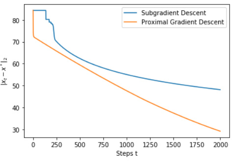

# HW9

## 1. Affine transformation of ellipse

### a) Plot 

$\mathcal{E}=\left\{\boldsymbol{x}=\left(\begin{array}{c}x_{1} \\
x_{2}
\end{array}\right): \boldsymbol{x}^{\top} Q \boldsymbol{x} \leq 1\right\}$ $Q=\left[\begin{array}{cc}
1 / 9 & 0 \\
0 & 1
\end{array}\right]$

```python
numPoints = 100
x1Line = np.linspace(-3.5,3.5,numPoints)
x2Line = np.linspace(-3.5,3.5,numPoints)
x1, x2 = np.meshgrid(x1Line,x2Line)
xspace = np.dstack([x1,x2])
def quadratic(Q,x):
    return np.dot(x,np.matmul(Q,x))

Q = np.array([[1/9,0],[0,1]])
y1 = np.array([[quadratic(Q,x) for x in row] for row in xspace])
ax1 = plt.contourf(x1,x2,y1,[-10,1])
plt.ylabel("$x_2$")
plt.xlabel("$x_1$")
plt.gca().set_aspect('equal', adjustable='box')
```


### b) Affine transformation

$$
\begin{array}{c}
A \boldsymbol{y}=\boldsymbol{x} \\
A=\left[\begin{array}{ll}
3 & 0 \\
0 & 1
\end{array}\right] .
\end{array}
$$


Then, $y = A^{-1}x$ for each coordinates, then in terms of the vectors, it is equivalent to $x' = Ax$ :

```python
def affineTransform(A,x):
    return np.matmul(A,x)

A = np.array([[3,0],[0,1]])
Q = np.array([[1/9,0],[0,1]])
y2 = np.array([[quadratic(Q,affineTransform(A,x)) for x in row] for row in xspace])
ax2 = plt.contourf(x1,x2,y2,[-10,1])
plt.ylabel("$x_2$")
plt.xlabel("$x_1$")
plt.gca().set_aspect('equal', adjustable='box')
```


### c) Plot ellipse

$$
\begin{array}{c}
\mathcal{E}=\left\{\boldsymbol{x}=\left(\begin{array}{c}
x_{1} \\
x_{2}
\end{array}\right): \boldsymbol{x}^{\top} Q \boldsymbol{x} \leq 1\right\} \\
Q=\left[\begin{array}{cc}
1 & 0.9 \\
0.9 & 1
\end{array}\right]
\end{array}
$$

```python
Q = np.array([[1,0.9],[0.9,1]])
y3 = np.array([[quadratic(Q,x) for x in row] for row in xspace])
ax3 = plt.contourf(x1,x2,y3,[-10,1])
plt.ylabel("$x_2$")
plt.xlabel("$x_1$")
plt.gca().set_aspect('equal', adjustable='box')
```


### d) Find matrix A for above ellipse to become spherical

From the implementation above, we can see that the new vectors on the ellipse represented with the original coordinate becomes:
$$
Quadratic(Q,Ax) = x^TA^TQAx = x^TQ'x, \quad \text{ where }Q'=A^TQA
$$
And we want $Q'$ to be isotropic

Calculate eigenvalues and eigenvectors of $Q$:

```python
>>>
[[1.  0.9]
 [0.9 1. ]]
eigenvalues:  [1.9+0.j 0.1+0.j]
eigenvectors: 
 [[ 0.70710678 -0.70710678]
 [ 0.70710678  0.70710678]]
```

Therefore $Q = V^T\Lambda V$ is positive semidefinite, and thus can be decomposed into product of $B^TB$, where $B = \sqrt{Q}$

Thus, $Q=B^TB$. We want $A^T B^T B A$ to be isotropic, thus $BA$ isotropic.
$$
\begin{array}{c}
BA=\left[\begin{array}{cc}
1 & 0 \\
0 & 1
\end{array}\right]\\
A=B^{-1}\left[\begin{array}{cc}
1 & 0 \\
0 & 1
\end{array}\right]
\end{array}
$$

```python
B = la.sqrtm(Q)
A = np.matmul(np.linalg.inv(B),np.array([[1,0],[0,1]]))


y4 = np.array([[quadratic(Q,affineTransform(A,x)) for x in row] for row in xspace])
ax4 = plt.contourf(x1,x2,y4,[-10,1])
plt.ylabel("$x_2$")
plt.xlabel("$x_1$")
plt.gca().set_aspect('equal', adjustable='box')
>>>
A=
array([[ 1.94387696, -1.21840071],
       [-1.21840071,  1.94387696]])
```


## 2. Affine Invariance

convex function $f(\cdot),$ unconstrained convex optimization problem.

$A$ invertible , change of coordinates $A \boldsymbol{y}=\boldsymbol{x},$ and accordingly, the function
$$
g(\boldsymbol{y})=f(A \boldsymbol{y})
$$
### a) Show GD is not affine invariant

Consider some starting point $\boldsymbol{x}_{0}$, and the sequence produced by gradient descent on $f(x)$ starting from $x_{0},$ and using step-size $\eta_{k}$ at iteration $k .$ Define also $y_{0}$ given by $A \boldsymbol{y}_{0}=\boldsymbol{x}_{0},$ and consider the sequence produced by performing gradient descent on $g(\boldsymbol{y})$ starting from $\boldsymbol{y}_{0},$ and with the same step size. Show that in general these will not be the same by providing a specific example of a function $f(\cdot)$ and a matrix $A,$ and demonstrating that the trajectories are not the same.

**Quadratic example:**
$$
f(x) = \frac{1}{2} x^{T}  Q x\\
g(y)=\frac{1}{2} y^{T} A^{T} Q A y\\
x_{+}=x-\eta \nabla f(x) = x-\eta Qx\\
\begin{aligned}
y_{+} &=y-\eta A^{T} Q A y \\
A y_{+} &=A y-\eta A\left(A^{T} Q A\right) y \\
&=x-\eta A A^{T} Q x \\
& \neq x_{+}
\end{aligned}
$$


**A general GD step:**
$$
x_{+}=x-\eta \nabla f(x)\\
x = Ay\\
g(y) = f(Ay)\\
\nabla g(y) = A^T \nabla f(Ay)\\

\begin{aligned}
Ay_+ & = A(y-\eta \nabla g(y))\\
& = Ay-\eta AA^T \nabla f(Ay)\\
& = x-\eta AA^T \nabla f(x)\\
& \ne x_+ 
\end{aligned}
$$
Therefore, every GD update does not necessarily maintain correspondence between $x$ and $y$ , thus their trajectories are not necessarily the same.

### b) Show Newton's Method is affine invariant

Now repeat this for Newton's method, where the updates $\left\{x_{k}\right\}$ and $\left\{y_{k}\right\}$ are generated by using undamped Newton's method on $f(\boldsymbol{x})$ and $g(\boldsymbol{y}),$ respectively. Show that $A \boldsymbol{y}_{k}=\boldsymbol{x}_{k}$ for all $k$. Show this in general, not through example.

__A general Newton's step__:
$$
x_{+}=x_{0}-\left[\nabla^{2} f\left(x_{0}\right)\right]^{-1} \nabla f\left(x_{0}\right)\\

\begin{aligned}
\nabla g(y) &=A^{T} \nabla f(A y) \\
\nabla^{2} g(y) &=A^{T} \nabla^{2} f(A y) A
\end{aligned}\\
\begin{aligned}
Ay_+ & = Ay - A\eta(\nabla^{2} g(y))^{-1}\nabla g(y) \\
& = Ay-\eta A (A^{T} \nabla^{2} f(A y) A)^{-1}A^T\nabla f(Ay)\\
& = Ay-\eta AA^{-1} (\nabla^{2} f(A y))^{-1} (A^{T})^{-1}A\nabla f(Ay)\\
& = Ay-\eta (\nabla^{2} f(A y))^{-1}\nabla f(Ay)\\
& = x-\eta [\nabla^{2} f(x)]^{-1}\nabla f(x)\\
& = x_+
\end{aligned}\\
$$
Therefore, every Newton's step maintain correspondence between $x$ and $y$ , thus their trajectories are the same.


## 3. L1 regularized regression problem

Consider the $\ell_{1}$ -regularized regression problem
$$
\min _{\boldsymbol{x}} \frac{1}{2}\|A \boldsymbol{x}-\boldsymbol{y}\|_{2}^{2}+\lambda\|\boldsymbol{x}\|_{1}
$$
Where $\boldsymbol{x} \in \mathbb{R}^{d}, \boldsymbol{y} \in \mathbb{R}^{n} .$ Show that a point $\bar{x}$ is an optimum of this problem if and only if there exists a $\boldsymbol{z} \in \mathbb{R}^{d}$ such that both the following hold:
(a) $-A^{\prime}(\boldsymbol{y}-A \overline{\boldsymbol{x}})+\lambda \boldsymbol{z}=0$
(b) For every $i \in[d], z_{i}=\operatorname{sign}\left(\bar{x}_{i}\right)$ if $\bar{x}_{i} \neq 0,$ and $\left|z_{i}\right| \leq 1$ if $\bar{x}_{i}=0$

+ Prove convexity: assume $\lambda >0$ the objective function is affine combination of norm balls, and norm balls are affine. Since affine combination of affine functions are affine, the problem is affine. 
+ For unconstrained convex function, optimum happens if and only if  $0 \in \partial f(\bar{x})$

$$
\begin{aligned}
\partial f(\bar{x}) &= \nabla \frac{1}{2}\|Ax-y\|^2+\partial \lambda \|x\|_1\\
&=A'(Ax-y)+\lambda \partial\|x\|_1\\
&=A'(Ax-y)+\lambda z\\
& \text{where } z \in -\partial\|x\|_1\\
\\
&0 \in \partial f(\bar{x}) \\
&\Leftrightarrow  \exists z, \text{ s.t.} A'(Ax-y)-\lambda z =0\\
& \Leftrightarrow \exists z, \text{ s.t.} -A'(Ax-y)+\lambda z =0 &\text{[Condition (a)]}\\
\\
&\text{since } \|x\|_1=\sum_{i=1}^n|x_i|\\


\end{aligned}\\
g \in \partial\|x\|_{1} \Leftrightarrow \text { either } g_{i}=\operatorname{sign}\left(x_{i}\right) \text { if } x_{i} \neq 0, \text { or } g_{i} \in[-1,1] \text { if } x_{i}=0\\
$$

Thus, for every $i \in[d], z_{i}=\operatorname{sign}\left(\bar{x}_{i}\right)$ if $\bar{x}_{i} \neq 0,$ and $\left|z_{i}\right| \leq 1$ if $\bar{x}_{i}=0$. [Condition (b)]


## 4. Lasso problem

$$
\min _{\boldsymbol{x}}: \frac{1}{2}\|A \boldsymbol{x}-\boldsymbol{y}\|_{2}^{2}+\lambda\|\boldsymbol{x}\|_{1}
$$
**proximal gradient approach:** exploit the fact that the first term is smooth, and the second term has an "easy" to evaluate prox function. 

**sub-gradient method:** solve directly, without treating the two terms separately.

### (a) Write subgradient method 

$$
x_{t+1}=x_{t}-\eta_{t} g_{t}\\
\text{find }x_{\text {best }}: f\left(x_{\text {best }}^{(t)}\right)=\min _{s \leq t} f\left(x_{s}\right)\\
\text{update to }x_{\text {best }}
$$

For each step, choose $\eta_t=\frac{1}{\sqrt{t}}$ for the problem to converge, $g_t=z$ is calculated as stated in problem 3. One subgradient is the following:

$g = A'(Ax-y)+\lambda*sign(x)$
When  $x_i\ne 0$, it equals to the gradient of smooth part of the function. When $x_i=0$,   then $sign(x_i)=0$ must be a subgradient of $|x_i|$ because it is within the convex hull of positive and negative gradients on either side of the absolute function on $i$'th coordinate.

### (b) Write proximal gradient update with fixed step size, $\eta_{t}=\eta .$ What is a good choice of $\eta ?$

$$
\begin{array}{c}
\operatorname{prox}_{\eta}(x)=\arg \min _{z}\left\{\frac{1}{2 \eta}\|x-z\|^{2}+h(z)\right\} \\
\end{array}\\
f(\beta)=\frac{1}{2} \underbrace{\|y-A \beta\|_{2}^{2}}_{g(\beta)}+\underbrace{\lambda\|\beta\|_{1}}_{h(\beta)}\\
\begin{aligned}
\operatorname{prox}_{\eta}(\beta) &=\underset{z }{\operatorname{argmin}} \frac{1}{2 \eta}\|\beta-z\|_{2}^{2}+\lambda\|z\|_{1} \\
& =\underset{z }{\operatorname{argmin}} \frac{1}{2}\|\beta-z\|_{2}^{2}+\lambda \eta\|z\|_{1} \\
&=S_{\lambda \eta}(\beta)\\
&=\left\{\begin{array}{ll}\beta_{i}-\eta \lambda & \text { if } \beta_{i}>\eta \lambda \\\beta_{i}+\eta \lambda & \text { if } \beta_{i}<-\eta \lambda \\0 & \text { else }\end{array}\right.\\
x_{+}&=\operatorname{prox}_{\eta}(x-\eta \nabla g(x))\\
&=s_{\lambda n}\left(x+\eta A^{T}(y-A x)\right)\\
\end{aligned}
$$

+ Choose $\eta$

  + Proximal gradient descent converges when $\eta < \frac{1}{M}$ , where $g(x)$ is M-smooth. Since $g(x)$ is a quadratic function, thus 
    $$
    \begin{aligned}
    \|\nabla f(x)-\nabla f(x')\| \leq M\|x-x'\|\\
    \|A'(Ax-y)-A'(Ax'-y)\| \leq M\|x-x'\|\\
    \|A'A\|\|x-x'\|\leq M\|x-x'\|\\
    \Rightarrow M=\|A'A\|
    \end{aligned}
    $$
    

  + Therefore we can choose $\eta < \frac{1}{\|A'A\|}$

## 5. Implementation

For the same setting as above, generate random data, and solve the problem numerically, plotting the rate of convergence $\left\|\boldsymbol{x}_{t}-\boldsymbol{x}^{*}\right\|_{2} .$ 

+ choose $n=50$ and $d=200,$
+  $\boldsymbol{x}^{*}$ : a vector with only 5 non-zero values (say, choose them to be -10 or $\left.10\right) .$ 
+ Choose the matrix $A$ by selecting each of its $n \times d$ entries uniformly at random from a standard Gaussian distribution $\left(A_{i j} \sim N(0,1)\right) .$ 
+ let $e$ be a random $n$ -dimensional vector, where each entry is generated according to $N(0,0.1) .$ And finally, set

$$
\boldsymbol{y}=A \boldsymbol{x}^{*}+\boldsymbol{e}
$$
Use sub-gradient and prox grad method to solve
$$
\hat{\boldsymbol{x}}=\arg \min : \frac{1}{2}\|A \boldsymbol{x}-\boldsymbol{y}\|_{2}^{2}+\lambda\|\boldsymbol{x}\|_{1}
$$
compare the rate of convergence for each method by plotting $\left\|\boldsymbol{x}_{t}-\boldsymbol{x}^{*}\right\|_{2}$ vs iteration.

Implementation and result are shown below:

#### Set up Lasso Problem

```python
# Lasso
n = 50
d = 200
nonZero = d-5
np.random.seed(0)

# Generate xStar
xStar = (np.random.rand(d)-0.5)*20
toZero = np.random.choice(np.arange(d),nonZero,replace=False)
xStar[toZero]=0

# Generate A
A = np.random.normal(0,1,(n,d))

# Generate e
e = np.random.normal(0,.1,n)

# Calculate y
y = np.matmul(A,xStar)+e

# Set lambda
Lambda = 1

def residual(x):
    return np.matmul(A,x)-y

def f(x):
    r = residual(x)
    return 0.5*np.matmul(r.T, r)+Lambda*np.linalg.norm(x,1)

def convergence(x):
    return np.linalg.norm(x-xStar,2)
```

#### Implementation of Subgradient Descent

```python
# Subgradient
epochs = 2000

def subgrad(x):
    r = residual(x)
    g = np.matmul(A.T,r)+Lambda*np.sign(x)
    return g


#Generate X:
np.random.seed(5)
x = (np.random.rand(d)-0.5)*20
xbest = x
fbest = f(xbest)
convergenceListSubgrad=[]
for i in range(epochs):
    eta = 1/(i+1)
    convergenceListSubgrad.append(convergence(x))
    xtemp = x - eta*subgrad(x)
    ftemp = f(xtemp)
    if ftemp<fbest:
        x = xtemp
        xbest = x
        fbest = ftemp
```

#### Implementation of proximal gradient descent

```python
# proximal
epochs = 2000
eta = 1/(np.linalg.norm(np.matmul(A.T,A),2)+1)
def prox(x):
    def thresholdCoord(bi):
        if bi>eta*Lambda:
            return bi-eta*Lambda
        elif bi<eta*Lambda:
            return bi+eta*Lambda
        else:
            return 0
    def threshold(b):
        return np.array([thresholdCoord(bi) for bi in b])
    return threshold(x-eta*np.matmul(A.T,residual(x)))


#Generate X:
np.random.seed(5)
x = (np.random.rand(d)-0.5)*20

convergenceListProx=[]
for i in range(epochs):
    convergenceListProx.append(convergence(x))
    x = prox(x)
```

#### Plot results

```python
t = np.arange(epochs)
plt.plot(t,convergenceListSubgrad, label="Subgradient Descent")
plt.plot(t,convergenceListProx, label="Proximal Gradient Descent")
plt.xlabel('Steps')
plt.ylabel(r'$\|x_t-x^*\|_2$')
plt.legend()
plt.show()
```



As is shown above, proximal gradient descent converges faster than subgradient descent, and subgradient descent flattens out due to diminishing $\eta_t$