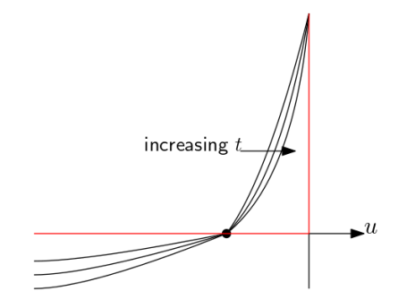
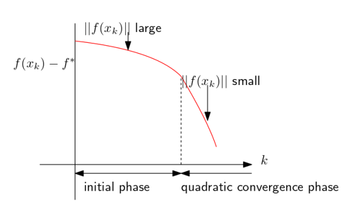

## Newton Method: Convergence Rate

$$
x_{+}=x_{0}-\eta\left[\nabla^{2} f\left(x_{0}\right)\right]^{-1} \nabla f\left(x_{0}\right)
$$

Stanford(10-14)

### Step size - Convergence

+ $\eta=1$ Pure Newton Method, may not converge

+ Backtracking line search (BTLS)

  + $$
    \begin{array}{l}
    \text { while } f(x-\eta d)>f(x)-\alpha \eta \nabla f(x)^{T} d \\
    \eta \leftarrow \eta \beta \\
    \text { where } \alpha<\frac{1}{2}, \beta<1, d=\left[\nabla^{2} f(x)\right]^{-1} \nabla f(x)
    \end{array}
    $$

  + Assumption

    + For strongly convex and smooth function: $m I \leq \nabla^{2} f(x) \leq M I \forall x$
    + $\nabla^{2} f(.) \text { is } L \text { -Lipschitz }$
      + $|\nabla^{2} f(x_1)-\nabla^{2} f(x_2)|\le L|x_1-x_2|$
    
+ **2-stage convergence**
  
  + $$
      f\left(x_{k}\right)-f^{*} \leq\left\{\begin{array}{llll}
      f\left(x_{0}\right)-f^{*}-\gamma k & k \leq k_{0} & [\text{Linear (log-Sublinear)}]\\
      \frac{2 m^{3}}{L^{2}}\left(\frac{1}{2}\right)^{k-k_{0}+1} & k \ge k_{0} & [\text{Inversed Exponential, diminishes fast}]
      \end{array}\right.
      $$
  
  + Damped phase: if $\|\nabla f(x)\| \geq \alpha$ then $f\left(x_{+}\right)-f(x) \leq-\gamma$
  
  + Pure phase: if $\|\nabla f(x)\|<\alpha$ then BTLS selects $\eta=1$ automatically, quadratic approximate close to optima is a good approximation, gradient going smaller exponentially:
      $$
      \frac{L}{2 m^{2}}\left\|\nabla f\left(x_{+}\right)\right\| \leq\left(\frac{L}{2 m^{2}}\|\nabla f(x)\|\right)^{2} \le 1 \quad [\frac{L}{2 m^{2}}\text{ guarantees} \le 1]
      $$
  
    + For Strongly convex: $\forall x, y\langle\nabla f(x)-\nabla f(y), x-y\rangle \geq m\|x-y\|^{2}$
    + $\nabla f(x)-\nabla f(x^*)\le \|\nabla f(x)\|$
      
    + Thus $\|\nabla f(x)\|$ is a good measurement of error 
      
    + $\epsilon_{k+1}=-\frac{\nabla^{2} f\left(\xi_{k}\right)}{2 \nabla f\left(x_{k}\right)} \epsilon_{k}^{2}$

    + $\left|\epsilon_{k+1}\right| \leq M \epsilon_{k}^{2},  \quad \text{ where } M=\sup _{x, y} \frac{\left|\nabla^{2} f(x)\right|}{2 \nabla f(y) \mid}<\infty$

    + [Question: [go through derivation](https://www.stat.cmu.edu/~ryantibs/convexopt-F13/scribes/lec9.pdf)]
  
  + Overall number of steps to reach $f(x)-f^{*} \leq \varepsilon$: 

    + $$
    \frac{f\left(x_{0}\right)-f^{*}}{\gamma}+\log \log \left(\frac{\varepsilon_{0}}{\varepsilon}\right)
      $$
  
    + **Quadratic convergence:** $\log \log \frac{\varepsilon_{0}}{\varepsilon} \approx$ constant, because it changes very slowly. Thus total number of steps ~ constant
  
    + Compare to GD Linear convergence: $\log \left(\frac{1}{\varepsilon}\right)$ 

### Affine invariance

+ Algorithm is affine invariance
+ But bounds are not affine invariant, depend on m, M, L..

#### Self-Concordance

+ In 1d $f: \mathbb{R} \rightarrow \mathbb{R}$: $\left|f^{\prime \prime \prime}(x)\right| \leq 2\left[f^{\prime \prime}(x)\right]^{\frac{3}{2}}$
+ In nd $f: \mathbb{R}^{n} \rightarrow \mathbb{R}$: if every 1d projection of the function is self-concordant
+ Examples:
  + $g(x)=-x^{p}$ for $0<p \leq 1$
    $g(x)=-\log x$
    $g(x)=x \log x$
    $g(x)=x^{p}$ for $-1 \leq p \leq 0$
    $g(x)=(a x+b)^{2} / x$
+ Operations that preserve: Linear combination, affine transformation
+ If $f$ is self-concordant and the domain of $f$ contains no straight line (infinite in both directions), then $f^{\prime \prime}$ is non-singular.

+ Convergence for self-concordant $f$:

  + Newton with $B T L S(\alpha, \beta)$ reaches $\varepsilon$ -optimality in
    $$
    c(\alpha, \beta)\left(f\left(x_{0}\right)-f *\right)+\log \log \frac{1}{\varepsilon}
    $$

  + No $\epsilon_0$ here, thus not depending on the constants

## Quasi Newton Methods

### Idea

For case when finding and inverting Hessian is infeasible

+ Sequential approximation of inverse Hessian
+ Super-linear convergence when strong convexity holds plus some extra assumptions

### Algorithm

+ Newton: $x_{+} \leftarrow x-\left[\nabla^{2} f\left(x\right)\right]^{-1} \nabla f\left(x\right)$

+ Quasi Newton:
  +  $x_{+} \leftarrow x+\eta s$:  
    + Find a matrix $B$ and vector $s$, two requirements:
      + **1st requirement** find $B$: $B$ approximates the Hessian $B\approx \nabla^{2} f(x),$
      + **2nd requirement** find $s$:  $Bs=-\nabla f(x)$ with $B s=-\nabla f(x)$ easy to solve
      + Compare to invertible case: $s=-B^{-1}\nabla f(x)=-[\nabla^{2} f(x)]^{-1}\nabla f(x)$

+ At step $k$: $x_{k+1}=x_{k}+s_{k} \eta_{k}$

  + **1st requirement**: solve $B_{k} s_{k}=-\nabla f\left(x_{k}\right)$

  + **2nd requirement:** compute $B_{k+1}$ using $B_{k} x_{k+1}$, so that $B_{k+1} \approx \nabla^{2} f\left(x_{k=1}\right)$

    + Hessian should satisfy Taylor expansion of the gradient: 
      $$
      \nabla f\left(x_{k+1}+u\right) \approx \nabla f\left(x_{k+1}\right)+\nabla^{2}f(x_{k+1}) u \approx \nabla f\left(x_{k+1}\right)+B_{k+1} u\\
      \text{let   } u=x_{k}-x_{k+1}=-s_{k}\eta_k\\
      \text{Then}\\
      \nabla f\left(x_{k}\right)\approx\nabla f\left(x_{k+1}\right)+B_{k+1}\left(-s_{k}\eta_k\right)
      $$
      

+ Algorithm involving **Secant Equation**: **Rank-1 update** [Question: are we taking $\eta=1$? ]

  + **2nd requirement**:  **Secant Equation**, $B_k, s_k \Rightarrow B_{k+1}$

    + $$
      B_{k+1}\left(-s_{k}\right)=\nabla f\left(x_{k+1}\right)-\nabla f\left(x_{k}\right) \text{set to }=y\\
      \text{can solve and get:}\\
      \left(a u^{T} s\right) u=y-B s
      $$

    + $B_+ = B_{k+1}$ needs to be computed cheaply from $B = B_k$ and $s=s_k$

      + rank 1 update, no second derivative involved
        $$
        \begin{array}{c}
        B_{+}=B+a u u^{T} &[a u u^{T}\text{ is symmetric, rank 1 matrix}, a \text{ is scalar}, u \text{ vector}] \\
        B_{+} s=y \Rightarrow\left(a u^{T} s\right) u=y-B s &[a, u^{T} s\text{ are scalar}] 
        \end{array}
        $$
        
        $$
        B_{+} \leftarrow B+\frac{(y-B s)(y-B s)^{T}}{(y-B s)^{T} s}
        $$

  + **1st requirement**: $B_{k+1}, B_k \Rightarrow s_{k+1}$ i.e. solve $B_{+} s_{+}=-\nabla f\left(x_{+}\right)$ to find $s_+$

    + Sherman, Morrison, Woodbury (SMW) theorem: $\left(A+u v^{T}\right)^{-1}=A^{-1}-\frac{A^{-1} u v^{T} A^{-1}}{1+v^{T} A^{-1} u}$
      + $\frac{A^{-1} u v^{T} A^{-1}}{1+v^{T} A^{-1} u}$ is rank=1

    + Can update $B_+^{-1}$ from $B^{-1}$
    + Then we have $s_+=-B_+^{-1}\nabla f(x)$

  + __Update__: $x_{k+2}=x_{k+1}+s_{k+1} \eta_{k+1}$, where $s_{k+1}+s_+$

  + **Problem**: if $(y-B s)^{T} s<0$, $B_+$ may not be positive semidefinite, $B_+$ needs to be symmetric and positive semidefinite for convex function

+ Algorithm involving **Rank-2 update,** add one more degree of freedom

  + **2nd requirement**: $B_k, s_k \Rightarrow B_{k+1}$

    +  $B_{+}=B+a u u^{T}+b v v^{T}$ Increase to rank 2
    +  $B_+$ is positive semidefinite if $a$ and $b$ are positive
    +  Solve and get $y-B s=\left(a u^{T} s\right) u+\left(b v^{T} s\right) v$
    +  $\mathbf{u}=\mathbf{y}_{k} \text { and } \mathbf{v}=B_{k} \mathbf{s}_{k}$
    
  + **Davidon-Fletcher-Powell (DFP)**: 

    + finds a solution that is symmetric, positive-definite and closest to the current approximate value of$B_k$ 

    + $$
      B_{k+1}=\left(I-\gamma_{k} y_{k} s_{k}^{T}\right) B_{k}\left(I-\gamma_{k} s_{k} y_{k}^{T}\right)+\gamma_{k} y_{k} y_{k}^{T}
      $$
      where
      $$
      \begin{array}{l}
      y_{k}=\nabla f\left(x_{k}+s_{k}\right)-\nabla f\left(x_{k}\right) \\
      \gamma_{k}=\frac{1}{y_{k}^{T} s_{k}}
      \end{array}
      $$
      and $B_{k}$ is a symmetric and positive-definite matrix.

  + __Broyden-Fletcher-Goldfarb-Shanno algorithm__:(more popular) [Question: what causes it to be different from DFP? Idea: added one more degree of freedom, we can have multiple solutions, solution depends on how they choose alpha and beta]

    + $B_{k+1}=B_{k}+\frac{\mathbf{y}_{k} \mathbf{y}_{k}^{\mathrm{T}}}{\mathbf{y}_{k}^{\mathrm{T}} \mathbf{s}_{k}}-\frac{B_{k} \mathbf{s}_{k} \mathbf{s}_{k}^{\mathrm{T}} B_{k}^{\mathrm{T}}}{\mathbf{s}_{k}^{\mathrm{T}} B_{k} \mathbf{s}_{k}}$
    + $\begin{aligned}
      \alpha &=\frac{1}{\mathbf{y}_{k}^{T} \mathbf{s}_{k}} \\
      \beta &=-\frac{1}{\mathbf{s}_{k}^{T} B_{k} \mathbf{s}_{k}}
      \end{aligned}$
    + $\left(B_{+}\right)^{-1}=\left(I-\frac{s y^{T}}{y^{T} s}\right) B^{-1}\left(I-\frac{s y^{T}}{y^{T} s}\right)+\frac{s s^{T}}{y^{T} s}$

### Convergence rate

+ Assume step size satisfies ($0<\alpha_1<\alpha_2<1$): eg. via backtracking line search (for strongly convex $f$)
  + $f(x+\eta s) \leq f(x)+\alpha_{1} \eta \nabla f(x)^{T} s$
  + $\nabla f(x+\eta x)^{T} s \geq \alpha_{2}\left|\nabla f(x)^{T} s\right|$

+ Theorem: If $f$ strongly convex, plus a few technical conditions, and $\eta$ satisfies the above conditions, then $x_{k} \rightarrow x^{*}$ **super linearly**.

+ Improvements: LBFGS (lLimited-memory BFGS)

  + Retaining and updating $B$ and $B^{-1}$ may still be hard: BFGS involves
    $$
    \left(B_{+}\right)^{-1}=\left(I-\frac{s y^{T}}{y^{T} s}\right) B^{-1}\left(I-\frac{s y^{T}}{y^{T} s}\right)+\frac{s s^{T}}{y^{T} s}
    $$

  + Idea: calculate $\left(B_{+}\right)^{-1}\left(-\nabla f\left(x_{+}\right)\right)$ directly by retaining past $(s, y)$ values.

### Extension

+ Stochastic optimization and stochastic gradients
+ Online settings
+ Lazy updating of $B$ values

## Barrier Methods

### Idea

+ Replace constraints by barrier terms in the objective
+ Increase parameter $t$ of barrier and "follow along central path"
+ Especially suited to linear programs

### Derivation

+ Convex program: 
  + $\min _{x} f(x)$ s.t. $h_{i}(x) \leq 0, i=1 \ldots m, A x=b$
    where $f(x)$ and all $h_{i}(x)$ are convex and twice differentiable 
  + This is equivalent to $\min _{x} f(x)+\sum_{i=1}^{m} I\left(h_{i}(x)\right)$ s.t. $A x=b$, where $I(x)=0 [x\le0],\quad I(x)=\infty [x>=0]$

+ Barrier method:

  + $$
    \begin{aligned}
    &\text { Replace } I(u) \text { by a smooth approximation }-\frac{1}{t} \log (-u)\\
    &\text { As } t \rightarrow \infty, \text { approx. } \rightarrow I(u)
    \end{aligned}
    $$

  + Red: $I(u)$, black: approx.

$$
\begin{array}{c}
\min _{x} f(x)+\frac{1}{t}\left[-\sum_{i=1}^{m} \log \left(-h_{i}(x)\right)\right] \mathrm{s.t.} A x=b \\
\text{Barrier function: }\left(\phi(x)=-\sum_{i=1}^{m} \log \left(-h_{i}(x)\right)\right)
\end{array}
$$

+ Key: improve barrier function (choosing of $t$) over time

  + if choose a large value of $t$ and solve, Gives a very badly conditioned optimization problem which is bad, especially when $x_0$ is far from $x^∗$ [Question: define bad conditioning]

  + Idea 1: increase $t,$ take a few steps, repeat $\ldots$ 

    + Initially: $x$ is "far", but $t$ is small, so bad conditioning not a problem. Newton method:

      + Suboptimality decreases slightly in the beginning, and faster when close to optima. Large $t\Rightarrow$ long initial phase
      + Eventually: $x$ is close, conditioning is bad but Newton accounts for it
      + 

    + **Central path**: the curve $x^{*}(t) \text { for } t>0$, check if $x^{*}(t) \rightarrow x^{*}$: 

    + KKT conditions for central path problem
      $$
      \begin{array}{c}
      t \nabla f\left(x^{*}(t)\right)-\sum_{i} \frac{\nabla h_i(x^*(t))}{h_{i}\left(x^{*}(t)\right)}+A^{T} w=0 & [\text{Stationarity}]\\
       A x^{*}(t)-b=0, h_{i}\left(x^{*}(t)\right) \leq 0 & [\text{Feasibility}]
      \end{array}
      $$
       $t$ is unknown, we want to find a pair of dual variables that through weak duality, we can prove that optima of approximated problem approaches that of original problem with increasing $t$

      Define $u_{i}^{*}(t)=\frac{-1}{t*h_{i}\left(x^{*}(t)\right)} \ge 0$ because $h_i(x)\le0$
      Define vector $v^{*}(t)=\frac{w}{t}$ 

      Lagrangian of the original (non-approximated) function

    + $$
      \begin{array}{c}
      L(x, u, v)=f(x)+\sum_{i} u_{i} h_{i}(x)+v^{T}(A x-b) & [u_{i}\ge0]\\
       g(u, v)=\min _{x} L(x, u, v)
      \end{array}
      $$
      Weak Duality $\Rightarrow f^{*} \geq g(u, v)$ for any feasible $u, v$

      Since $u_i^*$ and $v^*\ge 0$, they are always feasible in dual: [Question solved: what is $x^*(t)$? It is Optima of approximated function.  how do we know $x^*(t) $minimizes the Lagrangian? Because it is optima, it has to minimize Lagrangian]

    + $$
      \begin{aligned}
      g\left(u^{*}(t), v^{*}(t)\right) &=f\left(x^{*}(t)\right)+\sum_{i=1}^{m} u_{i}^{*}(t) h_{i}\left(x^{*}(t)\right)+v^{*}(t)\left(A x^{*}(t)-b\right) \\
      &[A x^{*}(t)-b=0 \quad \text{due to primal feasibility}]\\
      &=f\left(x^{*}(t)\right)+\sum_{i=1}^{m} \frac{-h_{i}\left(x^{*}(t)\right)}{t* h_{i}\left(x^{*}(t)\right)} \\
      &=f\left(x^{*}(t)\right)-\frac{m}{t}\\
      \text{Thus: }\\
      & f\left(x^{*}(t)\right)-f^{*} \leq \frac{m}{t}\\
      & t \rightarrow \infty, x^{*}(t) \rightarrow x *
      \end{aligned}
      $$

### Algorithm

Solves sequences of problems
$$
\min _{x} t f(x)+\sum_{i=1}^{m} h_{i}(x)
$$
s.t. $A x=b$
Start from initial $t^{(0)}$
At each epoch $t^{(k)},$ find $x^{*}\left(t^{(k)}\right)$ using Newton's method starting at previous central point $x^{*}\left(t^{(k-1)}\right) .$ Increase $t^{(k+1)}=\mu t^{(k)}$

+ For LPs:

  + $$
    \begin{array}{c}
    \min _{x} c^{T} x \text { s.t. } D x \leq f, A x=b \\
    \min _{x} t c^{T} x-\sum_{i=1}^{m} \log \left(e_{i}-d_{i}^{T} x\right) \text { s.t. } A x=b
    \end{array}
    $$
    This is self-concordant! The Newton method works very well