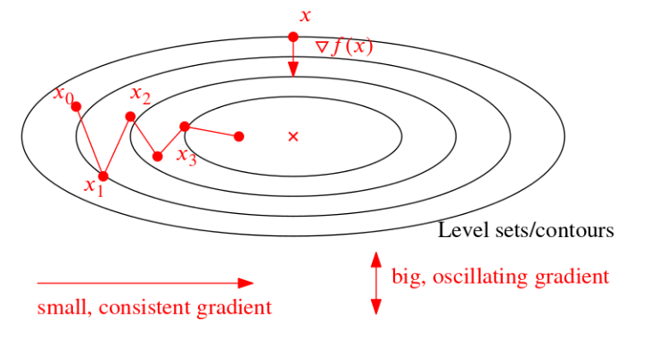
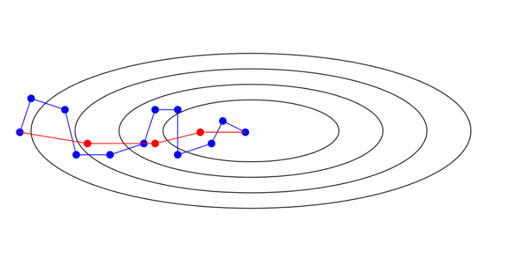
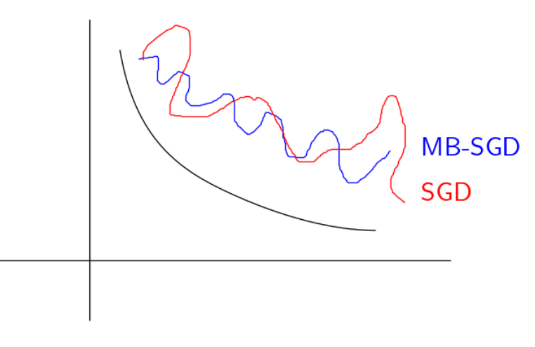

## Accelerated Gradient Descent

### Gradient descent: First Order Methods

+ Access to first order derivative: $x_{t+1}=x_{t}-\eta_{t} \nabla f\left(x_{t}\right)$
+ __Upper bounds:__
  + If L-Lipschitz and convex:  reduce in error $O\left(\frac{1}{T}\right) \approx f\left(x_{T}\right)-f *$ 
  + strongly convex:  $\left(1-\frac{2}{\kappa+1}\right)^T$  , where $\kappa$ is condition number, higher gives slower convergence
+ __Lower Bounds__: For methods within class: $x_{t+1} \in x_{1}+\operatorname{span}\left(\nabla f\left(x_{1}\right), \ldots, \nabla f\left(x_{t}\right)\right)$ 
  + There exists convex $f$ with L-Lipschitz gradients s.t. $\Omega\left(\frac{1}{T^{2}}\right)$ $\operatorname{error} f\left(x_{T}\right)-f * \geq \frac{c}{T^{2}}$
  + There exists strongly convex $f$ with $\kappa$ condition number such that error $\geq\left(1-\frac{2}{\sqrt{\kappa}+1}\right)^{T}$
+ __Summary__

$$
\begin{array}{|l|l|l|}
\hline \text { Gradient descent } & \text { Upper bound } & \text { Lower bound } \\
\hline \begin{array}{l}
\nabla f \\
\text { L-Lipschitz }
\end{array} & O\left(\frac{1}{T}\right) & \Omega\left(\frac{1}{T^{2}}\right) \\
\hline \begin{array}{l}
\text { Strongly convex with } \\
\text { condition number } \kappa
\end{array} & \left(1-\frac{2}{\kappa+1}\right)^{T} & \left(1-\frac{2}{\sqrt{\kappa}+1}\right)^{T} \\
\hline
\end{array}
$$

+ __Acceleration__: close the gap between lower and upper bound
+ __Example__:
  

### Momentum Method (Heavy Ball Method)

+ __Intuition__: Try to follow the direction of non-oscillating gradient. If Hessian is hard to calculate, we cannot use Newton's method. Idea: try to accumulate gradient over time to cancel oscillating gradients

+ $$
  x_{k+1}=x_{k}-\alpha_{k} \nabla f\left(x_{k}\right)+\beta_{k}\left(x_{k}-x_{k-1}\right)
  $$

  + $\beta_{k}\left(x_{k}-x_{k-1}\right)$ is momentum term

+ Understanding momentum term:

  + $\begin{aligned}
    x_{k+1} &=x_{k}-\alpha_{k} \nabla f\left(x_{k}\right)+\beta_{k}\left(x_{k}-x_{k-1}\right) \\
    &=x_{k}-\alpha_{k} \nabla f\left(x_{k}\right)+\beta_{k}\left[-\alpha_{k-1} \nabla f\left(x_{k-1}\right)+\beta_{k-1}\left(x_{k-1}-x_{k-2}\right)\right] \\
    &=x_{k}-\alpha_{k} \nabla f\left(x_{k}\right)-\alpha_{k-1} \beta_{k} \nabla f\left(x_{k-1}\right)
    \end{aligned}$
  + Accumulates gradients but with earlier terms weighted down

+ __Not closing the gap for L-Lipschitz condition__

+ For strongly convex $f$ with condition number $\kappa$, matches lower bound
  $$
  \left\|x_{T}-x^{*}\right\| \leq\left(1-\frac{2}{\sqrt{\kappa}+1}\right)^{T}\left\|x_{0}-x^{*}\right\|
  $$

+ Formal formulation: **"gradient before momentum"**
  $$
  \begin{aligned}
  p_{k} &=-\nabla f\left(x_{k}\right)+\beta_{k} p_{k-1} & \text{Gradient Step}\\
  x_{k+1} &=x_{k}+\alpha_{k} p_{k} & \text{Momentum Step}
  \end{aligned}
  $$
  

### Nestrov Accelerated Gradient

+ **"Momentum before gradient"**
  $$
  \begin{aligned}
  p_{k} &=-\nabla f\left(x_{k}+\beta_{k}\left(x_{k}-x_{k-1}\right)\right)+\beta_{k} p_{k-1} \\
  x_{k+1} &=x_{k}+\alpha_{k} p_{k}
  \end{aligned}
  $$

+ $-\nabla f\left(x_{k}+\beta_{k}\left(x_{k}-x_{k-1}\right)\right)$: take a step with momentum and calculate the gradient at the new point

+ $\alpha_{k}=\frac{1}{L}$ , $\beta_{k}=\frac{k-2}{k-1}$ as standard choice for both methods

+  $O\left(\frac{1}{T^{2}}\right)$ error for L-Lipschitz gradients
+  $O\left(\left(1-\frac{2}{\sqrt{\kappa}+1}\right)^{T}\right)$ error for $\kappa$ -conditioned strongly convex
+ Optimal for all first-order settings
+ Also works for proximal gradient setting

## Stochastic Gradient Descent

### Motivation

+ Calculating $\nabla f(x)$ can be expensive
+ When dimensionality is high, random choice of coordinate to descent 
+ separable problem: $\min _{x} \frac{1}{n} \sum_{i=1}^{n} f_{i}(x)$

### Noisy Unbiased (sub) Gradient (NUS)

$g(.)$ is a noisy unbiased subgradient (NUS) of $f(.)$ if
$$
E[g(x) \mid x] \in \partial f(x) \forall x
$$

+ if gradient exists, $E[g(x) \mid x] = \nabla f(x)$

To obtain NUS:

+ Random gradient descent: $\boldsymbol{f}(x)=\frac{1}{n} \sum_{i} f_{i}(x), g(x)=\nabla f_{i}(x)$
  where the index $i$ is chosen randomly from a uniform distribution
+ random coordinate descent $x_{+}^{(i)}=x^{(i)}-\eta \frac{\partial}{\partial x_{i}} f(x)$
  Again $i$ is chosen uniformly at random.

### Stochastic Gradient Descent

$$
x_{k+1}=x_{k}-\eta_{k} g\left(x_{k}\right)
$$
+ where $\eta_{k}$ is the step size, and $g$ is an NUS
+ $g\left(x_{k}\right) \equiv$ gradient estimate
+ Random updates at every step
+ Keep track of $x$ best

#### Convergence

$$
E[f(x_{Best}^T)]-f^{*} \leq \frac{R^{2}+G^{2} \Sigma_{0}^{T} \eta_{k}^{2}}{2 \Sigma_{0}^{T} \eta_{k}}
$$

+ $\Sigma_{0}^{\infty} \eta_{k} \rightarrow \infty$: if it increases faster than $\Sigma_{0}^{T} \eta_{k}^{2}$, will have convergence (error = 0)
+ $\left\|x_{0}-x^{*}\right\|^{2} \leq R^{2}$, $R$ depends on initial condition
+ $G^{2} \geq E\left[\|g(x)\|^{2} \mid x\right]$ : $G$ is a uniform upper bound on the variance of $g(x)$, higher variance, slower convergence
+ If fixed step size: not converge, because when close to $x^*$, fixed step size will keep stepping away from $x^*$
  
+ 
  
+ Problem: Stochastic gradient descent needs $\eta_{k} \rightarrow 0$ because $\operatorname{Var}\left(g_{k}\right)$ does not approach zero, But $\eta_{k} \rightarrow 0$ makes $\mathrm{SGD}$ "slower than it needs to be".

+ Summary
  $$
  \begin{aligned}
  &\text { Error after } T \text { iterations }\\
  &\begin{array}{|l|l|l|}
  \hline & \begin{array}{l}
  \text { Gradient } \\
  \text { descent }
  \end{array} & \begin{array}{l}
  \text { Stochastic } \\
  \text { gradient descent }
  \end{array} \\
  \hline \begin{array}{l}
  \text { Convex } f(.) \\
  \text { (potentially not smooth) }
  \end{array} & O\left(\frac{1}{\sqrt{T}}\right) & O\left(\frac{1}{\sqrt{T}}\right) \\
  \hline \begin{array}{l}
  \text { Lipschitz } \\
  \nabla f(i)
  \end{array} & O\left(\frac{1}{T}\right) & O\left(\frac{1}{\sqrt{T}}\right) \\
  \hline \begin{array}{l}
  \text { Strong } \\
  \text { convex }
  \end{array} & O\left(c^{T}\right) & O\left(\frac{1}{T}\right) \text{expotentially slower}\\
  \hline \text { Per iteration cost } & O(n d) & O(d) \\
  \hline
  \end{array}
  \end{aligned}
  $$
  

### Advantages

+ Huge number of samples $n\left(f(x)=\sum_{i=1}^{n} f_{i}(x)\right)$
+ In practice may not need very small optimization error $\left\|x_{k}-x^{*}\right\|,$ since even $x *$ will have statistical errors
+ Often fixed $\eta_{k}$ used
+ Choosing $\eta_{k}$ well is very important and has lots of research/ideas for it
+ Distributed settings, e.g. samples distributed across machines
+ For non-convex problems, SGD amenable to "extra tricks" e.g. Dropout

## Mini-batch SGD

### Definition

+ For separable problem: $\min _{x} \frac{1}{n} \sum_{i=1}^{n} f_{i}(x)$

+ Gradient Descent:

$$
x_{k+1}=x_{k}-\eta_{k} \frac{1}{n} \sum_{i} \nabla f_{i}\left(x_{k}\right)
$$
+ Stochastic Gradient Descent:

$$
x_{k+1}=x_{k}-\eta_{k} \nabla f_{i_{k}}\left(x_{k}\right)
$$
​		where the index $i_{k}$ is chosen at random

+ Mini-Batch SGD: [also a NUS] instead of 1 sample a time (SGD), take $b$ samble:
  $$
  x_{k+1}=x_{k}-\eta_{k} \frac{1}{b} \sum_{i \in I_{k}} \nabla f_{i}\left(x_{k}\right)
  $$
  where $b$ is the batch size, $I_{k}$ is a random set of samples with cardinality $b,$ and $U P D A T E=\frac{1}{b} \sum_{i \in I_{k}} \nabla f_{i}\left(x_{k}\right)$
  $$
  \begin{aligned}
  E\left[U P D A T E \mid x_{k}\right] &=\nabla f\left(x_{k}\right) \\
  \operatorname{Var}\left[U P D A T E \mid x_{k}\right] &=\frac{1}{b} \operatorname{Var}\left[S G D \mid x_{k}\right]
  \end{aligned}
  $$

### Convergence 

Error after $T$ iterations
$$
\mathrm{SGD} \quad \text { Mini-batch } \mathrm{SGD}
$$
$$
O\left(\frac{1}{\sqrt{T}}\right) \quad O\left(\frac{1}{\sqrt{b T}}+\frac{1}{T}\right)
$$
$$
\text{Iteration O(d)} \quad \text{Iteration } O(b d)
$$

+ no gain in compute cost

+  even for Lipschitz $\nabla f(.)$

### Properties

+ Similar to SGD, still need to have $\eta_k \rightarrow 0$
+ Reduces variance by $\frac{1}{b}$

## Variance Reduction

### Background

$$
\min _{x} \frac{1}{n} \sum_{i=1}^{n} f_{i}(x)
$$
Gradient Descent:
$$
x_{k+1}=x_{k}-\eta_{k} \frac{1}{n} \sum_{i} \nabla f_{i}\left(x_{k}\right)
$$
Stochastic gradient descent:
$$
x_{k+1}=x_{k}-\eta_{k} g_{k}\\
x_{k+1}=x_{k}-\eta_{k} \nabla f_{i_{k}}\left(x_{k}\right)
$$

#### Variance of SGD

$$
\begin{array}{l}
g(x) \equiv(\text { random }) \text { update } \\
\qquad x_{k+1}=x_{k} \eta_{k} g\left(x_{k}\right)
\end{array}
$$
set bias: $\quad E\left[g\left(x_{k}\right) \mid x_{k}\right]-\nabla f\left(x_{k}\right) = 0$
set variance: $\operatorname{Var}\left[\left\|g\left(x_{k}\right)\right\| \mid x_{k}\right]\leq G^{2}$
when $B I A S=0$ and $V A R \leq G^{2}, O\left(\frac{G^{2}}{\sqrt{T}}\right)$ convergence

#### Intuition

+ Reduce variance (bounded by $G_k$ rather than fixed $G$) as $k$ increases, then fixed step size is allowed 
  $E\left[f\left(x_{B E S T}^{T}\right)\right]-f^{*} \leq \frac{R^{2}+\sum_{0}^{T} \eta_{k}^{2} G_{k}^{2}}{2 \sum_{0}^{T} \eta_{k}}$

### Stochastic average gradient (SAG)

Schmidt, LeRoux, Bach

+ Maintain $g_{1}^{(k)}, \ldots, g_{n}^{(k)}$ , the current estimates for $\nabla f_{1}^{(k)}, \ldots, \nabla f_{n}^{(k)}$
+ Initialize with one pass over all samples: $g_{i}^{(0)}=\nabla f_{i}\left(x^{(0)}\right)$

+ Update $g$ values only one dimension a step: at step $k,$ pick $i_{k}$ randomly and do

$$
\begin{array}{l}
g_{i_{k}}^{(k)}=\nabla f_{i_{k}}\left(x^{(k-1)}\right) \\
g_{j}^{(k)}=g_{j}^{(k-1)} \text { for } j \neq i_{k} \\
x^{(k)}=x^{(k-1)}-\frac{\eta_{k}}{n} \sum_{i=1}^{n} g_{i}^{(k)}
\end{array}
$$
​		This **uses all the $g$ values** including the stale ones. (standard SGD only uses updated ones)

+ Memory efficient implementation (no need to memorize all $g_k$' s)':

$$
\sum_{i=1}^{k} g_{i}^{(k)}=\frac{g_{i_{k}}^{(k)}}{n}-\frac{g_{i_{k}}^{(k-1)}}{n}+\sum_{i=1}^{n} g_{i}^{(k-1)}
$$
+ This is implemented as:

$$
a^{(k)}=\frac{g_{i_{k}}^{(k)}}{n}-\frac{g_{i_{k}}^{(k-1)}}{n}+a^{(k-1)}
$$
+ $a^{(0)}$ just accumulates $\nabla f_{i}\left(x^{(0)}\right)$ values

#### Properties

+ Bias is no longer 0, (not unbiased). But asymptotically unbiased

+ $$
  B I A S=\frac{1}{n} \sum_{i} \nabla f_{i}\left(x^{(k)}\right)-\frac{1}{n} \sum_{i} g_{i}^{(k)}
  $$
  **Asymptotically unbiased**: As $k \rightarrow \infty, x^{(k)} \rightarrow x^{*}$ and so $B I A S \rightarrow 0$ and variance $\rightarrow 0$
  Allows **fixed step size**.

+ **L-Lipschitz**: If each $\nabla f_{i}(.)$ is L-Lipschitz, then stochastic average gradient with fixed step size has
  $$
  E\left[f\left(\bar{x}^{(T)}\right)\right]-f^{*} \leq c \frac{n}{T}\left[f\left(x^{(0)}\right)-f^{*}+L\left\|x^{0}-x^{*}\right\|\right]
  $$
  Note $O\left(\frac{1}{T}\right)$ convergence but the constant has $n$ in it (not as good as GD)

+ ___ $m$-strongly convex__: If each $f_{i}$ is $m$ -strongly convex,
  $$
  E\left[f\left(\bar{x}^{(T)}\right)\right]-f^{*} \leq\left(1-\frac{c_{0} m}{L}\right)^{T}+c_{1}\left[f\left(x_{0}\right)-f^{*}+\frac{L}{n}\left\|x^{(0)}-x^{*}\right\|\right]
  $$
  Linear convergence when strong convexity holds
  $c_0$ depends on $\frac{1}{n}$

### SAGA

An variant of SGD which is unbiased at each step [No longer divided by $n$]
$$
x^{(k)}=x^{(k-1)}-\eta_{k}\left[g_{i_{k}}^{(k)}-g_{i_{k}}^{(k-1)}+\frac{1}{n} \sum_{i} g_{i}^{(k-1)}\right]
$$
$g_{i_{k}}^{(k)}-g_{i_{k}}^{(k-1)}+\frac{1}{n} \sum_{i} g_{i}^{(k-1)}$ is the gradient estimate.
Compare to SAG:
$$
x^{(k)}=x^{(k-1)}-\eta_{k}\left[\frac{g_{i_{k}}^{(k)}-g_{i_{k}}^{(k-1)}}{n}+\frac{1}{n} \sum_{i} g_{i}^{(k-1)}\right]
$$

#### Properties

+ SAGA gradient estimate unbiased! (as opposed to SAG)
  Variance $\rightarrow 0$ because

$$
x^{(k)} \rightarrow x^{*} \Rightarrow g_{i_{k}}^{(k)} \rightarrow g_{i_{k}}^{(k-1)} \text { as } k \rightarrow \infty
$$
+ Similar convergence rates to those of SAG

+ Works with proximal idea
  $$
  \min _{x} \frac{1}{n} \sum_{i=1}^{n} f_{i}(x)+h(x)
  $$
  where the $f_{i}$ are smooth, etc.
  $$
  x^{(k)}=\operatorname{prox}_{\eta_{k}} h\left(x^{(k-1)}-S A G A_{k}\right)
  $$
  where $S A G A_{k}$ is the gradient estimate of SAGA

### Stochastic Variance Reduced Gradient (SVRG)

For epoch $t=1 \ldots T, \tilde{f}_{t}$ is the full gradient

For iterations $k=1, \ldots, M:$ SAG-like updates

