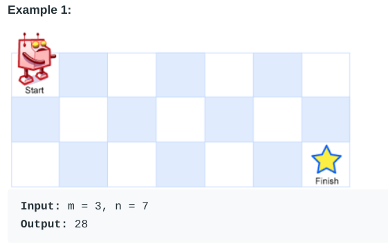

https://leetcode.com/list/xlern30i/


### 5 Longest Palindromic Substring

Given a string `s`, return *the longest palindromic substring* in `s`.

+ Examples:
  + s="babad", out: "bab", or "aba"
  + s="bccd", out:"cc"
  + s="a", out: "a"
+ First thought:
  + recusion:
    + base case: empty string: null. one char: return s
    + recursion: longestPal(s) = max(maxpalLength(s)+longestPal(s[1:])) $O(n)$
    + maxpalLength(s) checks the length of longest palLength starting from first char in s ($O(n^2)$)
    + Total $O(n^3)$
+ Optimization:
  + isPal:
    + check if in array
    + if(end<start): return false
    + if(end-start<=1): return true
    + if(s[start]==s[end]) `isPalArr[start][end]= isPal(s[start+1:end-1])+2` 
    + else `isPalArr[start][end]= false`
    + Storage
      + once we find a pal, we can store in `isPalArr[start][end]= true`
  + Then we calculate all start-end pair, ~$O(n^2)$

+ Implementation: time limit exceeded

```python
class MaxPalindrome:
    def longestPalindrome(self, s: str):
        self.s = s
        self.length = len(s)
        self.maxPalLength = -1
        self.longestPal = ""
        self.isPalArr = [[-1 for x in range(self.length)] for y in range(self.length)]  # -1: not visited, 0: false,
        # 1: true
        start = 0
        while self.length - start > self.maxPalLength:
            self.longestPalindromFromStart(start)
            start += 1
        print(np.array(self.isPalArr))
        return self.longestPal

    def longestPalindromFromStart(self, start):
        end = self.length-1
        while end >= start:
            if self.isPal(start, end) == 1: break
            end -= 1
        if end - start > self.maxPalLength:
            self.maxPalLength = end - start
            self.longestPal = self.s[start:end+1]
        return

    def isPal(self, start, end):
        if self.isPalArr[start][end] > -1: return self.isPalArr[start][end]
        if end < start:
            self.isPalArr[start][end] = 1
            return 1
        if end - start == 0:
            self.isPalArr[start][end]=1
            return 1
        if self.s[start] == self.s[end]:
            self.isPalArr[start][end] = self.isPal(start + 1, end - 1)
            return self.isPalArr[start][end]
        else:
            self.isPalArr[start][end] = 0
            return 0

```

+ Going over array multiple times is redundant, deal with the matrix directly

```python
class Solution:
    def longestPalindrome(self, string):
        # initialize 2-D table for storing results
        n = len(string)
        results = [[False] * n for i in range(n)]
        x, y = 0, 0  # start, end of longest palindromic substring so far
        # every 1-letter substring is a palindrome
        for i in range(n):
            results[i][i] = True

        # 2-letter substring(i, j) is a palindrome if string[i] == string[j]
        for i in range(n - 1):
            if string[i] == string[i + 1]:
                results[i][i + 1] = True
                # change longest palindrome to the 1st 2-letter palindrome
                if not x and not y:
                    x, y = i, i + 1

        # results[i][j] = True if results[i + 1][j - 1] == True
        # and string[i] == string[j]
        for k in range(2, n):
            for i in range(n - 2):
                j = i + k
                # break the loop if it exceeds the boundaries of the matrix
                if j == n:
                    break
                # check if current substring is a palindrome
                if results[i + 1][j - 1] and string[i] == string[j]:
                    results[i][j] = True
                    # len(substring(i, j)) > len(substring(x, y))
                    # this way we always choose 1st longest palindrome
                    if j - i > y - x:
                        x, y = i, j

        return string[x:y + 1]
```


+ Tips

  + Check if is palindrome:

    ```python
    if isPal(start+1, end-1) and s[start]==s[end]:
        return true
    ```

  + Find palindrome substrings with Recursion:

    ```python
    def findPalindrome(self, s:str):
        if(len(s)==1): 
            print(s)
            return True
        if(len(s)==2): 
            if(s[0]==s[1]):
                print(s)
                return True
            else:
                return False
        if(s[0]==s[-1] and self.findPalindrome(s[1:len(s)-1])):
            print(s)
            return True
        else:
            return False
    ```

    

  + Find palindrome substrings with DP: 

    + DP always starts from the subproblems and expands to bigger problems

      + cases in recursion are
        + len = 1
        + len = 2
        + len > 2
      + Then grow len is the direction of expansion
      + And going over the array is the direction of traverse

    + DP: 

      ```python
      for problem_size in direction_of_expansion:
          for n in direction_of_traverse:
              storageArray[problem] = f(storageArray[sub_problem])
      ```

    + (organized by `lenPal`: length of palindrome). 

    + $O(n^2)$ in time and space.

    ```python
    def findPalindrome(self, s: str):
        length = len(s)
        isPalArr=[[False for i in range(length)] for j in range(length)]
        for i in range(length): # lenPal==1
            isPalArr[i][i]=True
        for i in range(length-1): # lenPal==2
            if s[i]==s[i+1]:
                isPalArr[i][i+1]=True
        for lenPal in range(2,length): # lenPal>2
            for start in range(length-2):
                end = start+lenPal
                if(end==length): break
                if isPalArr[start+1][end-1] and s[start]==s[end]:
                    isPalArr[start][end]=True
                    print(s[start:end+1])
        return
    ```

  + Find palindrome substrings with center expansion: 

    + each palindrome is a sub-palindrome centered at the same location expanded on both side by 1
    
  + iterate over chars as center location, note cases when center is a char (odd length) and center is between chars (even length)
    
    + DP without storage if only need to return extrema:
    
      ```python
      for n in direction_of_traverse:
          for problem_size in direction_of_expansion:
              expanded_value = expand(sub_problem)
      ```
    
      
    
    + $O(n^2)$ time, $O(1)$ space.
    
    ```python
    def findPalindromeExpand(self, s: str):
        length = len(s)
      if length<1: return ""
        for i in range(length):
            oddLength = self.expandAroundCenter(s,i,i)
            evenLength = self.expandAroundCenter(s,i,i+1)
            
    def expandAroundCenter(self, s, left, right):
        L, R = left, right
        while L>=0 and R<len(s) and s[L]==s[R]:
            L-=1
            R+=1
            print(s[L:R+1])
        return R-L-1 #note here we expand both way, need to -1
    ```
    
    

### 53 Maximum Subarray

Given an integer array `nums`, find the contiguous subarray (containing at least one number) which has the largest sum and return *its sum*.

**Follow up:** If you have figured out the `O(n)` solution, try coding another solution using the **divide and conquer** approach, which is more subtle.

+ Example

  + `[-2,1,-3,4,-1,2,1,-5,4]` -> 6
  + `[1]` -> 1
  + `[0]` -> 0
  + `[-5]`-> -5
  + `1<=len(nums)<=2e4`

+ Analysis

  + Go over the array, store sum up to current index. If previous sum<0, reset sum to 0 and start from current index. Keep record of largest sum ever seen

+ Implementation [correct]

  ```python
  def maxSum(nums):
      maxsum = nums[0]
      cursum = nums[0]
      if len(nums)==1:
          return maxsum
      for i in range(1,len(nums)):
          if cursum<=0:
              cursum=0
          cursum+=nums[i]
          maxsum = max(cursum, maxsum)
      return maxsum
      
  ```

+ Divide and conquer: slower

  + find max in to halves
  + middle case: start at middle, expand on two sides, and record the maximum seen.

+ Tips

  + Find max sum of contiguous subarray:

    ```python
    maxsum = nums[0]
    cursum = nums[0]
    for i in range(1,len(nums)):
            if cursum<=0: #set to 0 if previous sum<0
                cursum=0
            cursum+=nums[i]
            maxsum = max(cursum, maxsum)
    ```


### 55 Jump Game

Given an array of non-negative integers `nums`, you are initially positioned at the **first index** of the array.

Each element in the array represents your maximum jump length at that position.

Determine if you are able to reach the last index.

+ Examples

  + `nums = [2,3,1,1,4]`: true
    + 1, 3
  + `nums = [3,2,1,0,4]`: false
    + always get to nums[3] and cannot move forward

+ Analysis

  + Recursion

    + Contraction direction: from top of array to the end

    ```python
    def canReach(index, s):
        available_jumps = list(range(s[0]+1))
        for jump in available_jumps:
            if canReach(index+jump,s):
                return True
        return False
    ```

    + Store visited

    ```python
        def canJump(self, nums: List[int]) -> bool:
            self.iterations = 0
            self.visited = [-1 for _ in range(len(nums))]
            return self.canReachFrom(0,nums)
    
        def canReachFrom(self,index, s):
            self.iterations+=1
            if self.visited[index] > -1:
                return True if self.visited[index] == 1 else False
            if s[index]>=len(s)-index-1:
                self.visited[index] = 1
                return True
            max_jump = min(s[index], len(s)-index-1)
            available_jumps = list(range(1,max_jump+1))
            for jump in available_jumps:
                if self.canReachFrom(index + jump, s):
                    return True
            self.visited[index] = 0
            return False
    ```

    

  + DP: reversed jump [slower]

    + Expansion direction: from end of array to top
    + Traverse direction: reversed jump starts from end location of last successful reversed jump
    + Storage: visitedIndexs = set()
    + This is actually slower than recursion because in recursion we only need to test available_jumps, but in reversed jump we need to test all possible jumps

    ```python
    def canReach(nums):
        if len(nums) <= 1: return True
        curIndex = len(nums) - 1
        startIndexs = [curIndex]
        while len(startIndexs) != 0:
            curIndex = startIndexs.pop()
            for reverseJump in range(1, curIndex+1):
                endIndex = curIndex - reverseJump
                if nums[endIndex] >= reverseJump:
                    if endIndex == 0: return True
                    startIndexs.append(endIndex)
        return False
                    
    ```

  + DP: turn recursion into iteration $O(n^2)$

    ```python
        def canReach(self, nums):
            self.visited = [-1 for _ in range(len(nums))]
            self.visited[-1] = 1
            for i in range(len(nums)-1):
                max_jump=min(i+nums[i],len(nums)-1)
                self.visited[i] = 0
                for jump in range(i+1,max_jump+1):
                    print(i, jump)
                    if self.visited[jump] == 1:
                        self.visited[i] = 1
                        return True
            return self.visited[0]==1
    ```

  + Greedy:

    + We only need one good jump position
    + Iterate from right to left: once we see a position with `num[i]>len(num)-i-1`, this is a good position
    + Find the right most good jump position R. If any position to the left L is also a good position, that that position must be able to jump to R because `nums[L]>R-L`
    + Then start from this position and go back

    ```python
    def canJump(self, nums):
        end = len(nums)-1
        start = end-1
        while start >= 0:
            if nums[start]>=end-start:
                end=start
            start-=1
        return end==0
    ```

  

### 62 Unique Paths

A robot is located at the top-left corner of a `m x n` grid (marked 'Start' in the diagram below).

The robot can only move either down or right at any point in time. The robot is trying to reach the bottom-right corner of the grid (marked 'Finish' in the diagram below).

How many possible unique paths are there?

+ Example:

  + 
  + `m=3, n=2` -> 3
  + `m=7,n=3`-> 28
  + `m=3, n=3`-> 6

+ Analysis

  + `[m,n]` and `[n,m]` gives same result

  + Base cases: 

    + `[1,1]`: 0
    + `[2,1],[1,2]`: 1
    + `[1,1]`: `f[2,1]+f[1,2]`

  + Recursion:

    ```python
    numPaths(m,n):
        return numPaths(m-1,n)+numPaths(m,n-1)
    ```

  + Memorization:

    ```python
    memo = {(m,n):num_paths}
    numPaths(m,n):
        if (m,n) or (n,m) in memo.keys(), return memo(m,n) or memo(n,m)
    ```

  + DP

    + direction of expansion: `m++, n++`

    ```python
    def numPaths(m,n):
        memo={(m,n): num_paths}
        memo[(1,1)]=0
        memo[(2,1)]=1
        memo[(1,2)]=1
        i = 2
        while i<=m:
            j = 2
            while j<=n:
                memo[(i,j)]=memo[(i-1,j)]+memo[(i,j-1)]
                j+=1
            i+=1
        return memo[m,n]
        
    ```

  + For each i, we only use the memorization from memo[(i-1)] and memo[(i)]. No need to store all rows

    + Note: because we need to use a full row as memorization, we must initialize a full row

    ```python
    def uniquePaths(m,n):
            if m==n==1: return 1
            memoprev, memocur = [1 for _ in range(n)], [1 for _ in range(n)]
            memoprev[0]=0
            memocur[0]=1
            i = 1
            while i < m:
                j = 1
                while j < n:
                    memocur[j] = memoprev[j] + memocur[j - 1]
                    j += 1
                memoprev = memocur
                memocur[0]=1
                i += 1
            return memocur[-1]
    ```

  + Can also use factorial to calculate directly:

    + in total we need to have m-1 steps down, n-1 steps right
    + count all unique combinators (steps down are no different from each other, same for right)
    + $\frac{(m-1+n-1)!}{(m-1)!(n-1)!}$

    ```python
    def uniquePaths(self, m: int, n: int) -> int:
        from math import factorial as fact
        return int(fact((m-1) + (n-1))/(fact(m-1) * fact(n-1)))
    ```

    

### 70 Climbing Stairs

You are climbing a staircase. It takes `n` steps to reach the top.

Each time you can either climb `1` or `2` steps. In how many distinct ways can you climb to the top?

+ Examples:
  + `n=2 -> 2`
  + `n=3 -> 3`

+ Analysis

  + Base case:

    + `n=0 -> 1` 
    + `n=1 -> 1`
    + `n=2 -> 2`

  + recursion

    ```python
    def climbStairs(n):
        return climbStairs(n-1)+climbStairs(n-2)
    ```

  + Memorization:

    ```python
    memo=[0]*n
    def climbStairs(n):
        if memo[n]>0: return memo[n]
        return climbStairs(n-1)+climbStairs(n-2)
    ```

  + DP:

    ```python
    def climbStairs(n):
        if basecase: return basecase
        memo=[0]*n
        memo[0]=1
        memo[1]=1
        i = 2
        while i<=n:
            memo[i]=memo[i-1]+memo[i-2]
        return memo[-1]
    ```

  + DP save space: we only use 1 and 2 steps ahead, no need to store the whole array

    ```python
    def climbStairs(n):
        if n<=1: return 1
        prev1=prev2=1
        cur=prev1+prev2
        i = 2
        while i<=n:
            cur=prev1+prev2
            prev1, prev2 = cur, prev1
            i+=1
        return cur
    ```

+ Tips:

  + climbing stairs problem, Fibonacci problem, all use one pass method:

    ```python
    while i<=n:
        cur=prev1+prev2
        prev1, prev2 = cur, prev1
        i+=1
    ```


### 91 Decode ways

A message containing letters from `A-Z` can be **encoded** into numbers using the following mapping:

```
'A' -> "1"
'B' -> "2"
...
'Z' -> "26"
```

To **decode** an encoded message, all the digits must be mapped back into letters using the reverse of the mapping above (there may be multiple ways). For example, `"111"` can have each of its `"1"`s be mapped into `'A'`s to make `"AAA"`, or it could be mapped to `"11"` and `"1"` (`'K'` and `'A'` respectively) to make `"KA"`. Note that `"06"` cannot be mapped into `'F'` since `"6"` is different from `"06"`.

Given a **non-empty** string `num` containing only digits, return *the **number** of ways to **decode** it*.

The answer is guaranteed to fit in a **32-bit** integer.

+ Example:

  + ```
    Input: s = "12"
    Output: 2
    Explanation: "12" could be decoded as "AB" (1 2) or "L" (12).
    ```

  + ```
    Input: s = "226"
    Output: 3
    Explanation: "226" could be decoded as "BZ" (2 26), "VF" (22 6), or "BBF" (2 2 6).
    ```

  + ```
    Input: s = "0"
    Output: 0
    Explanation: There is no character that is mapped to a number starting with 0. The only valid mappings with 0 are 'J' -> "10" and 'T' -> "20".
    Since there is no character, there are no valid ways to decode this since all digits need to be mapped.
    ```

  + ```
    Input: s = "1"
    Output: 1
    ```

+ Analysis

  + Base cases

    + `len(s)==1`:
      + `s=="0"->0`
      + else: ->1
    + `len(s)==2`:
      + `if 11<=int(s)<=26 && s!="20"`-> 2
      + else: 1 or 0

  + Recursion:

    + each step, check if last 1 and last 2 characters give legal encoding

    ```python
    def numDecodings(s):
        return isValid(s[-1])*numDecodings(s[:-1])+isValid(s[-2:])*numDecodings(s[:-2])
    
    def isValid(s):
        if len(s)==0: return 0
        if len(s)==1:
            return 0 if s=="0" else 1
        if len(s)==2:
            if int(s)>=10 and int(s)<=26: return 1
            else: return 0
            
    
    ```

  + Recursion with memorization:

    ```python
    memo={s: num_decodings}
    ```

  + DP: expand from last 1 and 2 characters

    ```python
    def numDecodings(s):
        if basecase: return basecase
        memo={idx: num_decodings}
        l = len(s)-1
        memo[l] = isValid(s[l])
        memo[l-1] = isValid(s[l-1:])+isValid(l)*isValid(l-1)
        i = len(s)-3
        while i>0:
            memo[i] = isValid(s[i:i+2])*memo[i+2]+isValid(s[i])*memo[i+1]
            i-=1
        memo[0] = isValid(s[0])*memo[1]
        
        return memo[0]
    
    ```

  + DP save space: we are only using `memo[i+1], memo[i+2]`

    ```python
    def numDecodings(s):
        if len(s)==1: return isValid(s)
        l = len(s)-1
        last2 = isValid(s[l])
        last1 = isValid(s[l-1:])+isValid(s[l])*isValid(s[l-1])
        if len(s)==2: return last1
        i = len(s)-3
        while i>=0:
            cur = isValid(s[i:i+2])*last2+isValid(s[i])*last1
            last1, last2=cur, last1
            i-=1
        return cur
    
    def isValid(s):
        if len(s)==0: return 0
        if len(s)==1:
            return 0 if s=="0" else 1
        if len(s)==2:
            if int(s)>=10 and int(s)<=26: return 1
            else: return 0
            
    ```

    

### 121  Best Time to Buy and Sell Stock

Say you have an array for which the *i*th element is the price of a given stock on day *i*.

If you were only permitted to complete at most one transaction (i.e., buy one and sell one share of the stock), design an algorithm to find the maximum profit.

Note that you cannot sell a stock before you buy one.


+ Example

  + ```
    Input: [7,1,5,3,6,4]
    Output: 5
    Explanation: Buy on day 2 (price = 1) and sell on day 5 (price = 6), profit = 6-1 = 5.
                 Not 7-1 = 6, as selling price needs to be larger than buying price.
    ```

  + ```
    Input: [7,6,4,3,1]
    Output: 0
    Explanation: In this case, no transaction is done, i.e. max profit = 0.
    ```

+ Analysis

  + Find index i and j where j>i and `prices[j]-prices[i]` is maxed.

  + Brutal force: `for i in range(len(prices))`test each j

  + Note that when we repeat computation when we are scanning for `j`'s

  + Recursion:

    ```python
    maxProfit(prices, i):
        with_i = max(prices)-i
        without_i = maxProfit(prices, i+1)
        return max(with_i, without_i)
    ```

  + Stack:

    + push if stack empty
    + pop all if `price<stack[0]`
    + pop top and push if `price>stack[top]`
    + Keep a record of max `stack[top]-stack[0]`

  + We are only using top and bottom of stack. Substitute with 2 integer variables instead

    ```python
    if len(prices)<1: return 0
    max_profit = 0
    bottom = prices[0]
    top = bottom
    for price in prices:
        if price<bottom:
            bottom=price
            top=bottom
        elif price>top:
            top = price
            max_profit = max(top-bottom, max_profit)
    return max_profit
    ```

+ Tips:

  + when have order-constrained extrema problem, try stack first. If only use bottom and top of stack, substitute with 2 integer variables..


### 139 word break

Given a **non-empty** string *s* and a dictionary *wordDict* containing a list of **non-empty** words, determine if *s* can be segmented into a space-separated sequence of one or more dictionary words.

**Note:**

- The same word in the dictionary may be reused multiple times in the segmentation.
- You may assume the dictionary does not contain duplicate words.


+ Example

  + ```
    Input: s = "leetcode", wordDict = ["leet", "code"]
    Output: true
    Explanation: Return true because "leetcode" can be segmented as "leet code".
    ```

  + ```
    Input: s = "applepenapple", wordDict = ["apple", "pen"]
    Output: true
    Explanation: Return true because "applepenapple" can be segmented as "apple pen apple".
                 Note that you are allowed to reuse a dictionary word.
    ```

  + ```
    Input: s = "catsandog", wordDict = ["cats", "dog", "sand", "and", "cat"]
    Output: false
    ```

+ Analysis

  + wordDict is a list. We need to check whether a word is in dict fast. So first convert it into a set `wordSet`, and find a `maxWordLen` and `minWordLen` for future use.

  + Decoding problem similar to # 91 and # 70

  + base case:

    + if `s in wordSet: return True`
    + if `len(s)<minWordLen: return False`

  + Recursion

    ```python
    start = 0
    wordSet
    s
    hasBreak(start):
        if baseCase: return baseCase
        for wordLen in range(minWordLen, maxWordLen+1):
            if s[:wordLen] in wordSet && hasBreak(start+wordLen):
                return True
        return False
    
    ```

  + Recursion with memory: we can store a truth array indexed by start:

    ```python
    memo[start] = [-1 for _ in len(s)]
    
    hasBreak(start):
        if memo[start]!=-1: return memo[start]
        if baseCase: return baseCase
        for wordLen in range(minWordLen, maxWordLen+1):
            if s[:wordLen] in wordSet && hasBreak(start+wordLen):
                memo[start]=1
                return True
        memo[start]=0
        return False
    
    ```

  + DP with memory: goes in same direction 

    + direction of expansion: wordLen
    + direction of traverse: left to right of the string

    ```python
    memo[start] = [False for _ in range(len(s))] # can start from index
    for wordLen in range(minWordLen, maxWordLen+1):
        if s[:wordLen] in wordSet:
            memo[wordLen]=True
    
    for wordLen in range(minWordLen, maxWordLen+1):
        start=minWordLen
        while start<len(s)-minWordLen:
            if s[start:wordLen] in wordSet and memo[start]: 
                memo[start+wordLen]=True
            start+=wordLen
    return memo[-1]
    ```

  + DP save space:

    + note that we only use `memo[start: start+maxWordLen]` in each step. We only need a constant size array of size `maxWordLen`

    + To do this we need to do traverse first then expand wordLen

    + Each index offsets the memo array by 1

    + We can skip all memo=0 index for next iteration

    + if previous memo is 1, then copy that 1

    + eg: applepenapple, ["a","apple","pen","app"], maxWordLen=5, minWordLen=1

      |      | a    | p    | p    | l    | e    | p    | e    | n    | a    | p    | p    | l    | e    | a    |      |
      | ---- | ---- | ---- | ---- | ---- | ---- | ---- | ---- | ---- | ---- | ---- | ---- | ---- | ---- | ---- | ---- |
      | 0    | 1    | 1    | 0    | 1    | 0    | 1    |      |      |      |      |      |      |      |      |      |
      | 1    |      | 1    | 0    | 1    | 0    | 1    | 0    |      |      |      |      |      |      |      |      |
      | 2    |      |      |      | 1    | 0    | 1    | 0    | 0    | 0    |      |      |      |      |      |      |
      | 3    |      |      |      |      |      | 1    | 0    | 0    | 1    | 0    | 0    |      |      |      |      |
      | 4    |      |      |      |      |      |      |      |      | 1    | 1    | 0    | 1    | 0    | 1    |      |
      | 5    |      |      |      |      |      |      |      |      |      | 1    | 0    | 1    | 0    | 1    | 0    |
      | 6    |      |      |      |      |      |      |      |      |      |      |      | 1    | 0    | 1    | 0    |
      | 7    |      |      |      |      |      |      |      |      |      |      |      |      |      | 1    | 1    |

    ```python
    memo = [False for _ in range(maxWordLen+1)]
    memo[0] = True
    start = 0
    stringLen=len(s)
    for wordLen in range(minWordLen, maxWordLen+1):
        if s[:wordLen] in wordSet:
            memo[wordLen]=True
            if start==0:
                start=wordLen
    offset=start
    while start<=stringLen-minWordLen:
        memo=memo[offset:]+[False for _ in range(offset)]
        copiedLength = maxWordLen-offset
        offset=0
        wordLen=minWordLen
        while wordLen<=maxWordLen and start+wordLen<=stringLen:
            if memo[wordLen] and offset==0: 
                	newStart=start+wordLen
                    wordLen = copiedLength
        	if s[start:start+wordLen] in wordSet:
            	memo[wordLen]=True
            wordLen+=1
       	offset=newStart-start
        start=newStart
    return memo[-1]
    ```

  + The above acceleration is making things more complicated. Use simple DP instead:

    ```python
    def wordBreak(self, s, wordDict):
        memo=[True]
        words=set(wordDict)
        for i in range(1, len(s)+1):
            memo += any(memo[j] and s[j:i] in words for j in range(i))
        return memo[-1]
    ```

    

### 152 Maximum Product Subarray

Given an integer array `nums`, find the **contiguous** subarray within an array (containing at least one number) which has the largest product.

+ Example

  + ```
    Input: [2,3,-2,4]
    Output: 6
    Explanation: [2,3] has the largest product 6.
    ```

  + ```
    Input: [-2,0,-1]
    Output: 0
    Explanation: The result cannot be 2, because [-2,-1] is not a subarray.
    ```

+ Analysis

  + base case: 

    + `len(nums)==0` out 0 
    + `len(nums)==1` out nums[0]
    + `len(nums)==2`out `max(nums[0], nums[0]*nums[1], nums[1])`

  + DP:

    + direction of expansion: `len(subarray)+=1`
    + direction of traversal: `i+=1`
    + memory: `memo[i][j]=prod(start,end)`
    + time and space: $O(n^2)$

    ```python
            length = len(nums)
            memo = [[0 for _ in range(length)] for _ in range(length)]
            maxProd = nums[0]
            for i in range(length):  # len(subarray)==1
                memo[i][i] = nums[i]
                maxProd = max(nums[i], maxProd)
            for subLen in range(2, length + 1):
                for start in range(0,length - subLen+1):
                    end = start + subLen - 1
                    memo[start][end] = nums[end] * memo[start][end - 1]
                    maxProd = max(memo[start][end], maxProd)
            return maxProd
    ```

  + DP to save space: first iterate through the array, then iterate over length

    ```python
    length = len(nums)
    maxProd = nums[0]
    for i in range(length):
        product = 1
        for j in range(i,length):
            product*=nums[j]
            result = max(result, product)
    return result
    ```

    

  + Improvement to reduce time: $O(n)$, following conditions for `num[i]`

    + positive: -> `prevMax*num[i]`
    + negative: ->`max(prevMin*num[i], num[i])`
    + zero: -> `num[i]`
    + Then we only need to traverse once, and keep a record of `curMin, curMax`

    ```python
    length = len(nums)
    maxProd = nums[0]
    curMax = nums[0]
    curMin = nums[0]
    for i in range(1,length):
        prevMax = curMax
        prevMin = curMin
        curMax = max(prevMax*nums[i], prevMin*nums[i], nums[i])
        curMin = min(prevMax*nums[i], prevMin*nums[i], nums[i])
        maxProd = max(curMax, maxProd)
    return maxProd
    
    ```

    

+ Tips:
  + For finding contiguous subarray, it usually saves space to first iterate over array, then iterate over subarray size. 
  + After find the solution, try to eliminate the iterations over subarray by memorizing results on the go during the first iteration


### 198 House Robber

max sum subarray with no adjacent elements. All elements between `[0,400]`

+ Examples:

  + ```
    Input: nums = [1,2,3,1]
    Output: 4
    Explanation: Rob house 1 (money = 1) and then rob house 3 (money = 3).
                 Total amount you can rob = 1 + 3 = 4.
    ```

  + ```
    Input: nums = [2,7,9,3,1]
    Output: 12
    Explanation: Rob house 1 (money = 2), rob house 3 (money = 9) and rob house 5 (money = 1).
                 Total amount you can rob = 2 + 9 + 1 = 12.
    ```

  + `[2,1,1,2]=> 4`: note: can skip more than one house

+ Analysis

  ```python
          n = len(nums)
          if n==0:
              return 0
          if n==1:
              return nums[0]
          last2 = 0
          last1 = nums[0]
          for i in range(1,n):
              curMax = max(nums[i]+last2, last1) #legal robs up to current point
              last2, last1  = last1, curMax
          return curMax
  ```

  

  

### 213 House Robber II

max sum subarray with no adjacent elements. Subarray is arranged in a circle (first and last element cannot appear together)

+ Example:

  + ```
    Input: nums = [2,3,2]
    Output: 3
    Explanation: You cannot rob house 1 (money = 2) and then rob house 3 (money = 2), because they are adjacent houses.
    ```

  + ```
    Input: nums = [1,2,3,1]
    Output: 4
    Explanation: Rob house 1 (money = 1) and then rob house 3 (money = 3).
    Total amount you can rob = 1 + 3 = 4.
    ```

  + ```
    Input: nums = [0]
    Output: 0
    ```


+ Extend from simple house robber:

  + take out the last element, then the remaining array is a problem of simple house robber
  + we need to remember if `nums[0]`is taken, if it is taken, then we cannot take the last element. If not, we can. 
  + Two passes of simpleHouseRobber: 

  ```python
      def rob(self, nums: List[int]) -> int:
          n = len(nums)
          if n<=0:
              return 0
          if n==1:
              return nums[0]
          return max(self.simpleHouseRobber(nums[:-1]), self.simpleHouseRobber(nums[1:]))
      def simpleHouseRobber(self, nums):
          n = len(nums)
          if n<=0:
              return 0
          if n==1:
              return nums[0]
          last2 = 0
          last1 = nums[0]
          for i in range(1,n):
              curMax = max(nums[i]+last2, last1) #legal robs up to current point
              last2, last1  = last1, curMax
          return curMax
  ```

  + Optimize time: try to do them in single pass

  ```python
      def rob(self, nums: List[int]) -> int:
          n = len(nums)
          if n <= 0:
              return 0
          if n == 1:
              return nums[0]
          if n == 2:
              return max(nums[0], nums[1])
          last2 = nums[0]
          last1 = max(nums[1],nums[0])
          last2Late= 0
          last1Late = nums[1]
          for i in range(2, n - 1):
              curMax = max(nums[i] + last2, last1)
              last2, last1 = last1, curMax
              curMaxLate = max(nums[i] + last2Late, last1Late)
              last2Late, last1Late = last1Late, curMaxLate
          curMaxLate = max(nums[-1] + last2Late, last1Late)
          return max(last1,curMaxLate)
  ```

  
  + The above two solution are both $O(n)$ , the second solution is slightly faster, but first solution is more clear and concise, and saves space.


### 300 Longest Increasing Subsequence

Given an integer array `nums`, return the length of the longest strictly increasing subsequence.

A **subsequence** is a sequence that can be derived from an array by deleting some or no elements without changing the order of the remaining elements. For example, `[3,6,2,7]` is a subsequence of the array `[0,3,1,6,2,2,7]`.


+ Example:

  + ```
    Input: nums = [10,9,2,5,3,7,101,18]
    Output: 4
    Explanation: The longest increasing subsequence is [2,3,7,101], therefore the length is 4.
    ```

  + ```
    Input: nums = [0,1,0,3,2,3]
    Output: 4 (0,1,2,3)
    ```

  + ```
    Input: nums = [7,7,7,7,7,7,7]
    Output: 1
    ```

+ Analysis

  + Recursion: each step is a combination of taking current element and not taking:

    + branch for each taken/ not taken. $O(2^n)$

    ```python
    def lengthofLIS(nums, prevMax, curIdx):
        if curIdx == len(nums): return 0
        taken = 0
        if nums[curIdx]>prevMax:
            taken = 1+lengthofLIS(nums, nums[curIdx],curIdx+1)
        notTaken = lengthofLIS(nums, prev,curIdx+1)
        return max(taken, notTaken)
    ```

  + Recursion with memorization: `memo[prevMax, curIdx]`: $O(n^2)$

    ```python
    memo[i][j]
    def lengthofLIS(nums, prevMax, curIdx):
        if memo[prevMax, curIdx]>-1: return memo[prevMax, curIdx]
        if curIdx == len(nums): return 0
        taken = 0
        if nums[curIdx]>prevMax:
            taken = 1+lengthofLIS(nums, nums[curIdx],curIdx+1)
        notTaken = lengthofLIS(nums, prev,curIdx+1)
        return max(taken, notTaken)
    ```

  + DP: if we know the all max lengths before `i`,  we can try appending `i` to each elements before it and find the max result. $O(n^2)$

  + DP: binary search (patient sort algorithm). With patient sort, the number of piles equal to the longest increasing sequence, because:

    + each pile is a decreasing sequence
    + patient sort always append to smaller pile first
    + $O(n log n)$

  ```python
  last_digit = []
  for num in nums:
      insert_pos = bisect.bisect_left(last_digits,num)
      if insert_pos>=len(last_digits):
          last_digits.append(num)
      else:
          last_digits[insert_pos] = num
  return len(last_digits)
  ```

  https://leetcode.com/problems/longest-increasing-subsequence/discuss/1000066/Python-O(nlogn)-with-patience-sort-explanation-faster-than-92.4

+ Tips:

  + Useful for recursion:

  ```python
  len(array, curIdx) = 1+len(array, curIdx+1)
  ```

  

